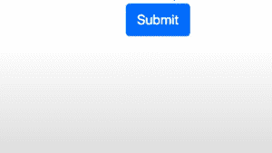

# 如何为 bootstrap 覆盖 SASS 函数？

> 原文:[https://www . geesforgeks . org/如何覆盖-sass-function-for-bootstrap/](https://www.geeksforgeeks.org/how-to-overwrite-sass-function-for-bootstrap/)

众所周知，我们必须超越引导风格，给我们的网站一个新的外观。否则，它会看起来很普通，通过覆盖我们可以改变它的默认主题——背景、字体、颜色、间距等。变量。所以这里我们必须覆盖默认的 Bootstrap 变量(因为变量负责输出)。为此，我们需要在本地启动。我们需要引导 SASS 代码背后的原始源代码，通过使用 NPM(节点包管理器)将它作为本地依赖项安装，我们可以很容易地获得它，并且您可以在安装 Nodejs 时自动获得它。现在只需按照下面给出的步骤进行覆盖:

*   **步骤 1:** 转到您的项目，打开您的终端或命令行，然后键入命令。基本上，这个命令把这个项目置于 npm 的控制之下。

    ```
    $ npm init -y
    ```

*   **步骤 2:** 使用命令安装模块/包。此后，您将看到一个名为 node_modules 的新文件夹，在该文件夹中，将有一个引导文件夹，在该文件夹中，您将看到一个名为 SASS 的文件夹。

    ```
    $ npm install bootstrap--save 
    ```

    现在 **DONT** 在那个 SASS 文件夹中进行更改，因为这不会起作用，因为你的程序不会被编译，或者你在这里编辑它不会影响编译和完成的 CSS 代码，另外，你不要碰这个，因为如果你需要重新安装你的项目和重新安装那个依赖项，那么你将覆盖你的更改。因此，为了解决这个问题，我们遵循下一步

*   **步骤 3:** 创建自己的自定义 sass 文件。让我们创建一个名为 main.scss 的文件。然后使用命令导入 main.scss 文件中的所有引导 scss 文件

    ```
    @import "node_modules/bootstrap/scss/bootstrap";
    ```

    现在从你的终端键入命令来执行你的文件。

    ```
    $ sass main.scss main.css;
    ```

    现在，这将为您提供更大的 main.css 文件，因为现在它包含了整个引导包。现在，您可以从 index.html 文件中删除旧的 CDN 引导标签。

*   **第 4 步:**现在你可以简单地在 main.scss 文件中重写你的默认值，你所要做的就是写命令，比如

    ```
    $theme-colors: (
      "primary": #521751,
      "danger": #b80c03
    );
    ```

    在跨 Sass 文件进行覆盖时，必须在导入引导数据库的 Sass 文件之前进行覆盖。因此，我们必须在

    ```
    @import "node_modules/bootstrap/scss/bootstrap"; 
    ```

    现在，当我们在导入的 Bootstrap Sass 文件上编写代码时，我们可以重新执行。一旦完成，你就能看到变化。

    ```
    $ sass main.scss main.css;
    ```

**示例:**我已经安装了节点模块/包，并创建了自己的 main.scss 文件，现在让下面给出的代码作为我们的主代码，比如 index.html。

## 超文本标记语言

```
<!DOCTYPE html>
<html>
  <head>
    <title>Page Title</title>
    <link rel="stylesheet"
      href=
"https://maxcdn.bootstrapcdn.com/bootstrap/3.3.7/css/bootstrap.min.css"
      integrity=
"sha384-BVYiiSIFeK1dGmJRAkycuHAHRg32OmUcww7on3RYdg4Va+PmSTsz/K68vbdEjh4u"
      crossorigin="anonymous"/>
  </head>
  <body>
    <button type="submit" class="btn btn-primary">Submit</button>
  </body>
</html>

</html>
```

因为我们已经在其中包含了引导值，所以在我们的 **main.scss** 文件中应用了更改之后，这些更改将反映在我们的最终输出中

## main . scss

```
$theme-colors: (
  "primary": #521751,
  "danger": #b80c03
);
@import "node_modules/bootstrap/scss/bootstrap";
```

**输出:**

*   在 main.scss 中进行更改之前:

    

*   进行更改和重新剪辑后:

    ```
    $ sass main.scss main.css;
    ```

    