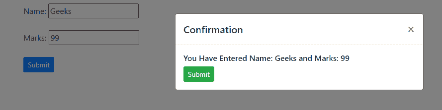
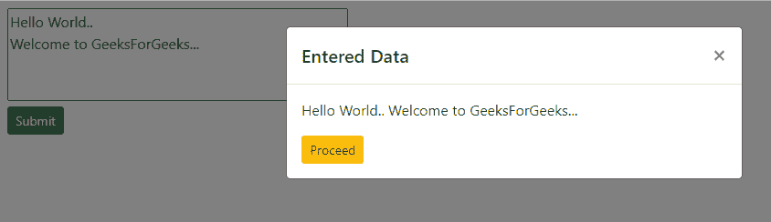

# 如何将数据传递到引导模式？

> 原文:[https://www . geeksforgeeks . org/如何将数据传递到引导模式/](https://www.geeksforgeeks.org/how-to-pass-data-into-a-bootstrap-modal/)

Bootstrap 是一个用于设计网页的 CSS 框架。Bootstrap v4.5 是最新版本。引导程序以及 HTML 和 JavaScript 可以用来构建响应性网页。

模态是需要执行某些操作的弹出窗口或对话框。模态。Bootstrap 有内置的模式组件。模态由模态头和模态体两部分组成。数据可以从 HTML 文档传递到模态主体，当模态弹出时，HTML 文档显示出来。为了将数据传递到模式体中，使用了 jquery 方法。

jQuery 类似于 JavaScript，但是 jQuery 方法简单且更容易实现。本文演示了两个例子，其中数据从 HTML 文档体传递到模态体。

**示例 1:** 在这种方法中，网页由接受用户输入的两个输入字段名称和标记组成。使用 jQuery val()方法，使用各个字段的 id 提取输入字段中的数据。接下来，从输入字段获得的数据被连接成一个字符串。这个字符串是使用 jQuery 的 html()方法传递给模式体的。

## 超文本标记语言

```html
<!DOCTYPE html>
<html>

<head>
    <!-- Import bootstrap cdn -->
    <link rel="stylesheet" href=
"https://cdn.jsdelivr.net/npm/bootstrap@4.5.3/dist/css/bootstrap.min.css"
        integrity=
"sha384-TX8t27EcRE3e/ihU7zmQxVncDAy5uIKz4rEkgIXeMed4M0jlfIDPvg6uqKI2xXr2"
        crossorigin="anonymous">

    <!-- Import jquery cdn -->
    <script src="https://code.jquery.com/jquery-3.5.1.slim.min.js"
        integrity=
"sha384-DfXdz2htPH0lsSSs5nCTpuj/zy4C+OGpamoFVy38MVBnE+IbbVYUew+OrCXaRkfj"
        crossorigin="anonymous">
    </script>

    <script src=
"https://cdn.jsdelivr.net/npm/bootstrap@4.5.3/dist/js/bootstrap.bundle.min.js"
        integrity=
"sha384-ho+j7jyWK8fNQe+A12Hb8AhRq26LrZ/JpcUGGOn+Y7RsweNrtN/tE3MoK7ZeZDyx"
        crossorigin="anonymous">
    </script>
</head>

<body>
    <div class="container mt-2">

        <!-- Input field to accept user input -->
        Name: <input type="text" name="name" 
            id="name"><br><br>

        Marks: <input type="text" name="marks"
            id="marks"><br><br>

        <!-- Button to invoke the modal -->
        <button type="button" class="btn btn-primary 
            btn-sm" data-toggle="modal" 
            data-target="#exampleModal"
            id="submit">
            Submit
        </button>

        <!-- Modal -->
        <div class="modal fade" id="exampleModal" 
            tabindex="-1" 
            aria-labelledby="exampleModalLabel" 
            aria-hidden="true">

            <div class="modal-dialog">
                <div class="modal-content">
                    <div class="modal-header">
                        <h5 class="modal-title" 
                            id="exampleModalLabel">
                            Confirmation
                        </h5>

                        <button type="button" 
                            class="close" 
                            data-dismiss="modal" 
                            aria-label="Close">
                            <span aria-hidden="true">
                                ×
                            </span>
                        </button>
                    </div>

                    <div class="modal-body">

                        <!-- Data passed is displayed 
                            in this part of the 
                            modal body -->
                        <h6 id="modal_body"></h6>
                        <button type="button" 
                            class="btn btn-success btn-sm" 
                            data-toggle="modal"
                            data-target="#exampleModal" 
                            id="submit">
                            Submit
                        </button>
                    </div>
                </div>
            </div>
        </div>
    </div>

    <script type="text/javascript">
        $("#submit").click(function () {
            var name = $("#name").val();
            var marks = $("#marks").val();
            var str = "You Have Entered " 
                + "Name: " + name 
                + " and Marks: " + marks;
            $("#modal_body").html(str);
        });
    </script>
</body>

</html>
```

**输出**



**示例 2:** 在这种方法中，文本区域用于接受用户的输入。当点击提交按钮时，它调用 jQuery 函数。输入文本区域的数据使用 val()方法提取到文本变量中。该文本字符串使用 jQuery 的 html()方法传递给模式体。

## 超文本标记语言

```html
<!DOCTYPE html>
<html>

<head>
    <!-- Import bootstrap cdn -->
    <link rel="stylesheet" href=
"https://cdn.jsdelivr.net/npm/bootstrap@4.5.3/dist/css/bootstrap.min.css"
        integrity=
"sha384-TX8t27EcRE3e/ihU7zmQxVncDAy5uIKz4rEkgIXeMed4M0jlfIDPvg6uqKI2xXr2"
        crossorigin="anonymous">

    <!-- Import jquery cdn -->
    <script src="https://code.jquery.com/jquery-3.5.1.slim.min.js"
        integrity=
"sha384-DfXdz2htPH0lsSSs5nCTpuj/zy4C+OGpamoFVy38MVBnE+IbbVYUew+OrCXaRkfj"
        crossorigin="anonymous">
    </script>

    <script src=
"https://cdn.jsdelivr.net/npm/bootstrap@4.5.3/dist/js/bootstrap.bundle.min.js"
        integrity=
"sha384-ho+j7jyWK8fNQe+A12Hb8AhRq26LrZ/JpcUGGOn+Y7RsweNrtN/tE3MoK7ZeZDyx"
        crossorigin="anonymous">
    </script>
</head>

<body>
    <div class="container mt-2">

        <!-- Input field to accept user input -->
        <textarea id="textarea" rows="4" 
            cols="50">
        </textarea><br>

        <!-- Button to invoke the modal -->
        <button type="button" 
            class="btn btn-success btn-sm" 
            data-toggle="modal" 
            data-target="#exampleModal"
            id="submit">
            Submit
        </button>

        <!-- modal -->
        <div class="modal fade" id="exampleModal" 
            tabindex="-1" 
            aria-labelledby="exampleModalLabel" 
            aria-hidden="true">
            <div class="modal-dialog">
                <div class="modal-content">
                    <div class="modal-header">
                        <h5 class="modal-title" 
                            id="exampleModalLabel">
                            Entered Data
                        </h5>

                        <button type="button" 
                            class="close" 
                            data-dismiss="modal" 
                            aria-label="Close">

                            <span aria-hidden="true">
                                ×
                            </span>
                        </button>
                    </div>

                    <div class="modal-body">

                        <!-- Data passed is displayed
                            in this part of the 
                            modal body -->
                        <p id="modal_body"></p>

                        <button type="button" 
                            class="btn btn-warning btn-sm" 
                            data-toggle="modal"
                            data-target="#exampleModal">
                            Proceed
                        </button>
                    </div>
                </div>
            </div>
        </div>
    </div>

    <script type="text/javascript">
        $("#submit").click(function () {
            var text = $("#textarea").val();
            $("#modal_body").html(text);
        });
    </script>
</body>

</html>
```

**输出**



HTML 是网页的基础，通过构建网站和网络应用程序用于网页开发。您可以通过以下 [HTML 教程](https://www.geeksforgeeks.org/html-tutorials/)和 [HTML 示例](https://www.geeksforgeeks.org/html-examples/)从头开始学习 HTML。