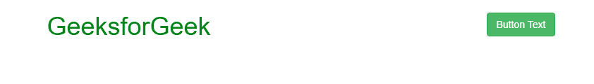
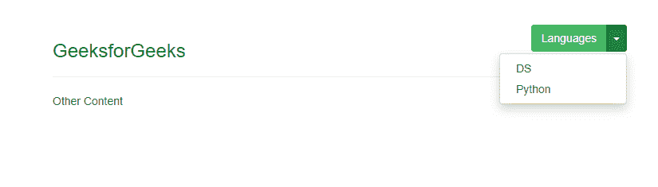

# 如何使用 bootstrap 将按钮放置在右上角？

> 原文:[https://www . geesforgeks . org/how-to-place-button-in-右上角-use-bootstrap/](https://www.geeksforgeeks.org/how-to-place-button-in-top-right-corner-using-bootstrap/)

要将按钮放在右上角，有几种方法可以做到这一点。

1.  The easiest way to do this, Set **“pull-right”** in button class.
    **Example:**

    ```html
    <!DOCTYPE html>
    <html lang="en">

    <head>
        <title>
          place button in top right corner
      </title>

        <meta charset="utf-8">
        <meta name="viewport" 
              content="width=device-width, 
                       initial-scale=1">
        <link rel="stylesheet"
              href=
    "https://maxcdn.bootstrapcdn.com/bootstrap/3.4.0/css/bootstrap.min.css">

        <script src=
    "https://ajax.googleapis.com/ajax/libs/jquery/3.4.1/jquery.min.js">
      </script>

        <script src=
    "https://maxcdn.bootstrapcdn.com/bootstrap/3.4.0/js/bootstrap.min.js">
      </script>
    </head>

    <body>
        <div class="container">
            <h1>
          <span style="color:green">GeeksforGeek</span>
          <button class='btn btn-success pull-right'>
            Button Text
              </button>
        </h1>
        </div>
    </body>

    </html>
    ```

    **输出:**
    

2.  The **button group** is used for more than one button like in this example.
    The **button group** is optional if you’re only using a single button.
    **Example:**

    ```html
    <!DOCTYPE html>
    <html lang="en">

    <head>
        <title>
            place button in top right corner
        </title>

        <meta charset="utf-8">
        <meta name="viewport" 
              content="width=device-width, 
                       initial-scale=1">
        <link rel="stylesheet" 
              href=
    "https://maxcdn.bootstrapcdn.com/bootstrap/3.4.0/css/bootstrap.min.css">

        <script src=
    "https://ajax.googleapis.com/ajax/libs/jquery/3.4.1/jquery.min.js">
        </script>

        <script src=
    "https://maxcdn.bootstrapcdn.com/bootstrap/3.4.0/js/bootstrap.min.js">
        </script>
    </head>

    <body>

        <div class="container">
            <section>
                <div class="page-header">
                    <h3 style="color:green"
                        class="pull-left">
            GeeksforGeeks
          </h3>
                    <div class="pull-right">
                        <div class="btn-group">
                            <button class="btn btn-success">
                                Languages
                            </button>
                            <button class="btn btn-success dropdown-toggle" 
                                    data-toggle="dropdown">
                                <span class="caret"></span>
                            </button>
                            <ul class="dropdown-menu pull-right">
                                <li>
                                    <a href="#">DS</a>
                                </li>
                                <li>
                                    <a href="#">Python</a>
                                </li>
                            </ul>
                        </div>
                    </div>
                    <div class="clearfix"></div>
                </div>
                Other Content
            </section>
        </div>
    </body>

    </html>
    ```

    