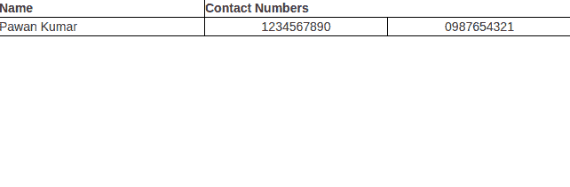

# 如何使用 Bootstrap 将表格文本置于中心？

> 原文:[https://www . geesforgeks . org/how-to-place-table-text-in-center-use-bootstrap/](https://www.geeksforgeeks.org/how-to-place-table-text-into-center-using-bootstrap/)

表格允许我们聚集大量的数据，并以清晰有序的方式呈现出来。一个基本的 Bootstrap 表有一个轻填充，只有水平分隔。基类是**。表格**到任何表格，在添加它之后，我们可以用自定义样式或者我们的各种包含的修改器类来扩展我们的表格，以达到设计的目的。

**使用 Bootstrap 将表格文本放入** **中心:**默认情况下，**<【TD】>**元素中的文本始终是规则的并左对齐的。

我们要基本处理 **< td >** 元素。

有两种方法:

1.  通过添加**文本-对齐:居中；**在我们的 CSS 代码中为 tds。
2.  通过将 Bootstrap 3 的**“**”T2【文本中心】“类添加到 td 元素中，也可以开箱即用。

*   **By adding <u>text-align:center</u> in CSS code**

    **文本对齐**属性指定元素中文本的水平对齐方式。因此，在我们的 CSS 代码中，我们只需将 tds 的 text-align 属性设置为中心，表格文本就会放在中心。

    ```html
    .table td {
    text-align: center;
    } 

    ```

    **示例:**

    ```html
    <!DOCTYPE html>
    <html>
    <head>
    <title>Page Title</title>
    <style>

    table, th, td {
      border: 1px solid black;
      border-collapse: collapse;

    }
    /* setting the text-align property to center*/
     td {
      padding: 5px;
      text-align:center;

    }
    </style>
    </head>
    <body>
    <table style="width:100%">
      <tr>
        <th>Name</th>
        <th colspan="2">Contact Numbers</th>
      </tr>
      <tr>
        <td >Pawan Kumar</td>
        <td>1234567890</td>
        <td>0987654321</td>
      </tr>
    </table>

    </body>

    </html>
    ```

    

*   **By adding the <u>” text-center”</u> class of Bootstrap 3**

    我们可以使用 bootstrap 3 的“文本中心”类来对元素进行中心对齐。因此，在我们的 td 中，当我们添加“文本中心”类时，我们的表格文本就位于中心。

    ```html
    <td class="text-center">.......</td>

    ```

    **示例:**

    ```html
    <!DOCTYPE html>
    <html>
    <head>
    <title>Page Title</title>
    <!-- Latest compiled and minified CSS -->
    <link rel="stylesheet" 
          href=
    "https://maxcdn.bootstrapcdn.com/bootstrap/3.3.7/css/bootstrap.min.css"
         integrity=
    "sha384-BVYiiSIFeK1dGmJRAkycuHAHRg32OmUcww7on3RYdg4Va+PmSTsz/K68vbdEjh4u" 
         crossorigin="anonymous">

    <!-- Optional theme -->
    <link rel="stylesheet"
          href=
    "https://maxcdn.bootstrapcdn.com/bootstrap/3.3.7/css/bootstrap-theme.min.css" 
         integrity=
    "sha384-rHyoN1iRsVXV4nD0JutlnGaslCJuC7uwjduW9SVrLvRYooPp2bWYgmgJQIXwl/Sp" 
          crossorigin="anonymous">

    <!-- Latest compiled and minified JavaScript -->
    <script src=
    "https://maxcdn.bootstrapcdn.com/bootstrap/3.3.7/js/bootstrap.min.js" 
    integrity=
    "sha384-Tc5IQib027qvyjSMfHjOMaLkfuWVxZxUPnCJA7l2mCWNIpG9mGCD8wGNIcPD7Txa" 
    crossorigin="anonymous"></script>
    <style>
    table, th, td {
      border: 1px solid black;
      border-collapse: collapse;

    }
    </style>
    </head>
    <body>
    <table style="width:100%">
      <tr>
        <th >Name</th>
        <th colspan="2">Contact Numbers</th>
      </tr>
      <tr>
        <td class="text-center">Pawan Kumar</td>
        <td class="text-center">1234567890</td>
        <td class="text-center">0987654321</td>
      </tr>
    </table>

    </body>

    </html>
    ```

    