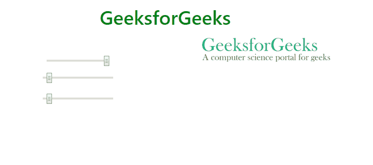

# 如何在 bootstrap 中将图片放置在移动视图的滑块上方？

> 原文:[https://www . geesforgeks . org/如何将图像放置在引导移动视图滑块上方/](https://www.geeksforgeeks.org/how-to-place-the-image-above-the-slider-in-mobile-view-in-bootstrap/)

制作一个响应页面，其中用户在桌面视图中将图像放在范围滑块的右侧。但是在移动视图中，图像与滑块重叠。

使用网格列作为引导来解决这个问题。将范围列设置为*右拉*用于桌面视图，*伸缩-列-反转*用于在移动视图中设置滑块上方的图像。

**增加一行一列:**

```html
<div class="row flex-column-reverse flex-md-row">

        <div class="col-xs-12 col-sm-6 pull-right">
            <div class="input">
                <div class="slidecontainer">
                    <input type="range" 
                           min="0" max="100" 
                           value="100" id="rangeid1">
                </div>
            </div>
        </div>

        <div class="col-xs-12 col-sm-6">
            <div class="output">
                
            </div>
        </div>
    </div>
</div>
```

**示例:**

```html
<!DOCTYPE html>
<html>

<head>
    <title>
      place the image above the slider 
      in mobile view in bootstrap
  </title>
    <meta name="viewport"
          content="width=device-width, initial-scale=1">

    <link rel="stylesheet" 
          href=
"https://stackpath.bootstrapcdn.com/bootstrap/4.3.1/css/bootstrap.min.css" 
          integrity=
"sha384-ggOyR0iXCbMQv3Xipma34MD+dH/1fQ784/j6cY/iJTQUOhcWr7x9JvoRxT2MZw1T"
          crossorigin="anonymous">

    <link rel="stylesheet" 
          type="text/css"
          href="draft.css">

    <script src=
"https://code.jquery.com/jquery-3.3.1.slim.min.js" 
            integrity=
"sha384-q8i/X+965DzO0rT7abK41JStQIAqVgRVzpbzo5smXKp4YfRvH+8abtTE1Pi6jizo" 
            crossorigin="anonymous">
    </script>
    <script src=
"https://cdnjs.cloudflare.com/ajax/libs/popper.js/1.14.7/umd/popper.min.js" 
            integrity=
 "sha384-UO2eT0CpHqdSJQ6hJty5KVphtPhzWj9WO1clHTMGa3JDZwrnQq4sF86dIHNDz0W1" 
            crossorigin="anonymous">
    </script>
    <script src=
"https://stackpath.bootstrapcdn.com/bootstrap/4.3.1/js/bootstrap.min.js"
            integrity=
"sha384-JjSmVgyd0p3pXB1rRibZUAYoIIy6OrQ6VrjIEaFf/nJGzIxFDsf4x0xIM+B07jRM" 
            crossorigin="anonymous">
    </script>
</head>
<style>
    body {
        margin-top: 1rem;
        margin-left: 2rem;
        margin-right: 2rem;
    }

    .input {
        margin-top: 3rem;
    }

    #rangeid {
        padding: 0.5rem;
    }
</style>

<body>
    <center>
        <div class="container">
            <h1 style="color:green" class="Hclass">
              GeeksforGeeks
          </h1>

            <div class="row flex-column-reverse flex-md-row">

                <div class="col-xs-12 col-sm-6 pull-right">
                    <div class="input">
                        <div class="slidecontainer">
                            <input type="range" 
                                   min="0" max="100"
                                   value="100" 
                                   id="rangeid1">
                        </div>
                        <div class="slidecontainer">
                            <input type="range" 
                                   min="0" max="100" 
                                   value="0" 
                                   id="rangeid">
                        </div>
                        <div class="slidecontainer">
                            <input type="range" min="0" max="100" 
                                   value="0" 

                                   id="rangeid">
                        </div>
                    </div>
                </div>

                <div class="col-xs-12 col-sm-6">
                    <div class="output">
                        
                    </div>
                </div>
            </div>
        </div>
    </center>
</body>
<script>
    var ranger = document.getElementById('rangeid1');
    var image = document.getElementById('imgid');
    var width = image.width;
    var height = image.height;

    ranger.onchange = function() {
        image.width = width * (ranger.value / 100);
        image.height = height * (ranger.value / 100);
    }
</script>
</html>
```

**输出:**
**桌面视图:**


**移动视图:**
