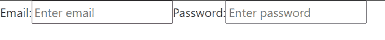

# 如何使用 Bootstrap 4 将两个输入框并排放置？

> 原文:[https://www . geesforgeks . org/how-to-place-two-input-box-next-to-other-use-bootstrap-4/](https://www.geeksforgeeks.org/how-to-place-two-input-box-next-to-each-other-using-bootstrap-4/)

在本文中，我们将学习如何在 HTML 中的一行中接受两个输入。HTML 支持各种类型的输入，如文本、密码、日期时间、日期、时间、星期、数字、电子邮件等等。有各种各样的情况，我们必须在一条直线上或相邻的直线上接受多个输入，这可以通过以下方式实现。输入组和内联元素。内联元素不取整行，而是取必要的宽度。

**示例 1:** 在两个连续的字段中进行输入。

## 超文本标记语言

```html
<!DOCTYPE html>
<html>

<head>
    <link rel="stylesheet" href=
"https://stackpath.bootstrapcdn.com/bootstrap/4.4.1/css/bootstrap.min.css"
        integrity=
"sha384-Vkoo8x4CGsO3+Hhxv8T/Q5PaXtkKtu6ug5TOeNV6gBiFeWPGFN9MuhOf23Q9Ifjh"
        crossorigin="anonymous">
</head>

<body>
    <div class="input-group">

        <!-- declaration for first field -->
        <input type="text" class="form-control 
                input-sm" value="input 1 " />

        <!-- reducong the gap between them to zero -->
        <span class="input-group-btn" 
            style="width:0px;"></span>

        <!-- declaration for second field -->
        <input type="text" class="form-control 
                input-sm" value="input 2" />
    </div>
</body>

</html>
```

**输出:**


**例 2:** 将输入作为一行中的两个字段。

## 超文本标记语言

```html
<!DOCTYPE html>
<html>

<head>
    <link rel="stylesheet" 
        href=
"https://stackpath.bootstrapcdn.com/bootstrap/4.4.1/css/bootstrap.min.css"
        integrity=
"sha384-Vkoo8x4CGsO3+Hhxv8T/Q5PaXtkKtu6ug5TOeNV6gBiFeWPGFN9MuhOf23Q9Ifjh" 
        crossorigin="anonymous">
</head>

<body>
    <form class="form-inline" action="/action_page.php">
      <label for="email">Email:</label>
      <input type="email" id="email" 
            placeholder="Enter email" name="email">

      <label for="pwd">Password:</label>
      <input type="password" id="pwd" 
            placeholder="Enter password" name="pswd">

    </form>
</body>

</html>
```

**输出:**



**例 3:** 混合标签一行输入。

## 超文本标记语言

```html
<!DOCTYPE html>
<html>

<head>
    <link rel="stylesheet" 
        href=
"https://stackpath.bootstrapcdn.com/bootstrap/4.4.1/css/bootstrap.min.css"
        integrity=
"sha384-Vkoo8x4CGsO3+Hhxv8T/Q5PaXtkKtu6ug5TOeNV6gBiFeWPGFN9MuhOf23Q9Ifjh" 
        crossorigin="anonymous">
</head>

<body>
    <div class="input-group">
        <span class="input-group-text">Between</span>
        <input type="text" class="form-control" 
            placeholder="Type something..." />
        <span class="input-group-text" 
            style="border-left: 0; border-right: 0;">
            and
        </span>
        <input type="text" class="form-control"     
            placeholder="Type something..." />
    </div>
</body>

</html>
```

**输出:**

