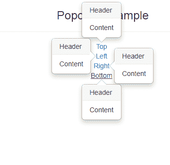
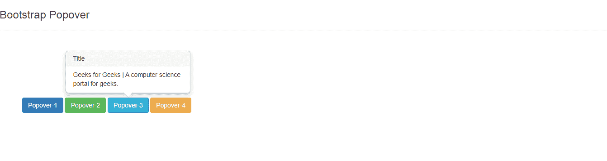

# 如何定位引导弹出窗口？

> 原文:[https://www . geesforgeks . org/如何定位-引导-popover/](https://www.geeksforgeeks.org/how-to-position-a-bootstrap-popover/)

本文描述了如何在页面上放置 popover。Bootstrap 的 popover 属性可以用来使网站看起来更加动态。弹出窗口通常用于显示任何元素的附加信息，并在鼠标指针点击该元素时显示。它类似于引导工具提示。然而，弹出窗口可以包含比工具提示更多的内容。

Popovers 是定位元素的第三方库 **Popper.js** 。bootstrap.js 之前必须包含库 popper.min.js

**语法:**

```html
$(function () {
  $('[data-toggle="popover"]').popover()
})

```

根据需要，定位有时非常重要，但是用户需要显式地进行定位，因为缺省情况下 Popover 将出现在元素的右侧。

**示例 1:** 下面的代码是 HTML、Bootstrap 和 JavaScript 中的基本实现。所有 4 个方向(左、右、上、下)popover 都已使用数据放置设置实现。

## 超文本标记语言

```html
<!DOCTYPE html>
<html>

<head>
  <title>Bootstrap Example</title>
  <meta charset="utf-8">
  <meta name="viewport" content=
    "width=device-width, initial-scale=1">
  <link rel="stylesheet" href=
"https://maxcdn.bootstrapcdn.com/bootstrap/3.4.1/css/bootstrap.min.css">
  <script src=
"https://ajax.googleapis.com/ajax/libs/jquery/3.5.1/jquery.min.js">
  </script>
  <script src=
"https://maxcdn.bootstrapcdn.com/bootstrap/3.4.1/js/bootstrap.min.js">
  </script>
</head>

<body style="text-align:center;">
  <div class="container">
    <h3>Popover Example</h3>
    <hr>
    <ul class="list-inline">
      <li>
        <!-- Popover positioned to the top -->
        <a href="#" title="Header" 
          data-toggle="popover" 
          data-placement="top" 
          data-content="Content">
          Top
        </a>
      </li>
      <br>
      <li>
        <!-- Popover positioned to the left -->
        <a href="#" title="Header" 
          data-toggle="popover" 
          data-placement="left" 
          data-content="Content">
          Left
        </a>
      </li>
      <br>
      <li>
        <!-- Popover positioned to the right -->
        <a href="#" title="Header" 
          data-toggle="popover" 
          data-placement="right" 
          data-content="Content">
          Right
        </a>
      </li>
      <br>
      <li>
        <!-- Popover positioned to the bottom -->
        <a href="#" title="Header" 
          data-toggle="popover" 
          data-placement="bottom" 
          data-content="Content">
          Bottom
        </a>
      </li>
    </ul>
  </div>
  <script>
    // Enable all popovers in the document
    $(document).ready(function () {
      $('[data-toggle="popover"]').popover();
    });
  </script>
</body>

</html>
```

**输出:**



**示例 2:** 以下示例是顶部悬停弹出窗口，当光标指向按钮时弹出窗口触发，当光标从按钮上移开时弹出窗口消失。

## 超文本标记语言

```html
<!DOCTYPE html>
<html lang="en">

<head>
  <title>
    Example of Triggering Bootstrap
    Popover on Mouseover
  </title>

  <link rel="stylesheet" href=
"https://maxcdn.bootstrapcdn.com/bootstrap/3.3.7/css/bootstrap.min.css">
  <script src=
"https://ajax.googleapis.com/ajax/libs/jquery/1.12.4/jquery.min.js">
  </script>
  <script src=
"https://maxcdn.bootstrapcdn.com/bootstrap/3.3.7/js/bootstrap.min.js">
  </script>

  <script>
    $(document).ready(function () {
      $('[data-toggle="popover"]').popover({

        // Set the placement of 
        // the popup to the top
        placement: 'top',
        trigger: 'hover'
      });
    });
  </script>

  <style>
    .pop {
      margin: 150px 50px;
    }
  </style>
</head>

<body>
  <h3>
    Bootstrap Popover
  </h3>
  <hr>
  <div class="pop">
    <button type="button" 
      class="btn btn-primary" 
      data-toggle="popover" 
      title="Title" 
      data-content="Geeks for Geeks">
      Popover-1
    </button>
    <button type="button" 
      class="btn btn-success" 
      data-toggle="popover" 
      title="Title" 
      data-content="Geeks for Geeks">
      Popover-2
    </button>
    <button type="button" 
      class="btn btn-info" 
      data-toggle="popover" 
      title="Title" 
      data-content="Geeks for Geeks |
      A computer science portal for geeks.">
      Popover-3
    </button>
    <button type="button" 
      class="btn btn-warning" 
      data-toggle="popover" title="Title" 
      data-content="Geeks for Geeks">
      Popover-4
    </button>
  </div>
</body>

</html>
```

**输出:**

