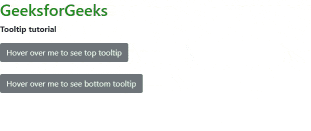
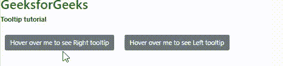

# 如何使用 Bootstrap 在按钮中定位工具提示？

> 原文:[https://www . geesforgeks . org/如何定位-按钮中的工具提示-使用-引导/](https://www.geeksforgeeks.org/how-to-position-tooltip-in-button-using-bootstrap/)

在[**<u>Bootstrap 4</u>**](https://www.geeksforgeeks.org/bootstrap-4-introduction/)<u>中，可以将工具提示定位在各个方向(左、右、上、下)。工具提示的定位是通过在 bootstrap.js 之前使用第三方库(Popper.js)来设置的，以便工具提示能够工作。</u>

<u>**方法:**放置工具提示所需的标记在*数据放置*上，您可以将工具提示设置为</u>

*   <u>底部</u>
*   <u>对吧</u>
*   <u>顶端</u>
*   <u>左边的</u>

<u>**CDN 链接:**在你的 HTML 代码头部包含以下文件。</u>

> <u><src 脚本= " https://code . jquery . com/jquery-3 . 6 . 0 . slim . js "></script><src 脚本= " https://cdnjs . cloudflare . com/Ajax/libs/popper . js/1 . 14 . 3/UMD/</u>

<u>按钮被赋予一个唯一的标识，在 jQuery 代码中引用该标识来启动工具提示。该 jQuery 代码仅启动悬停时显示的工具提示，如下所示:</u>

<u>**语法:**</u>

```html
$(function () {
    $('[data-toggle="tooltip"]').tooltip()
})
```

<u>**示例 1:** 下面的代码使用*数据放置*属性演示了上面的工具提示定位。工具提示与按钮元素相关联。当您将鼠标悬停在按钮上时，工具提示会显示在默认的底部位置。</u>

*   <u>**工具提示位置底部**</u>

    ```html
    <div class="text-center">
      <button
        type="button"
        class="btn btn-secondary"
        data-toggle="tooltip"
        data-placement="bottom"
        title="Tooltip on bottom"
      />
    </div> 
    ```

*   <u>**工具提示位置顶部**</u>

    ```html
    <div class="text-center">
      <button
        type="button"
        class="btn btn-secondary"
        data-toggle="tooltip"
        data-placement="top"
        title="Tooltip on top"
      />
    </div>
    ```

## <u>超文本标记语言</u>

```html
<!DOCTYPE html>
<html>
  <head>
    <meta charset="utf-8" />
    <meta name="viewport" content="width=device-width" />

    <link
      rel="stylesheet"
      href=
"https://cdn.jsdelivr.net/npm/bootstrap@4.6.0/dist/css/bootstrap.min.css"/>
    <script src=
"https://code.jquery.com/jquery-3.6.0.slim.js">
    </script>
    <script
      src=
"https://cdnjs.cloudflare.com/ajax/libs/popper.js/1.14.3/umd/popper.min.js"
      crossorigin="anonymous">
    </script>
    <script src=
"https://cdn.jsdelivr.net/npm/bootstrap@4.6.0/dist/js/bootstrap.min.js">
    </script>
    <script src=
"https://cdn.jsdelivr.net/npm/bootstrap@4.6.0/dist/js/bootstrap.bundle.min.js">
    </script>
    <script>
      $(function () {
        $('[data-toggle="tooltip"]').tooltip();
      });
    </script>
  </head>

  <body>
    <h2 style="color: green">GeeksforGeeks</h2>
    <p><b>Tooltip tutorial</b></p>
    <button
      type="button"
      class="btn btn-secondary"
      data-toggle="tooltip"
      data-placement="top"
      title="This is top tooltip">
      Hover over me to see top tooltip
    </button>
    <br /><br />
    <button
      type="button"
      class="btn btn-secondary"
      data-toggle="tooltip"
      data-placement="bottom"
      title="This is bottom Tooltip">
      Hover over me to see bottom tooltip
    </button>
  </body>
</html>
```

<u>**输出:**</u>

<u></u>

<u>**示例:**下面的代码演示了工具提示在按钮左右的定位。</u>

*   <u>**工具提示左侧位置:**</u>

    ```html
    <div class="text-center">
      <button
        type="button"
        class="btn btn-secondary"
        data-toggle="tooltip"
        data-placement="left"
        title="Tooltip on left"
      />
    </div>
    ```

*   <u>**工具提示位置右侧:**</u>

    ```html
    <div class="text-center">
      <button
        type="button"
        class="btn btn-secondary"
        data-toggle="tooltip"
        data-placement="right"
        title="Tooltip on right"
      />
    </div> 
    ```

## <u>超文本标记语言</u>

```html
<!DOCTYPE html>
<html>
  <head>
    <meta charset="utf-8" />
    <meta name="viewport" content="width=device-width" />

    <link
      rel="stylesheet"
      href=
"https://cdn.jsdelivr.net/npm/bootstrap@4.6.0/dist/css/bootstrap.min.css"/>
    <script src=
"https://code.jquery.com/jquery-3.6.0.slim.js">
    </script>
    <script
      src=
"https://cdnjs.cloudflare.com/ajax/libs/popper.js/1.14.3/umd/popper.min.js"
      crossorigin="anonymous">
    </script>
    <script src=
"https://cdn.jsdelivr.net/npm/bootstrap@4.6.0/dist/js/bootstrap.min.js">
    </script>
    <script src=
"https://cdn.jsdelivr.net/npm/bootstrap@4.6.0/dist/js/bootstrap.bundle.min.js">
    </script>

    <script>
      $(function () {
        $('[data-toggle="tooltip"]').tooltip();
      });
    </script>
    <style>
      .btn {
        margin: 10px;
      }
    </style>
  </head>

  <body>
    <h2 style="color: green">GeeksforGeeks</h2>
    <p><b>Tooltip tutorial</b></p>

    <button
      type="button"
      class="btn btn-secondary"
      data-toggle="tooltip"
      data-placement="right"
      x-placement="left"
      title="This is left Tooltip">
        Hover over me to see Right tooltip
    </button>

    <button
      type="button"
      class="btn btn-secondary"
      data-toggle="tooltip"
      data-placement="left"
      x-placement="right"
      title="This is right Tooltip">
       Hover over me to see Left tooltip
    </button>
  </body>
</html>
```

<u>**输出:**</u>

<u></u>

<u>跟随 [Bootstrap 4 tooltip](https://www.geeksforgeeks.org/bootstrap-4-tooltip/) 文章，可以了解关于 Tooltip 的所有其他东西。</u>