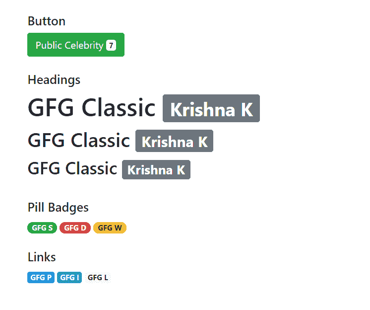
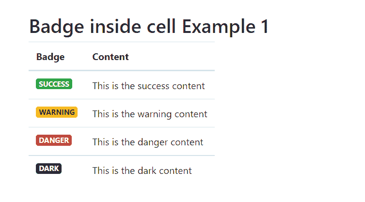
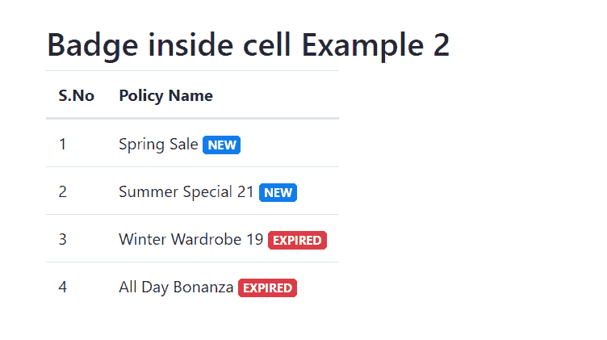

# 如何使用 Bootstrap 在表格单元格中放置徽章？

> 原文:[https://www . geeksforgeeks . org/如何使用引导程序将徽章放入表格单元格/](https://www.geeksforgeeks.org/how-to-put-a-badge-in-a-table-cell-using-bootstrap/)

在本文中，我们将学习如何使用 Bootstrap 在表格单元格中使用徽章。我们将首先学习如何使用引导徽章，然后将它们添加到表格的单元格中。

[**引导徽章:**](https://www.geeksforgeeks.org/bootstrap-badges-and-breadcrumbs/) 响应徽章包含在最新的引导版本中。徽章为任何内容添加了额外的信息，如计数或标签。徽章的样式为其目的提供了明显的暗示。这些徽章可以出现在句子、链接或按钮的顶端。下面的示例演示了引导徽章。

**示例:**这里我们将使用 noramll 形式的 bafges，在下一个示例中，我们将在表格单元格中使用它。

## 超文本标记语言

```
<!DOCTYPE html>
<html>

<head>
    <script src=
"https://code.jquery.com/jquery-3.4.1.slim.min.js">
    </script>
    <link rel="stylesheet" href=
"https://stackpath.bootstrapcdn.com/bootstrap/4.4.1/css/bootstrap.min.css">
    <script src=
"https://cdn.jsdelivr.net/npm/popper.js@1.16.0/dist/umd/popper.min.js">
    </script>
    <script src=
"https://stackpath.bootstrapcdn.com/bootstrap/4.4.1/js/bootstrap.min.js">
    </script>
</head>

<body class="container pt-4">
    <h5>Button</h5>

    <button type="button" class="btn btn-success">
        Public Celebrity
        <span class="badge badge-light">7</span>
    </button>
    <br><br>

    <h5>Headings</h5>
    <h1>GFG Classic
        <span class="badge badge-secondary">
            Krishna K
        </span>
    </h1>
    <h2>GFG Classic
        <span class="badge badge-secondary">
            Krishna K
        </span>
    </h2>
    <h3>GFG Classic
        <span class="badge badge-secondary">
            Krishna K
        </span>
    </h3>
    <br>
    <h5>Pill Badges</h5>
    <span class="badge badge-pill badge-success">
        GFG S
    </span>
    <span class="badge badge-pill badge-danger">
        GFG D
    </span>
    <span class="badge badge-pill badge-warning">
        GFG W
    </span>
    <br><br>
    <h5>Links</h5>
    <a href="#" class="badge badge-primary">
        GFG P
    </a>
    <a href="#" class="badge badge-info">
        GFG I
    </a>
    <a href="#" class="badge badge-light">
        GFG L
    </a>
</body>

</html>
```

**输出:**



**单元格中的徽章:**只需将包含徽章的分区包含在一个表格单元格中，徽章就可以放置在表格单元格中。这可以用来突出显示表格中的一些文本。以下示例演示了徽章在表格单元格中的使用。

**示例 1:** 在本例中，我们将在第一列显示徽章，在第二列显示其他文本。

## 超文本标记语言

```
<!DOCTYPE html>
<html>

<head>
    <script src="https://code.jquery.com/jquery-3.4.1.slim.min.js">
    </script>
    <link rel="stylesheet" href=
"https://stackpath.bootstrapcdn.com/bootstrap/4.4.1/css/bootstrap.min.css">
    <script src=
"https://cdn.jsdelivr.net/npm/popper.js@1.16.0/dist/umd/popper.min.js">
    </script>
    <script src=
"https://stackpath.bootstrapcdn.com/bootstrap/4.4.1/js/bootstrap.min.js">
    </script>
</head>

<body>
    <div class="container pt-4">
        <h2>Badge inside cell Example 1</h2>
        <table class="table table-responsive">
            <thead>
                <tr>
                    <th>Badge</th>
                    <th>Content</th>
                </tr>
            </thead>

            <tbody>
                <tr>
                    <td><span class="badge badge-success
                           text-uppercase">
                            Success
                        </span>
                    </td>
                    <td>This is the success content</td>
                </tr>
                <tr>
                    <td><span class="badge badge-warning 
                           text-uppercase">
                            Warning
                        </span>
                    </td>
                    <td>This is the warning content</td>
                </tr>
                <tr>
                    <td><span class="badge badge-danger 
                           text-uppercase">
                            Danger
                        </span>
                    </td>
                    <td>This is the danger content</td>
                </tr>
                <tr>
                    <td><span class="badge badge-dark
                           text-uppercase">
                            Dark
                        </span>
                    </td>
                    <td>This is the dark content</td>
                </tr>
            </tbody>
        </table>
    </div>
</body>

</html>
```

**输出:**



**示例 2:** 在本例中，我们将在表格单元格的内容旁边显示徽章。

## 超文本标记语言

```
<!DOCTYPE html>
<html>

<head>
    <script src="https://code.jquery.com/jquery-3.4.1.slim.min.js">
    </script>
    <link rel="stylesheet" href=
"https://stackpath.bootstrapcdn.com/bootstrap/4.4.1/css/bootstrap.min.css">
    <script src=
"https://cdn.jsdelivr.net/npm/popper.js@1.16.0/dist/umd/popper.min.js">
    </script>
    <script src=
"https://stackpath.bootstrapcdn.com/bootstrap/4.4.1/js/bootstrap.min.js">
    </script>
</head>

<body>
    <div class="container pt-4">
        <h2>Badge inside cell Example 2</h2>
        <table class="table table-responsive">
            <thead>
                <tr>
                    <th>S.No</th>
                    <th>Policy Name</th>
                </tr>
            </thead>
            <tbody>
                <tr>
                    <td>1</td>
                    <td>Spring Sale
                        <span class="badge badge-primary 
                           text-uppercase">new
                        </span>
                    </td>
                </tr>
                <tr>
                    <td>2</td>
                    <td>Summer Special 21
                        <span class="badge badge-primary
                           text-uppercase">new
                        </span>
                    </td>
                </tr>
                <tr>
                    <td>3</td>
                    <td>Winter Wardrobe 19
                        <span class="badge badge-danger 
                           text-uppercase">expired
                        </span>
                    </td>
                </tr>
                <tr>
                    <td>4</td>
                    <td>All Day Bonanza
                        <span class="badge badge-danger 
                           text-uppercase">expired
                        </span>
                    </td>
                </tr>
            </tbody>
        </table>
    </div>
</body>

</html>
```

**输出:**

