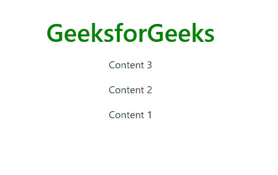

# 在 Bootstrap 4 中如何将物品放在彼此下方的伸缩盒中？

> 原文:[https://www . geeksforgeeks . org/如何将物品放在彼此下方-flex-box-in-bootstrap-4/](https://www.geeksforgeeks.org/how-to-put-items-underneath-each-other-flex-box-in-bootstrap-4/)

**bootstrap 4 中的 Flexbox:**从 bootstrap 3 到 Bootstrap 4 发生了惊人的变化，Bootstrap 4 可以利用 Flexbox 来处理内容的布局。FlexBox 布局模块使设计和灵活响应的布局结构变得更加容易。

**方法:**将柔性物品的**方向**放置在带有方向工具的柔性容器中。在大多数情况下，您可以排除水平类，因为浏览器默认为一行。在任何情况下，你都会遇到需要明确设置这种尊重的情况(比如响应性布局)。

以下示例代表了在弹性框中将项目放在彼此下方的不同方式。

**例 1:** 使用。**伸缩柱**类将物品放在彼此下方。

```html
<div class="d-flex flex-column"></div>
```

## 超文本标记语言

```html
<!DOCTYPE html>
<html lang="en">

<head>
  <!-- Required meta tags -->
  <meta charset="utf-8">
  <meta name="viewport" content=
    "width=device-width, initial-scale=1, 
    shrink-to-fit=no">

  <!-- Bootstrap CSS -->
  <link rel="stylesheet" href=
"https://stackpath.bootstrapcdn.com/bootstrap/4.5.0/css/bootstrap.min.css"
    integrity=
"sha384-9aIt2nRpC12Uk9gS9baDl411NQApFmC26EwAOH8WgZl5MYYxFfc+NcPb1dKGj7Sk"
    crossorigin="anonymous">
</head>

<body>
  <center>
    <h1 style="color: green">GeeksforGeeks</h1>
    <div class="d-flex flex-column bd-highlight mb-3">
      <div class="p-2 bd-highlight">Content 1</div>
      <div class="p-2 bd-highlight">Content 2</div>
      <div class="p-2 bd-highlight">Content 3</div>
    </div>
  </center>
</body>

</html>
```

**输出:**


**例 2:** 也可以使用**。flex-column-reverse** 类以相反的顺序将项目放在彼此下方。以相反的顺序显示伸缩盒。

## 超文本标记语言

```html
<!DOCTYPE html>
<html lang="en">

<head>

  <!-- Required meta tags -->
  <meta charset="utf-8">
  <meta name="viewport" content="width=device-width,
      initial-scale=1, shrink-to-fit=no">

  <!-- Bootstrap CSS -->
  <link rel="stylesheet" href=
"https://stackpath.bootstrapcdn.com/bootstrap/4.5.0/css/bootstrap.min.css"
    integrity=
"sha384-9aIt2nRpC12Uk9gS9baDl411NQApFmC26EwAOH8WgZl5MYYxFfc+NcPb1dKGj7Sk"
    crossorigin="anonymous">

  <title>flexbox | bootstrap4</title>
</head>

<body>
  <center>
    <h1 style="color: green">GeeksforGeeks</h1>
    <div class="d-flex flex-column-reverse bd-highlight mb-3">
      <div class="p-2 bd-highlight">Content 1</div>
      <div class="p-2 bd-highlight">Content 2</div>
      <div class="p-2 bd-highlight">Content 3</div>
    </div>
  </center>
</body>

</html>
```

**输出:**



**例 3:** 使用**弯曲方向:柱；**和**对齐-项目:居中；**你可以把物品放在中间，一个放在另一个下面。因此，如下所示，我们可以使用 bootstrap 4 中的 flexbox 将图标或图像放置在彼此下方。

## 超文本标记语言

```html
<!DOCTYPE html>
<html lang="en">

<head>
  <!-- Required meta tags -->
  <meta charset="utf-8">
  <meta name="viewport" content="width=device-width,
      initial-scale=1, shrink-to-fit=no">

  <!-- Bootstrap CSS -->
  <link rel="stylesheet" href=
"https://stackpath.bootstrapcdn.com/bootstrap/4.5.0/css/bootstrap.min.css"
    integrity=
"sha384-9aIt2nRpC12Uk9gS9baDl411NQApFmC26EwAOH8WgZl5MYYxFfc+NcPb1dKGj7Sk"
    crossorigin="anonymous">

  <script src="https://kit.fontawesome.com/577845f6a5.js"
    crossorigin="anonymous">
  </script>

  <title>flexbox | bootstrap4</title>

  <style type="text/css">
    .my_content {
      flex-grow: 1;
      display: flex;
      flex-direction: column;
      align-items: center;
      width: 100%;
    }

    .my_options {
      border: 1px solid green;
      display: flex;
      align-items: center;
      justify-content: center;
    }
  </style>
</head>

<body>
  <center>
    <h1 style="color: green">GeeksforGeeks</h1>
  </center>
  <div class="my_content">
    <div class="my_options col-xs-6">
      <div><i class="fa fa-hand-o-down fa-2x"
          aria-hidden="true"></i></div>
      <h3> fa-hand-o-down</h3>
    </div>
    <div class="my_options col-xs-6">
      <div><i class="fa fa-hand-o-left fa-2x" 
          aria-hidden="true"></i></div>
      <h3> fa-hand-o-left</h3>
    </div>
    <div class="my_options col-xs-6">
      <div><i class="fa fa-hand-o-right fa-2x" 
          aria-hidden="true"></i></div>
      <h3> fa-hand-o-right</h3>
    </div>
    <div class="my_options col-xs-6">
      <div><i class="fa fa-hand-o-up fa-2x" 
          aria-hidden="true"></i></div>
      <h3> fa-hand-o-up</h3>
    </div>
  </div>
</body>

</html>
```

**输出:**

