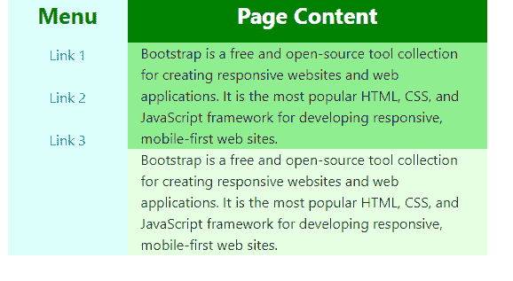

# 如何在 Bootstrap 的侧边栏中把两列一个在另一个下面？

> 原文:[https://www . geeksforgeeks . org/如何放置两列-一个在另一个下面-在侧边栏-在引导中/](https://www.geeksforgeeks.org/how-to-put-two-columns-one-below-other-in-sidebar-in-bootstrap/)

Bootstrap 由 Mark Otto 和 Jacob Thornton 开发，是一个免费的开源响应 CSS 框架，用于前端 web 开发。尽管 Bootstrap 5 Alpha 是 2020 年 6 月 16 日推出的 Bootstrap 的最新版本，但它仍处于开发阶段，因此大多数开发人员仍在继续使用 Bootstrap 4。Bootstrap 是一个 CSS 框架，专注于简化网页的开发。它主要用于为用户创建交互界面。Bootstrap 与许多布局、组件和实用程序捆绑在一起。该列是 Bootstrap 中网格布局的一部分。Bootstrap 4 中的网格系统是动态且流动的。网格布局有 12 列，由于网格系统是建立在 flexbox 上的，它完全响应。侧边栏是 Bootstrap 的另一个组件。侧栏支持侧面导航。根据需要，边栏可以是左侧的，也可以是右侧的。在本文中，我们将演示左侧边栏以及一个在另一个下面的栏。

**第一种方法:**在第一种方法中，我们将演示一个侧边栏，该侧边栏始终打开并固定在页面的左侧。代码包含嵌套的行和列，以获得所需的输出。

```html
<!DOCTYPE html>
<html>

<head>
    <link rel="stylesheet" href=
"https://stackpath.bootstrapcdn.com/bootstrap/4.5.2/css/bootstrap.min.css"
        integrity=
"sha384-JcKb8q3iqJ61gNV9KGb8thSsNjpSL0n8PARn9HuZOnIxN0hoP+VmmDGMN5t9UJ0Z"
        crossorigin="anonymous">
</head>

<body>
    <!-- Main container holds the 
        entire content -->
    <div class=container>
        <!-- Row -->
        <div class="row">
            <!-- This div takes 3 out of
                 12 columns in the grid -->
            <div class="col-3" style="background-color: #DEFFFB">
                <!--This row contains the col which
                shows the column heading-->
                <div class="row">
                    <!-- this div takes 12 out of
                      12 columns in the grid -->
                    <div class="col" style="text-align: center;
                            font-weight: bold;
                            font-size: 25px; 
                            color: green">Menu
                    </div>
                </div>
                <!-- This row contains the menu items-->
                <div class="row">
                    <div class="col" style="text-align: center;
                            padding: 15px;">
                        <a href="#">Link 1</a><br> <br>
                        <a href="#">Link 2</a><br><br>
                        <a href="#">Link 3</a>
                    </div>
                </div>

            </div>
            <!--This column takes 9 out of 12 
            columns available-->
            <div class="col-9">
                <div class="row" style="height: 50px">
                    <div class="col" style="text-align: center;
                            background-color: green;
                            font-weight: bold;
                            font-size: 25px; 
                            color: white">Page Content
                    </div>
                </div>
                <!--This row contains the first column-->
                <div class="row">
                    <div class="col" style="background-color: lightgreen;">
                        Bootstrap is a free and open-source
                        tool collection for creating responsive
                        websites and web applications.
                        It is the most popular HTML, CSS,
                        and JavaScript framework for developing
                        responsive, mobile-first web sites.
                    </div>
                </div>
                <!--This row contains the second column-->
                <div class="row">
                    <div class="col" style="background-color: #E6FFE3 ;">
                        Bootstrap is a free and open-source tool
                        collection for creating responsive websites
                        and web applications. It is the most popular
                        HTML, CSS, and JavaScript framework for
                        developing responsive, mobile-first web sites.
                    </div>
                </div>
            </div>
        </div>
    </div>
</body>

</html>            
```

**输出**


**第二种方法:**在这种方法中，侧边栏并不总是保持打开。侧边栏是可折叠的，当侧边栏打开时，页面内容会向右移动。这种设计让主要内容占据了网页上的整个空间，只有在需要时才会打开导航面板。这标志着高效的空间管理。在这种方法中，当页面加载时，边栏是隐藏的。当用户点击汉堡包按钮时，side_open() javascript 函数被触发，边栏打开。侧边栏现在可见，并有一个按钮来关闭它。当点击关闭按钮时，side_close() javascript 函数被触发，边栏关闭。在打开状态下，侧边栏占据 25%的页面宽度，而在关闭状态下，它占据 0%的页面宽度。因此，这两列会相应地进行调整。

```html
<!-- Write HTML code here -->
<!DOCTYPE html>
<html>

<head>
    <link rel="stylesheet" href=
"https://stackpath.bootstrapcdn.com/bootstrap/4.5.2/css/bootstrap.min.css"
        integrity=
"sha384-JcKb8q3iqJ61gNV9KGb8thSsNjpSL0n8PARn9HuZOnIxN0hoP+VmmDGMN5t9UJ0Z"
        crossorigin="anonymous" />

    <!-- JS, Popper.js, jquery and 
        jQuery autocomplete -->
    <script src="https://code.jquery.com/jquery-3.5.1.slim.min.js"
        integrity=
"sha384-DfXdz2htPH0lsSSs5nCTpuj/zy4C+OGpamoFVy38MVBnE+IbbVYUew+OrCXaRkfj"
        crossorigin="anonymous">
    </script>

    <script src=
"https://cdn.jsdelivr.net/npm/popper.js@1.16.1/dist/umd/popper.min.js"
        integrity=
"sha384-9/reFTGAW83EW2RDu2S0VKaIzap3H66lZH81PoYlFhbGU+6BZp6G7niu735Sk7lN"
        crossorigin="anonymous">
    </script>

    <script src=
"https://stackpath.bootstrapcdn.com/bootstrap/4.5.2/js/bootstrap.min.js"
        integrity=
"sha384-B4gt1jrGC7Jh4AgTPSdUtOBvfO8shuf57BaghqFfPlYxofvL8/KUEfYiJOMMV+rV"
        crossorigin="anonymous">
    </script>
</head>

<body>
    <!--Main container that contains the 
            main content-->
    <div class="container">
        <!--Main row -->
        <div class="row">
            <!--Display is set to none so that it 
                    remains hidden when page loads-->
            <div class="col-3" id="mySidebar"
                style="display: none; 
                    background-color: #fbdeff;" >

                <!--Button is used to close the sidebar-->
                <button onclick="side_close()">
                    Close ×
                </button>

                <!--Menu items-->
                <h1>Menu</h1>
                <a href="#">Link 1</a><br />
                <br />
                <a href="#">Link 2</a><br />
                <br />
                <a href="#">Link 3</a>
            </div>

            <!-- Main page content -->
            <div class="col-9" id="main">

                <!-- Button used to open the sidebar -->
                <button id="openNav" onclick="side_open()">☰</button>
                <div class="row" style="background-color: #c2ff95;">
                    <div class="col">
                        <h1>Page Content</h1>
                    </div>
                </div>
                <div class="row" style="background-color: #deffe2;">
                    <div class="col">
                        Bootstrap is a free and open-source
                        tool collection for creating
                        responsive websites and web
                        applications. It is the most
                        popular HTML, CSS, and JavaScript
                        framework for developing responsive,
                        mobile-first web
                        sites.
                    </div>
                </div>
                <div class="row" style="background-color: #b8b7f9;">
                    <div class="col">
                        Bootstrap is a free and open-source
                        tool collection for creating
                        responsive websites and web
                        applications. It is the most
                        popular HTML, CSS, and JavaScript
                        framework for developing responsive,
                        mobile-first web
                        sites.
                    </div>
                </div>
            </div>
        </div>
    </div>

    <!-- JavaScript functions to control the sidebar-->

    <script>
        // JavaScript functions to open the sidebar
        function side_open() {

            /* Sidebar takes 25% of the total width
            of main container in open state */
            document.getElementById(
                "mySidebar").style.width = "25%";
            document.getElementById(
                "mySidebar").style.display = "block";
            document.getElementById(
                "openNav").style.display = "none";
        }

        // JavaScript functions to close the sidebar
        function side_close() {

            // Sidebar takes 0% of the total width
            // of main container in open state
            document.getElementById(
                "main").style.marginLeft = "0%";
            // Visibility is hidden
            document.getElementById(
                "mySidebar").style.display = "none";
            document.getElementById(
                "openNav").style.display = "inline-block";
        }
    </script>
</body>

</html>
```

**输出:**

