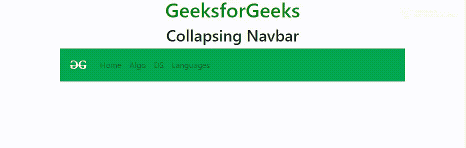

# 在 Bootstrap 中点击导航标签外，如何移除活动导航标签？

> 原文:[https://www . geesforgeks . org/如何删除-活动-导航-标签-单击时-导航外-标签-引导/](https://www.geeksforgeeks.org/how-to-remove-active-nav-tab-when-click-outside-of-nav-tab-in-bootstrap/)

Bootstrap 有一个名为**“折叠导航条-折叠”**的类，当用户改变屏幕分辨率时折叠导航条。代码底部的 java 脚本和它一起触发折叠菜单，这样当用户单击菜单的汉堡包图标并导航到所需的链接时，它会在单击后再次折叠菜单。滚动事件仅适用于可滚动元素，也适用于浏览器窗口。它基本上附加了一个函数来运行，该函数表示当滚动事件发生时，导航条应该折叠，这里，它是用户对导航条上不同链接的导航。

**示例:**

```html
<!DOCTYPE html>
<html lang="en">

<head>
    <title>Navigation Bar</title>

    <meta charset="utf-8">
    <meta name="viewport"
        content="width=device-width, initial-scale=1">

    <link rel="stylesheet"
        href=
"https://maxcdn.bootstrapcdn.com/bootstrap/4.3.1/css/bootstrap.min.css">

    <script src=
"https://ajax.googleapis.com/ajax/libs/jquery/3.3.1/jquery.min.js">
    </script>

    <script src=
"https://cdnjs.cloudflare.com/ajax/libs/popper.js/1.14.7/umd/popper.min.js">
    </script>

    <script src=
"https://maxcdn.bootstrapcdn.com/bootstrap/4.3.1/js/bootstrap.min.js">
    </script>
</head>

<body>

    <div class="container">

        <h1 style="color:green;text-align:center;"> 
            GeeksforGeeks 
        </h1>

        <h2 style="text-align:center;">Collapsing Navbar</h2>

        <nav class="navbar navbar-expand-sm bg-success navbar-light">

            <!-- Brand/logo -->
            <a class="navbar-brand" href="#">
                
            </a>

            <button class="navbar-toggler"
                    type="button"
                    data-toggle="collapse"
                    data-target="#collapse_Navbar">

                <span class="navbar-toggler-icon"></span>
            </button>

            <div class="collapse navbar-collapse"
                id="collapse_Navbar">
                <ul class="navbar-nav">
                    <li class="nav-item active">
                        <a class="nav-link"
                        data-toggle="tab"
                        href="#home">
                        Home
                    </a>
                    </li>

                    <li class="nav-item">
                        <a class="nav-link"
                        data-toggle="tab"
                        href="#algo">
                        Algo
                    </a>
                    </li>

                    <li class="nav-item">
                        <a class="nav-link"
                        data-toggle="tab"
                        href="#ds">
                        DS
                    </a>
                    </li>

                    <li class="nav-item">
                        <a class="nav-link"
                        data-toggle="tab"
                        href="#lang">
                        Languages
                    </a>
                    </li>
                </ul>
            </div>
        </nav>
    </div>

    <!-- Tab panes -->
    <div class="tab-content">
        <div class="tab-pane"
            id="home"
            role="tabpanel">A</div>
        <div class="tab-pane"
            id="algo"
            role="tabpanel">B</div>
        <div class="tab-pane"
            id="ds"
            role="tabpanel">C</div>
        <div class="tab-pane"
            id="lang"
            role="tabpanel">D</div>
    </div>

    <script>
$(document).on('click', '.nav-link.active', function() {
  var href = $(this).attr('href').substring(1);
  //alert(href);
  $(this).removeClass('active');
  $('.tab-pane[id="' + href + '"]').removeClass('active');

});
$(document).mouseup(function(e) {
    var container = $("#tablist"); // target ID or class
    // if the target of the click isn't the container nor a descendant of the container
    if (!container.is(e.target) && container.has(e.target).length === 0) {
        // get Event here
        $('.active').removeClass('active');
    }
});
    </script>
</body>

</html>                    
```

**输出:**
