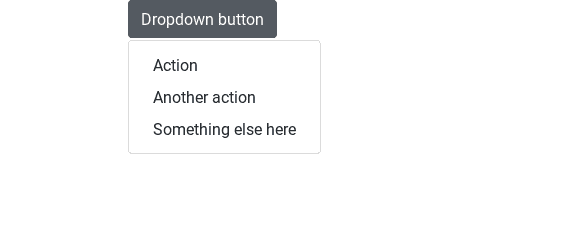
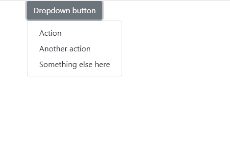

# 如何在 Bootstrap 中移除下拉箭头？

> 原文:[https://www . geesforgeks . org/如何删除引导中的下拉箭头/](https://www.geeksforgeeks.org/how-to-remove-arrow-in-dropdown-in-bootstrap/)

下拉列表是任何 web 应用程序不可或缺的重要组件之一。Bootstrap 为此组件提供了自己的交互式版本。引导下拉菜单通过点击来切换，而不是像有意的设计决策那样悬停。要在 web 项目中使用 Dropdowns，请在项目中包含 Popper.js。

每个引导下拉按钮或链接在 CSS 中的选择器后都有一个**:。**::在**之后选择器通常用于在元素内容之后插入一些文本。在这种情况下，内容是一个下拉箭头。要删除它，只需将内容转到*“无”*。**

**语法:**

```
.my-dropdown-toggle::after {
    content: none;
}

```

您可以使用此功能在顶部导航栏中创建导航菜单。这里有一个完整的例子来说明如何做到这一点。
**例 1:**

```
<!DOCTYPE html>
<html>

<head>
    <meta charset="utf-8">
    <meta name="viewport" 
          content=
"width=device-width, initial-scale=1, shrink-to-fit=no">

    <link rel="stylesheet"
          href=
"https://maxcdn.bootstrapcdn.com/bootstrap/4.0.0/css/bootstrap.min.css" />

    <title>Remove Dropdown Arrow</title>

    <style>
        .dropdown-toggle::after {
            content: none;
        }
    </style>
</head>

<body>

    <div class="container">
        <div class="dropdown">
            <button class="btn btn-secondary dropdown-toggle"
                    type="button"
                    id="dropdownMenuButton" 
                    data-toggle="dropdown" 
                    aria-haspopup="true"
                    aria-expanded="false">
                Dropdown button
            </button>

            <div class="dropdown-menu" 
                 aria-labelledby="dropdownMenuButton">
                <a class="dropdown-item" href="#">
                  Action
              </a>
                <a class="dropdown-item" href="#">
                  Another action
              </a>
                <a class="dropdown-item" href="#">
                  Something else here
              </a>
            </div>
        </div>
    </div>

    <script src=
"https://code.jquery.com/jquery-3.2.1.slim.min.js">
  </script>
    <script src=
"https://cdnjs.cloudflare.com/ajax/libs/popper.js/1.12.9/umd/popper.min.js">
 </script>
    <script src=
"https://maxcdn.bootstrapcdn.com/bootstrap/4.0.0/js/bootstrap.min.js">
  </script>
</body>

</html>
```

**输出:**


**示例 2:** 删除下拉箭头，并对**类名**进行一些更改。

```
<!DOCTYPE html>
<html>

<head>
    <meta charset="utf-8">
    <meta name="viewport" 
          content=
"width=device-width, initial-scale=1, shrink-to-fit=no">

    <link rel="stylesheet" 
          href=
"https://maxcdn.bootstrapcdn.com/bootstrap/4.0.0/css/bootstrap.min.css" />

    <title>Remove Dropdown Arrow</title>

</head>

<body>

    <div class="container">
        <div class="dropdown">
            <button class="btn btn-secondary"
                    type="button" 
                    id="dropdownMenuButton" 
                    data-toggle="dropdown" 
                    aria-haspopup="true" 
                    aria-expanded="false">
                Dropdown button
            </button>

            <div class="dropdown-menu" 
                 aria-labelledby="dropdownMenuButton">
                <a class="dropdown-item" href="#">
                  Action
              </a>
                <a class="dropdown-item" href="#">
                  Another action
              </a>
                <a class="dropdown-item" href="#">
                  Something else here
              </a>
            </div>
        </div>
    </div>

    <script src=
"https://code.jquery.com/jquery-3.2.1.slim.min.js">
  </script>
    <script src=
"https://cdnjs.cloudflare.com/ajax/libs/popper.js/1.12.9/umd/popper.min.js">
  </script>
    <script src=
"https://maxcdn.bootstrapcdn.com/bootstrap/4.0.0/js/bootstrap.min.js">
  </script>
</body>

</html>
```

**输出:**
