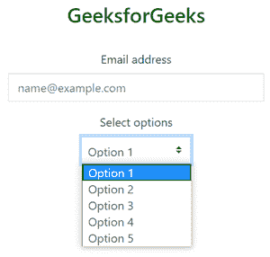

# 如何使用 Bootstrap 从 Select 标记中删除边框半径？

> 原文:[https://www . geeksforgeeks . org/如何从选择标记中删除边界半径-使用引导/](https://www.geeksforgeeks.org/how-to-remove-border-radius-from-select-tag-using-bootstrap/)

[**<选择>标签:**](https://www.geeksforgeeks.org/html-select-tag/)<选择>组件用于制作下拉列表。<选择表单中最常用的>组件，收集用户输入。提交表单后，需要 name 属性来引用表单数据(如果排除 name 属性，则不会提交下拉列表中的任何数据)。需要 id 属性来将下拉列表与名称相关联。 [<选项>标记<内的](https://www.geeksforgeeks.org/html-option-tag/)选择>组件表征下拉列表内的可访问选项。

**语法:**

```html
<select>
  <option>Option1</option>
  <option>Option2</option>
      .
      .
      .
  <option>Option n</option>
 </select>

```

**属性:**

*   **自动对焦:**表示当页面加载时，下拉列表应该随之对焦。(值:自动对焦)
*   **禁用:**表示下拉列表应该禁用。(值:已禁用)
*   **表单:**表征下拉列表中有位置的表单。(值:form_id)
*   **多个:**表示可以一次选择多个选项。(值:倍数)
*   **名称:**表示下拉列表的名称。(值:名称)
*   **必选:**表示要求用户在最近提交表单的某个时间选择一个值。(值:必需)
*   **大小:**表示下拉列表中可见选项的数量。(值:数字)

我们可以通过以下两种方法从选择标签中删除边框半径:

**方法一:使用 CSS:** 使用一些 CSS 属性移除边框半径。

**示例:**

## 超文本标记语言

```html
<!DOCTYPE html>
<html lang="en">

<head>
  <title>
    Remove border radius from
    Select tag in css
  </title>

  <style type="text/css">

    /* To remove border radius */
    select {
      height: 20px;
      -webkit-border-radius: 0;
      border: 0;
      outline: 1px solid #ccc;
      outline-offset: -1px;
    }
  </style>
</head>

<body>
  <center>
    <h3 style="color: green"><br />
      GeeksforGeeks
    </h3><br />

    <select>
      <option>Option1</option>
      <option>Option2</option>
      <option>Option3</option>
      <option>Option4</option>
      <option>Option5</option>
    </select>
  </center>
</body>

</html>
```

**输出:**


**方法 2:使用 Bootstrap:**Chrome 的用户代理样式表为<选择的>组件的所有角落赋予 5px 的边框半径。自定义选择菜单需要一个自定义类。自定义-选择以触发自定义样式。自定义样式仅限于选择的起始外观，并且由于浏览器的限制，不能更改选项的外观。

**示例:**

## 超文本标记语言

```html
<!DOCTYPE html>
<html lang="en">

<head>
  <!-- Required meta tags -->
  <meta charset="utf-8">
  <meta name="viewport" content=
    "width=device-width, initial-scale=1, 
    shrink-to-fit=no">

  <!-- Bootstrap CSS -->
  <link rel="stylesheet" href=
"https://stackpath.bootstrapcdn.com/bootstrap/4.5.0/css/bootstrap.min.css"
    integrity=
"sha384-9aIt2nRpC12Uk9gS9baDl411NQApFmC26EwAOH8WgZl5MYYxFfc+NcPb1dKGj7Sk"
    crossorigin="anonymous">

  <script src="https://kit.fontawesome.com/577845f6a5.js" 
    crossorigin="anonymous">
  </script>

  <!-- Optional JavaScript -->
  <!-- jQuery first, then Popper.js, 
    then Bootstrap JS -->
  <script src="https://code.jquery.com/jquery-3.5.1.slim.min.js"
    integrity=
"sha384-DfXdz2htPH0lsSSs5nCTpuj/zy4C+OGpamoFVy38MVBnE+IbbVYUew+OrCXaRkfj"
    crossorigin="anonymous">
  </script>

  <script src=
"https://cdn.jsdelivr.net/npm/popper.js@1.16.0/dist/umd/popper.min.js"
    integrity=
"sha384-Q6E9RHvbIyZFJoft+2mJbHaEWldlvI9IOYy5n3zV9zzTtmI3UksdQRVvoxMfooAo"
    crossorigin="anonymous">
  </script>

  <script src=
"https://stackpath.bootstrapcdn.com/bootstrap/4.5.0/js/bootstrap.min.js"
    integrity=
"sha384-OgVRvuATP1z7JjHLkuOU7Xw704+h835Lr+6QL9UvYjZE3Ipu6Tp75j7Bh/kR0JKI"
    crossorigin="anonymous">
  </script>

  <title>
    Remove border radius from 
    Select tag in bootstrap
  </title>

  <style type="text/css">

    /* For default browser setting */
    select:not([multiple]) {
      -webkit-appearance: none;
      -moz-appearance: none;
      padding: .5em;
      padding-right: 1.5em
    }

    /* To remove default border radius */
    #mySelect {
      border-radius: 0
    }

    /* Optional styling */
    option {
      font-size: 1.1rem !important;
      font-weight: bold;
      text-transform: uppercase !important;
      color: #013208 !important;
    }
  </style>
</head>

<body>
  <center>
    <br />
    <h3 style="color: green"><br />
      GeeksforGeeks
    </h3><br />

    <select id="mySelect" class="custom-select"
      style="width:150px;
        background-color: lightgreen;
        font-weight:bold;color:#013208;">
      <option value="1">G</option>
      <option value="2">E</option>
      <option value="3">E</option>
      <option value="4">K</option>
      <option value="5">S</option>
      <option value="6">F</option>
      <option value="7">O</option>
      <option value="8">R</option>
      <option value="9">G</option>
      <option value="10">E</option>
      <option value="11">E</option>
      <option value="12">K</option>
      <option value="13">S</option>
    </select>
  </center>
</body>

</html>
```

**输出:**


我们可以使用 select 标记和。使用表单控件自定义选择类，如下所示

**示例:**

## 超文本标记语言

```html
<!DOCTYPE html>
<html lang="en">

<head>
  <!-- Required meta tags -->
  <meta charset="utf-8">
  <meta name="viewport" content=
    "width=device-width, initial-scale=1, 
    shrink-to-fit=no">

  <!-- Bootstrap CSS -->
  <link rel="stylesheet" href=
"https://stackpath.bootstrapcdn.com/bootstrap/4.5.0/css/bootstrap.min.css"
    integrity=
"sha384-9aIt2nRpC12Uk9gS9baDl411NQApFmC26EwAOH8WgZl5MYYxFfc+NcPb1dKGj7Sk"
    crossorigin="anonymous">

  <script src="https://kit.fontawesome.com/577845f6a5.js" 
    crossorigin="anonymous">
  </script>

  <!-- Optional JavaScript -->
  <!-- jQuery first, then Popper.js, 
       then Bootstrap JS -->
  <script src="https://code.jquery.com/jquery-3.5.1.slim.min.js"
    integrity=
"sha384-DfXdz2htPH0lsSSs5nCTpuj/zy4C+OGpamoFVy38MVBnE+IbbVYUew+OrCXaRkfj"
    crossorigin="anonymous">
  </script>

  <script src=
"https://cdn.jsdelivr.net/npm/popper.js@1.16.0/dist/umd/popper.min.js"
    integrity=
"sha384-Q6E9RHvbIyZFJoft+2mJbHaEWldlvI9IOYy5n3zV9zzTtmI3UksdQRVvoxMfooAo"
    crossorigin="anonymous">
  </script>

  <script src=
"https://stackpath.bootstrapcdn.com/bootstrap/4.5.0/js/bootstrap.min.js"
    integrity=
"sha384-OgVRvuATP1z7JjHLkuOU7Xw704+h835Lr+6QL9UvYjZE3Ipu6Tp75j7Bh/kR0JKI"
    crossorigin="anonymous">
  </script>

  <title>
    Remove border radius from 
    Select tag in bootstrap
  </title>

  <style type="text/css">

    /* For default browser setting */
    select:not([multiple]) {
      -webkit-appearance: none;
      -moz-appearance: none;
      padding: .5em;
      padding-right: 1.5em
    }

    /* To remove default border radius */
    #mySelect {
      border-radius: 0
    }
  </style>
</head>

<body>
  <center>
    <br />
    <h3 style="color: green"><br />
      GeeksforGeeks
    </h3><br />

    <form>
      <div class="form-group">
        <label for="mySelect">Email address</label>
        <input type="email" class="form-control" 
              id="mySelect" style="width:350px;" 
              placeholder="name@example.com">
      </div>
      <div class="form-group">
        <label for="mySelect">
          Select options
        </label><br />

        <select class="form-control custom-select"
          style="width:150px;" id="mySelect">
          <option>Option 1</option>
          <option>Option 2</option>
          <option>Option 3</option>
          <option>Option 4</option>
          <option>Option 5</option>
        </select>
      </div>
    </form>
  </center>
</body>

</html>
```

**输出:**

