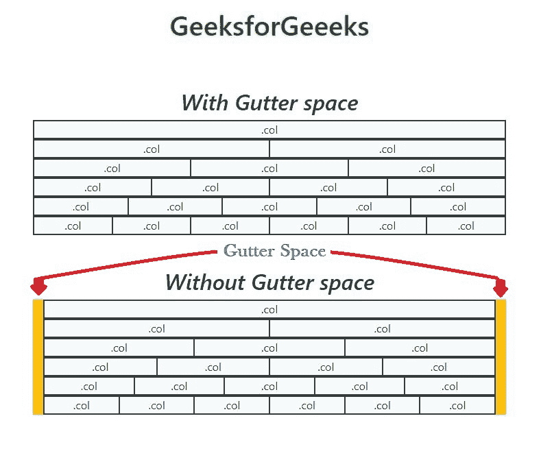
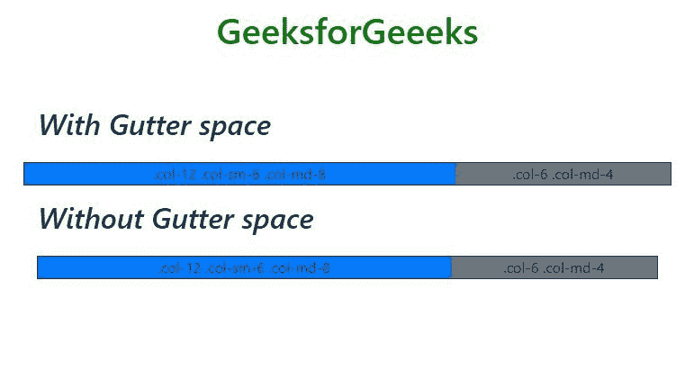
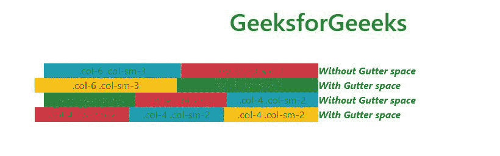

# 如何在 Bootstrap 中移除特定 div 的檐槽空间？

> 原文:[https://www . geeksforgeeks . org/如何移除引导中特定分区的檐槽空间/](https://www.geeksforgeeks.org/how-to-remove-gutter-space-for-a-specific-div-in-bootstrap/)

要删除特定 div 的檐槽空间，首先我们必须知道什么是檐槽空间。在 Bootstrap 4 中，网格系统中有 12 列，每列之间有一个小空间，该空间称为檐槽空间。檐槽空间的宽度为 30px(一列每侧 15px)。下面的方法将解释清楚。

**进场:**

*   By default, Bootstrap 4 has class=”no-gutters” to remove gutter spaces of any specific div. The following image shows the highlighted gutter space and space between columns on bootstrap 4 12 column grid system. You can even modify gutter width by reducing 15px width of gutter space between each columns.

    

**示例 1:** 下面的示例说明了如何移除特定 div 的檐槽空间。

```html
<!DOCTYPE html>
<html lang="en">

<head>
    <meta charset="utf-8">
    <meta name="viewport" content="width=device-width, initial-scale=1">
    <link rel="stylesheet" href=
"https://maxcdn.bootstrapcdn.com/bootstrap/4.3.1/css/bootstrap.min.css">
    <script src=
"https://ajax.googleapis.com/ajax/libs/jquery/3.4.1/jquery.min.js">
    </script>
    <script src=
"https://cdnjs.cloudflare.com/ajax/libs/popper.js/1.14.7/umd/popper.min.js">
    </script>
    <script src=
"https://maxcdn.bootstrapcdn.com/bootstrap/4.3.1/js/bootstrap.min.js">
    </script>
</head>

<body>
    <center>
        <div class="container">
            <h1 style="color:green;padding:13px;">
              GeeksforGeeeks
            </h1>
            <br>
            <div class="row p-3">
                <h2><em>With Gutter space</em></h2>
            </div>
            <div class="row border border-dark ">
                <div class="col-12 col-sm-6 col-md-8 bg-primary ">
                    .col-12 .col-sm-6 .col-md-8
                </div>
                <div class="col-6 col-md-4 bg-secondary">
                    .col-6 .col-md-4
                </div>
            </div>

            <div class="row p-3">
                <h2><em>Without Gutter space</em></h2>
            </div>
            <div class="row no-gutters border border-dark">
                <div class="col-12 col-sm-6 col-md-8 bg-primary ">
                    .col-12 .col-sm-6 .col-md-8
                </div>
                <div class="col-6 col-md-4 bg-secondary">
                    .col-6 .col-md-4
                </div>
            </div>
        </div>
    </center>
</body>

</html>
```

**输出:**


**示例 2:** 下面的示例说明了如何仅为特定 div 移除檐槽空间。

```html
<!DOCTYPE html>
<html lang="en">

<head>
    <meta charset="utf-8">
    <meta name="viewport" 
          content="width=device-width, initial-scale=1">
    <link rel="stylesheet" href=
"https://maxcdn.bootstrapcdn.com/bootstrap/4.3.1/css/bootstrap.min.css">
    <script src=
"https://ajax.googleapis.com/ajax/libs/jquery/3.4.1/jquery.min.js">
    </script>
    <script src=
"https://cdnjs.cloudflare.com/ajax/libs/popper.js/1.14.7/umd/popper.min.js">
    </script>
    <script src=
"https://maxcdn.bootstrapcdn.com/bootstrap/4.3.1/js/bootstrap.min.js">
    </script>
</head>

<body>
    <center>
        <div class="container">
            <h1 style="color:green;padding:13px;">
              GeeksforGeeeks
            </h1>
            <br>

            <div class="container">

                <div class= "row no-gutters">
                    <div class= "col-6 col-sm-3 bg-info">
                        .col-6 .col-sm-3
                    </div>
                    <div class= "col-6 col-sm-3 bg-danger">
                        .col-6 .col-sm-3
                    </div>
                    <b><em>Without Gutter space</em></b>
                </div>

                <div class="row ">
                    <div class= "col-6 col-sm-3 bg-warning">
                        .col-6 .col-sm-3 
                    </div>
                    <div class= "col-6 col-sm-3 bg-success">
                        .col-6 .col-sm-3 
                    </div>
                    <b><em>With Gutter space</em></b>
                </div>

                <div class= "row no-gutters">
                    <div class= "col-4 col-sm-2 bg-success">
                        .col-4 .col-sm-2 
                    </div>
                    <div class= "col-4 col-sm-2 bg-danger ">
                        .col-4 .col-sm-2 
                    </div>
                    <div class= "col-4 col-sm-2 bg-info">
                        .col-4 .col-sm-2
                    </div>
                    <b><em>Without Gutter space</em></b>
                </div>

                <div class= "row ">
                    <div class= "col-4 col-sm-2 bg-danger">
                        .col-4 .col-sm-2 
                    </div>
                    <div class= "col-4 col-sm-2 bg-info">
                        .col-4 .col-sm-2 
                    </div>
                    <div class= "col-4 col-sm-2 bg-warning">
                        .col-4 .col-sm-2
                    </div>
                    <b><em>With Gutter space</em></b>
                </div>
            </div>
        </div>
    </center>
</body>

</html>
```

**输出:**


**参考:**T2】https://getbootstrap.com/docs/4.3/layout/grid/#no-gutters