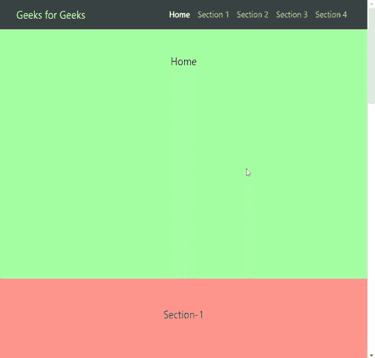
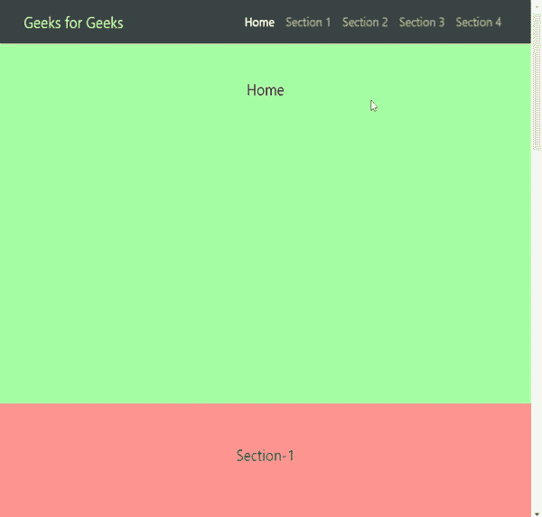

# 如何从 bootstrap 设置活动类到 nav 菜单？

> 原文:[https://www . geesforgeks . org/如何从引导程序设置活动类到导航菜单/](https://www.geeksforgeeks.org/how-to-set-active-class-to-nav-menu-from-bootstrap/)

要通过滚动或点击导航链接将活动类别动态设置到导航菜单中，需要根据网页的位置在每个部分设置*活动*类别。为了添加方法和变量，使用了 JavaScript。要执行某些操作，可以在某些事件上调用这些函数，例如单击和滚动。

**示例:**这个示例实现了上面提到的方法。

## 超文本标记语言

```html
<!doctype html>
<html lang="en">

<head>
    <!-- Required meta tags -->
    <meta charset="utf-8">
    <meta name="viewport" content="width=device-width, 
        initial-scale=1, shrink-to-fit=no">

    <!-- Bootstrap CSS -->
    <link rel="stylesheet" href=
"https://stackpath.bootstrapcdn.com/bootstrap/4.3.1/css/bootstrap.min.css"
        integrity=
"sha384-ggOyR0iXCbMQv3Xipma34MD+dH/1fQ784/j6cY/iJTQUOhcWr7x9JvoRxT2MZw1T"
        crossorigin="anonymous">

    <!-- jQuery first, then Popper.js, then Bootstrap JS -->
    <script src="https://code.jquery.com/jquery-3.3.1.slim.min.js" 
        integrity=
"sha384-q8i/X+965DzO0rT7abK41JStQIAqVgRVzpbzo5smXKp4YfRvH+8abtTE1Pi6jizo"
        crossorigin="anonymous">
    </script>

    <script src=
"https://cdnjs.cloudflare.com/ajax/libs/popper.js/1.14.7/umd/popper.min.js"
        integrity=
"sha384-UO2eT0CpHqdSJQ6hJty5KVphtPhzWj9WO1clHTMGa3JDZwrnQq4sF86dIHNDz0W1"
        crossorigin="anonymous">
    </script>

    <script src=
"https://stackpath.bootstrapcdn.com/bootstrap/4.3.1/js/bootstrap.min.js"
        integrity=
"sha384-JjSmVgyd0p3pXB1rRibZUAYoIIy6OrQ6VrjIEaFf/nJGzIxFDsf4x0xIM+B07jRM"
        crossorigin="anonymous">
    </script>

    <style>
        html {
            /*For smooth scrolling behavior*/
            scroll-behavior: smooth;
        }

        #home,
        #section1,
        #section2,
        #section3,
        #section4 {
            height: 70vh;
            text-align: center;
            font-size: 20px;
            padding-top: 50px;
        }

        #home {
            background-color: lightgreen;
        }

        #section1 {
            background-color: lightcoral;
        }

        #section2 {
            background-color: cyan;
        }

        #section3 {
            background-color: lightsalmon;
        }

        #section4 {
            background-color: lightseagreen;
        }
    </style>
</head>

<body>
    <!-- Creating Nav Bar  -->
    <section id="navigation">
        <nav class="navbar navbar-expand-sm 
            navbar-dark bg-dark fixed-top">
            <div class="container">
                <a class="navbar-brand" href="#" 
                    style="color:greenyellow;">
                    Geeks for Geeks
                </a>

                <div class=" navbar-default">
                    <ul class="navbar-nav ml-auto">
                        <li class="nav-item ">

                            <!--Initially active class 
                                is set to home link -->
                            <a class="nav-link active" href="#">
                                Home
                            </a>
                        </li>

                        <li class="nav-item">
                            <a class="nav-link" href="#section1">
                                Section 1
                            </a>
                        </li>

                        <li class="nav-item">
                            <a class="nav-link" href="#section2">
                                Section 2
                            </a>
                        </li>

                        <li class="nav-item">
                            <a class="nav-link" href="#section3">
                                Section 3
                            </a>
                        </li>

                        <li class="nav-item">
                            <a class="nav-link" href="#section4">
                                Section 4
                            </a>
                        </li>
                    </ul>
                </div>
            </div>
        </nav>

        <br><br>
        <!-- creating sections -->
        <section id="home" class="page-section">
            Home </section>
        <section id="section1" class="page-section">
            Section-1 </section>
        <section id="section2" class="page-section">
            Section-2 </section>
        <section id="section3" class="page-section">
            Section-3 </section>
        <section id="section4" class="page-section">
            Section-4 </section>

        <!-- JavaScript code -->
        <script>

            /* Code for changing active 
            link on clicking */
            var btns = 
                $("#navigation .navbar-nav .nav-link");

            for (var i = 0; i < btns.length; i++) {
                btns[i].addEventListener("click",
                                      function () {
                    var current = document
                        .getElementsByClassName("active");

                    current[0].className = current[0]
                        .className.replace(" active", "");

                    this.className += " active";
                });
            }

            /* Code for changing active 
            link on Scrolling */
            $(window).scroll(function () {
                var distance = $(window).scrollTop();
                $('.page-section').each(function (i) {

                    if ($(this).position().top 
                        <= distance + 250) {

                            $('.navbar-nav a.active')
                                .removeClass('active');

                            $('.navbar-nav a').eq(i)
                                .addClass('active');
                    }
                });
            }).scroll();
        </script>
    </section>
</body>

</html>
```

**输出:**

*   **滚动网页时:**
    
*   **同时点击导航链接:**
    