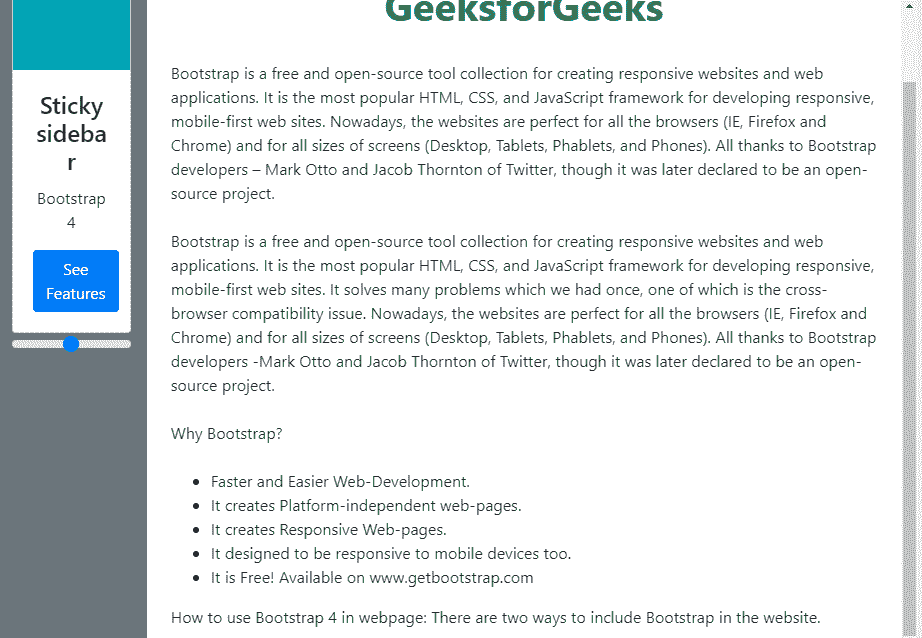

# 如何设置 Bootstrap 4 滚动到长粘边栏底部？

> 原文:[https://www . geesforgeks . org/how-set-bootstrap-4-滚动到长粘边栏底部/](https://www.geeksforgeeks.org/how-to-set-bootstrap-4-scroll-to-the-bottom-of-long-sticky-sidebar/)

*   在 **Bootstrap 3** 中，可以使用*词缀*将 Bootstrap 滚动设置到长粘性边栏的底部，该词缀由**的“词缀 jQuery 插件”**处理。
*   遗憾的是，在 **Bootstrap 4** 迁移**中【词缀 jQuery 插件】**被删除。
*   为了达到这个词缀属性，就像 **Bootstrap 3** ， **Bootstrap 4** 推荐我们 CSS 属性，即*位置:粘性；*风格或执行位置直接:粘性；on*@支持*规则。
*   虽然*位置:粘性*可能不是在所有情况下都支持，但是我们可以采用第三方 ScrollPos-Styler 库。

**示例 1:** 下面的示例说明了如何使用 css 属性设置 Bootstrap 4 滚动到长棍侧边栏的底部。

```html
<!DOCTYPE html>
<html lang="en">

<head>
    <meta charset="utf-8">
    <meta name="viewport" content="width=device-width, initial-scale=1">
    <link rel="stylesheet" href="
https://maxcdn.bootstrapcdn.com/bootstrap/4.3.1/css/bootstrap.min.css
">
    <script src="
https://ajax.googleapis.com/ajax/libs/jquery/3.4.1/jquery.min.js
"></script>
    <script src="
https://cdnjs.cloudflare.com/ajax/libs/popper.js/1.14.7/umd/popper.min.js
"></script>
    <script src="
https://maxcdn.bootstrapcdn.com/bootstrap/4.3.1/js/bootstrap.min.js
"></script>
    <link rel="stylesheet" href="
https://cdnjs.cloudflare.com/ajax/libs/font-awesome/4.7.0/css/font-awesome.min.css
">
    <style>
        .sidebar {
            top: 50px;
            left: 0px;
            position: sticky;
        }
    </style>
</head>

<body data-spy="scroll" 
      data-target="#myScrollspy"
      data-offset="1">

    <!-- Toggler/collapsibe Button -->
    <button class="navbar-toggler" 
            type="button" 
            data-toggle="collapse" 
            data-target="#collapsibleNavbar">
        <span class="navbar-toggler-icon"></span>
    </button>
    </nav>
    <div class="container-fluid" id="body">
        <div class="row">
            <div class="col-sm-2 p-3 bg-secondary sidebar">
                <div class="card text-center" 
                     style="width:auto">
                    <span class="card-img-top fakeimg bg-info p-5" 
                          src=""
                          alt="Card image"></span>
                    <div class="card-body ">
                        <h4 class="card-title">Sticky sidebar</h4>
                        <p class="card-text ">Bootstrap 4</p>
                        <a href=
"https://getbootstrap.com/docs/4.3/getting-started/introduction/"
                           class="btn btn-primary"
                           target="_blank">See Features</a>
                    </div>
                </div>
                <hr class="d-sm-none">
                <form>

                    <input type="range" 
                           class="custom-range"
                           id="customRange"
                           name="points1">
                </form>
                <hr class="d-sm-none">

            </div>
            <div class="col-sm-10 p-4">
                <h1 class="text-success font-weight-bold text-center">
GeeksforGeeks</h1>
                <br> Bootstrap is a free and open-source tool collection
              for creating responsive websites and web applications. 
              It is the most popular HTML, CSS, and JavaScript framework
              for developing responsive, mobile-first web sites. 
              Nowadays, the websites are perfect for all the browsers 
              (IE, Firefox and Chrome) and for all sizes of screens 
              (Desktop, Tablets, Phablets, and Phones). 
              All thanks to Bootstrap developers – Mark Otto and
              Jacob Thornton of Twitter, though it was later declared 
              to be an open-source project.
                <br>
                <br> Bootstrap is a free and open-source tool collection
              for creating responsive websites and web applications.
              It is the most popular HTML, CSS, and JavaScript framework
              for developing responsive, mobile-first web sites. 
              It solves many problems which we had once, one of which is
              the cross-browser compatibility issue. Nowadays, the websites
              are perfect for all the browsers (IE, Firefox and Chrome) and
              for all sizes of screens (Desktop, Tablets, Phablets, and Phones).
              All thanks to Bootstrap developers -Mark Otto and Jacob Thornton 
              of Twitter, though it was later declared to be an open-source project.
                <br>
                <br> Why Bootstrap?
                <br>
                <br>
                <ul>
                    <li>Faster and Easier Web-Development.</li>
                    <li>It creates Platform-independent web-pages.</li>
                    <li>It creates Responsive Web-pages.</li>
                    <li>It designed to be responsive to mobile devices too.</li>
                    <li>It is Free! Available on www.getbootstrap.com</li>
                </ul>
                How to use Bootstrap 4 in webpage:
              There are two ways to include Bootstrap in the website.
            </div>
        </div>
    </div>
</body>

<script>
    $(document).ready(function() {
        $("#filter").on("keyup", function() {
            var value = $(this).val().toLowerCase();
            $("#body *").filter(function() {
                $(this).toggle($(this).text().toLowerCase().indexOf(value) > -1)
            });
        });
    });
</script>

</html>
```

**输出:**

**参考**[https://getbootstrap.com/docs/4.3/migration/#components](https://getbootstrap.com/docs/4.3/migration/#components)