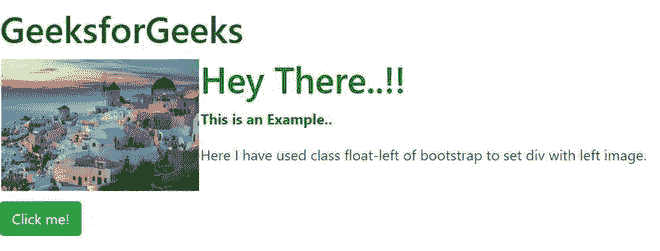
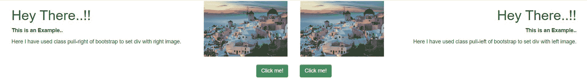
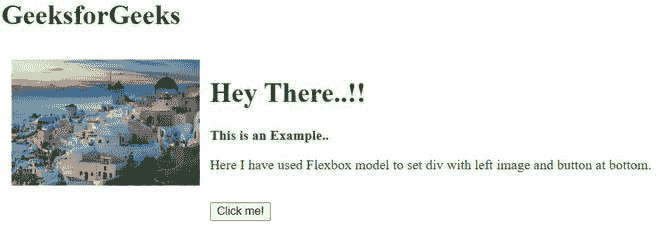

# 如何使用 bootstrap 设置底部有左图像和按钮的 div？

> 原文:[https://www . geeksforgeeks . org/如何使用引导程序在底部设置带左图像和按钮的 div/](https://www.geeksforgeeks.org/how-to-set-div-with-left-image-and-button-at-bottom-using-bootstrap/)

我们可以通过以下两种方法设置底部有左图像和按钮的 div:

*   **方法 1:使用自举**

    **向左浮动**

    这些实用程序类**向左浮动**一个组件向左或禁用浮动，基于当前视口大小利用 CSS 浮动属性。**！重要的**被包括在内，以回避(避免)特异性问题。这些使用与我们的网格系统相同的视口断点。

    **相对位置**

    与 CSS 属性**位置相同:相对**。

    **位置-绝对**

    与 CSS 属性**位置相同:绝对**。

    **示例:**

    ```
    <!DOCTYPE html>
    <html lang="en">
        <head>
            <!-- Required meta tags -->
            <meta charset="utf-8" />
            <meta name="viewport" 
                  content="width=device-width,
                           initial-scale=1, 
                           shrink-to-fit=no" />
            <!-- Bootstrap CSS -->
            <link rel="stylesheet"
                  href=
    "https://stackpath.bootstrapcdn.com/bootstrap/4.5.0/css/bootstrap.min.css"
                  integrity=
    "sha384-9aIt2nRpC12Uk9gS9baDl411NQApFmC26EwAOH8WgZl5MYYxFfc+NcPb1dKGj7Sk" 
                  crossorigin="anonymous" />
            <script src=
    "https://kit.fontawesome.com/577845f6a5.js" 
                    crossorigin="anonymous">
          </script>

            <title>Set div with left image
          </title>
            <style type="text/css">
                .bottom-left {
                    left: 0;
                }
            </style>
        </head>
        <body>
            <h1 style="color: #006400;">
                <br />
                GeeksforGeeks
            </h1>
            <div class="float-left">
                
            </div>
            <div class="position-relative" style="color: green;">
                <h1>Hey There..!!</h1>
                <p><b>This is an Example..</b></p>
                <p>Here I have used class float-left of
                bootstrap to set div with left image.</p>
                <br />
            </div>
            <div class="position-relative">
                <div class="position-absolute bottom-left">
                    <button type="button" 
                            class="btn btn-success">
                      Click me!
                  </button>
                </div>
            </div>
        </body>
    </html>
    ```

    **输出:**

    

    **注意:**如果您的内容较少，请将 **< br >** 标签放在内容的末尾，否则按钮会放错位置，因为它是相对于内容的位置。

    使用 **bootstrap 3** 我们也可以通过 bootstrap 网格系统设置 div，左图像&按钮在底部，右图像&按钮在底部，如下所示:

    **示例:**

    ```
    <!DOCTYPE html>
    <html lang="en">
        <head>
            <!-- Required meta tags -->
            <meta charset="utf-8" />
            <meta name="viewport" 
                  content="width=device-width,
                           initial-scale=1,
                           shrink-to-fit=no" />
            <!-- Bootstrap CSS -->
            <!-- Latest compiled and minified CSS -->
            <link rel="stylesheet" 
                  href=
    "https://maxcdn.bootstrapcdn.com/bootstrap/3.3.7/css/bootstrap.min.css" 
                  integrity=
    "sha384-BVYiiSIFeK1dGmJRAkycuHAHRg32OmUcww7on3RYdg4Va+PmSTsz/K68vbdEjh4u" 
                  crossorigin="anonymous" />

            <!-- Optional theme -->
            <link rel="stylesheet" 
                  href=
    "https://maxcdn.bootstrapcdn.com/bootstrap/3.3.7/css/bootstrap-theme.min.css" 
                  integrity=
    "sha384-rHyoN1iRsVXV4nD0JutlnGaslCJuC7uwjduW9SVrLvRYooPp2bWYgmgJQIXwl/Sp" 
                  crossorigin="anonymous" />

            <!-- Latest compiled and minified JavaScript -->
            <script src=
    "https://maxcdn.bootstrapcdn.com/bootstrap/3.3.7/js/bootstrap.min.js" 
                    integrity=
    "sha384-Tc5IQib027qvyjSMfHjOMaLkfuWVxZxUPnCJA7l2mCWNIpG9mGCD8wGNIcPD7Txa" 
                    crossorigin="anonymous">
          </script>

            <title>Set div with left image</title>
            <style type="text/css">
                .bottom-left {
                    left: 0;
                }
                .bottom-right {
                    right: 0;
                }
            </style>
        </head>
        <body>
            <div class="container-fluid">
                <div class="col-md-6">
                    <div class="pull-right">
                        
                    </div>
                    <div style="color: green; text-align: left;">
                        <h1>Hey There..!!</h1>
                        <p><b>This is an Example..</b></p>
                        <p>Here I have used class pull-right of 
                          bootstrap to set div with right image.
                      </p>
                        <br />
                        <br />
                    </div>
                    <div class="pull-right bottom-right">
                        <button type="button" 
                                class="btn btn-success">
                          Click me!
                      </button>
                    </div>
                </div>
                <div class="col-md-6">
                    <div class="pull-left">
                        
                    </div>
                    <div style="color: green; 
                                text-align: right;">
                        <h1>Hey There..!!</h1>
                        <p><b>This is an Example..</b></p>
                        <p>Here I have used class pull-left of
                          bootstrap to set div with left image.
                      </p>
                        <br />
                        <br />
                    </div>
                    <div class="pull-left bottom-left">
                        <button type="button" 
                                class="btn btn-success">
                          Click me!
                      </button>
                    </div>
                </div>
            </div>
        </body>
    </html>
    ```

    **输出:**

    

    **注意:**由于引导网格，当代码在 IDE 上运行时，系统输出会有所不同，因此在您的源代码上运行该代码。

*   **方法 2:** 使用弹性盒

    **示例:**

    ```
    <!DOCTYPE html>
    <html lang="en">
        <head>
            <!-- Required meta tags -->
            <meta charset="utf-8" />
            <meta name="viewport" 
                  content="width=device-width, 
                           initial-scale=1, 
                           shrink-to-fit=no" />
            <title>Set div with left image</title>
            <style type="text/css">
                .flex_row {
                    display: flex;
                    flex-direction: row;
                    flex-wrap: nowrap;
                    justify-content: flex-start;
                    align-content: stretch;
                    align-items: flex-start;
                }
                .article {
                    box-sizing: border-box;
                    flex: 1 1 50%;
                    align-self: stretch;
                    padding: 10px;
                }
                .content {
                    box-sizing: border-box;
                    flex: 1 1 auto;
                    align-self: stretch;
                    padding: 0 10px;
                    display: flex;
                    flex-direction: column;
                    flex-wrap: nowrap;
                }
                .innercontent {
                    flex: 1 1 auto;
                    align-self: stretch;
                    color: green;
                }
                .buttonBar {
                    flex: 0 0 auto;
                }
                .onRight {
                    text-align: left;
                }
            </style>
        </head>
        <body>
            <h1 style="color: #006400;">
                <br />
                GeeksforGeeks
            </h1>
            <div class="flex_row">
                <div class="article onRight flex_row">
                    <div class="image">
                        
                    </div>
                    <div class="content">
                        <div class="innercontent">
                            <h1>Hey There..!!</h1>
                            <p><b>This is an Example..
                              </b></p>
                            <p>Here I have used Flexbox model 
                              to set div with left image 
                              and button at bottom.</p>
                            <br />
                        </div>
                        <div class="buttonBar">
                            <button>Click me!</button>
                        </div>
                    </div>
                </div>
            </div>
        </body>
    </html>
    ```

    **输出:**

    