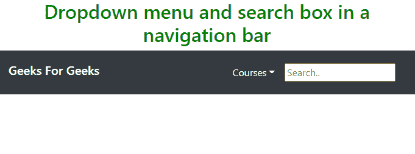
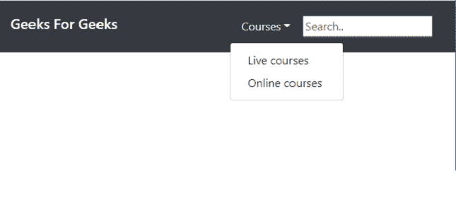
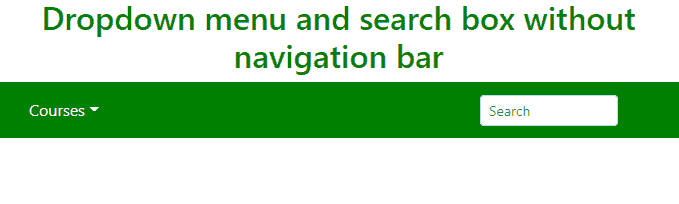
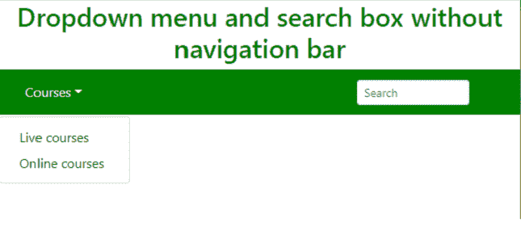

# 如何使用 Bootstrap 在同一行设置下拉和搜索框？

> 原文:[https://www . geesforgeks . org/如何使用引导程序在同一行中设置下拉和搜索框/](https://www.geeksforgeeks.org/how-to-set-dropdown-and-search-box-in-same-line-using-bootstrap/)

下拉菜单是一种菜单类型，通过使用下拉菜单，用户可以从给定的预定义集合中选择一些东西。这是一个可切换的菜单，这意味着当用户点击菜单时它就会出现。搜索框是一种类型的框，您可以在其中写入要搜索的字符串。

主要目的是将下拉菜单和搜索框排成一条直线。

**示例 1:** 我们将创建一个导航栏，并创建一个下拉菜单和搜索框，它们最初不会以直线形式出现。我们可以使用列表形式的 HTML 结构的无序列表“ul”。

## 超文本标记语言

```html
<!DOCTYPE html>
<html>

<head>
    <meta charset="utf-8">
    <meta name="viewport" content=
        "width=device-width, initial-scale=1">

    <!-- Bootstrap CSS library -->
    <link rel="stylesheet" href=
"https://maxcdn.bootstrapcdn.com/bootstrap/4.5.2/css/bootstrap.min.css">

    <link rel="stylesheet" href=
"https://use.fontawesome.com/releases/v5.6.3/css/all.css"
        integrity=
"sha384-UHRtZLI+pbxtHCWp1t77Bi1L4ZtiqrqD80Kn4Z8NTSRyMA2Fd33n5dQ8lWUE00s/"
        crossorigin="anonymous">

    <!-- jQuery library -->
    <script src=
"https://ajax.googleapis.com/ajax/libs/jquery/3.5.1/jquery.min.js">
    </script>

    <script src=
"https://cdnjs.cloudflare.com/ajax/libs/popper.js/1.16.0/umd/popper.min.js">
    </script>

    <script src=
"https://maxcdn.bootstrapcdn.com/bootstrap/4.5.2/js/bootstrap.min.js">
    </script>
</head>

<body>

    <!-- Navigation Bar -->
    <nav class="navbar navbar-expand-sm 
        bg-dark navbar-dark">

        <h5 class="navbar-brand">Geeks For Geeks</h5>

        <ul class="navbar nav ml-auto">
            <!-- Dropdown list -->
            <li class="nav-item dropdown">
                <a class="nav-link dropdown-toggle" 
                    data-toggle="dropdown" href="#" 
                    role="button" aria-haspopup="true"
                    aria-expanded="false" 
                    style="color:white;">
                    Courses
                </a>

                <div class="dropdown-menu">
                    <a class="dropdown-item" 
                        href="#">Live courses
                    </a>

                    <a class="dropdown-item" 
                        href="#">Online courses
                    </a>
                </div>
            </li>
            <li>
                <!-- Search Box -->
                <input type="text" placeholder="Search..">
            </li>
        </ul>
    </nav>
</body>

</html>
```

**输出:**

 

**例 2:**

## 超文本标记语言

```html
<!DOCTYPE html>
<html>

<head>
    <meta charset="utf-8">
    <meta name="viewport" content=
        "width=device-width, initial-scale=1">

    <!-- Bootstrap CSS library -->
    <link rel="stylesheet" href=
"https://maxcdn.bootstrapcdn.com/bootstrap/4.5.2/css/bootstrap.min.css">

    <link rel="stylesheet" href=
        "https://use.fontawesome.com/releases/v5.6.3/css/all.css"
        integrity=
"sha384-UHRtZLI+pbxtHCWp1t77Bi1L4ZtiqrqD80Kn4Z8NTSRyMA2Fd33n5dQ8lWUE00s/"
        crossorigin="anonymous">

    <!-- jQuery library -->
    <script src=
"https://ajax.googleapis.com/ajax/libs/jquery/3.5.1/jquery.min.js">
    </script>

    <script src=
"https://cdnjs.cloudflare.com/ajax/libs/popper.js/1.16.0/umd/popper.min.js">
    </script>

    <script src=
"https://maxcdn.bootstrapcdn.com/bootstrap/4.5.2/js/bootstrap.min.js">
    </script>
</head>

<body>
    <h2 align="Center" style="color:green;">
        Dropdown menu and search box 
        without navigation bar
    </h2>

    <ul class="navbar nav ml-auto" 
        style="color:white;background-color:green">
        <!-- Dropdown list -->
        <li>
            <a class="nav-link dropdown-toggle" 
                data-toggle="dropdown" href="#" 
                role="button" aria-haspopup="true"
                aria-expanded="false" 
                style="color:white;">
                Courses
            </a>

            <div class="dropdown-menu">
                <a class="dropdown-item" 
                    href="#">Live courses
                </a>

                <a class="dropdown-item" 
                    href="#">Online courses
                </a>
            </div>

        <!-- Search Box -->
        <li>
            <input class="form-control 
                form-control-sm mr-3 w-75" 
                type="text" placeholder="Search" 
                aria-label="Search">
        </li>
        </li>
    </ul>
</body>

</html>
```

**输出:**


