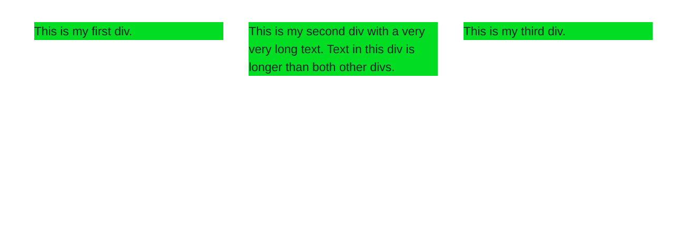
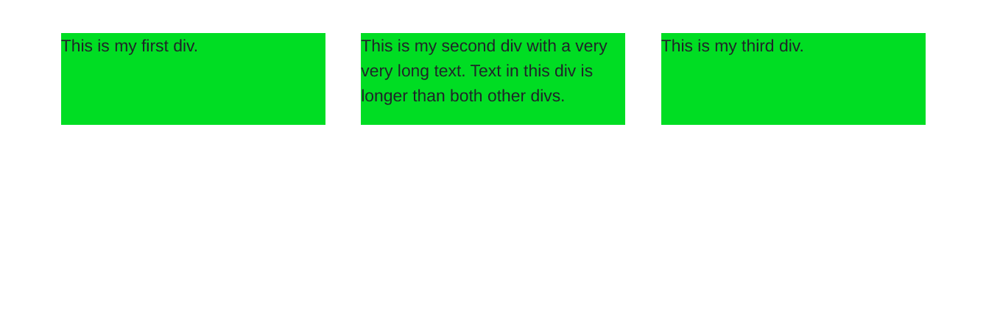

# 如何使用 bootstrap 4 设置盒子内部 div 的全高？

> 原文:[https://www . geesforgeks . org/如何使用 bootstrap-4/](https://www.geeksforgeeks.org/how-to-set-full-height-in-box-inner-div-using-bootstrap-4/) 设置盒内全高

**d-flex** 是 Bootstrap 4 中的内置类，可用于将全高设置为 div。我们将用下面的工作代码示例来说明这一点。

**语法:**

```html
<div class="d-flex"> ... <div>
```

下面的代码创建了三个水平排列的 div，但问题是类**框内**的内部 div 的高度在所有 div 中都不相同，并且取决于 div 中的文本。我们希望所有 div 的高度都相同，并且等于文本最长的 div 的高度。

*   **程序:**

    ```html
    <!DOCTYPE html>
    <html>

    <head>
        <link rel="stylesheet" href=
    "https://maxcdn.bootstrapcdn.com/bootstrap/4.0.0/css/bootstrap.min.css">
        <style>
            .box-inner {
                background: rgb(104, 201, 25);
                margin: 2px;
            }

            .container {
                margin-top: 30px;
            }
        </style>
    </head>

    <body>
        <h1>GeeksforGeeks</h1>
        <b>A Computer Science Portal for Geeks</b>

        <div class="container">
            <div class="row">
                <div class="col-12 col-lg-3 col-md-6 box">
                    <div class="box-inner">
                        <p class="content">
                            This is my first div.
                        </p>
                    </div>
                </div>
                <div class="col-12 col-lg-3 col-md-6 box">
                    <div class="box-inner">
                        <p class="content">
                            This is my second div with a
                            very very long text. Text in
                            this div is longer than both
                            other divs.
                        </p>
                    </div>
                </div>
                <div class="col-12 col-lg-3 col-md-6 box">
                    <div class="box-inner">
                        <p class="content">
                            This is my third div.
                        </p>
                    </div>
                </div>
            </div>
        </div>
    </body>

    </html>
    ```

*   **输出:**
    

**解决方案:**我们将使用 **d-flex** 类来增加所有草皮的高度，同时我们将添加**宽度:100%；**因此所有草皮的宽度都是可用面积的最大值。

*   **程序:**

    ```html
    <!DOCTYPE html>
    <html>

    <head>
        <link rel="stylesheet" href=
    "https://maxcdn.bootstrapcdn.com/bootstrap/4.0.0/css/bootstrap.min.css">

        <style>
            .box-inner {
                background: rgb(104, 201, 25);
                margin: 2px;
                width: 100%;
            }

            .container {
                margin-top: 30px;
            }
        </style>
    </head>

    <body>
        <div class="container">
            <div class="row">
                <div class="col-12 col-lg-3 col-md-6 box d-flex">
                    <div class="box-inner">
                        <p class="content">
                            This is my first div.
                        </p>
                    </div>
                </div>
                <div class="col-12 col-lg-3 col-md-6 box d-flex">
                    <div class="box-inner">
                        <p class="content">
                            This is my second div with a very
                            very long text. Text in this div
                            is longer than both other divs.
                        </p>
                    </div>
                </div>
                <div class="col-12 col-lg-3 col-md-6 box d-flex">
                    <div class="box-inner">
                        <p class="content">
                            This is my third div.
                        </p>
                    </div>
                </div>
            </div>
        </div>

    </body>

    </html>
    ```

*   **输出:**
    