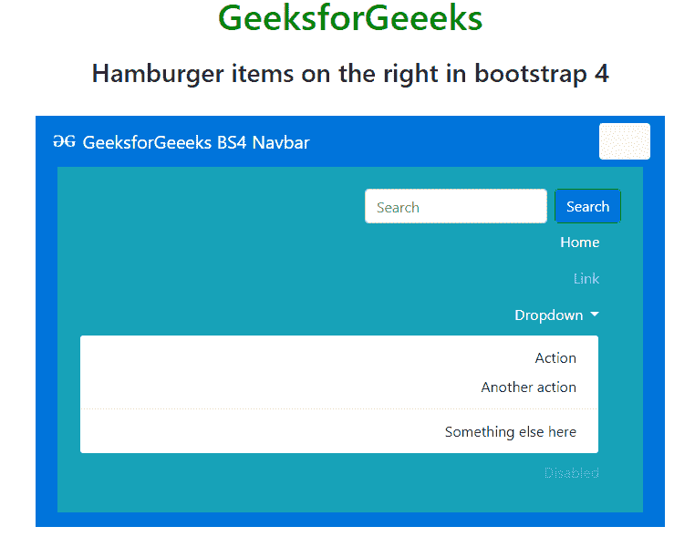

# 如何在 bootstrap 4 中设置右侧汉堡项目？

> 原文:[https://www . geesforgeks . org/how-to-set-hamburger-items-on-right-in-bootstrap-4/](https://www.geeksforgeeks.org/how-to-set-hamburger-items-on-the-right-in-bootstrap-4/)

在 Bootstrap 4 中，导航栏是用于菜单目的的基本组件。使用 float-right 类将菜单项向右对齐在 Bootstrap 3 中效果很好，但在 Bootstrap 4 中不行，因为 navbar 现在是 flexbox。下面的方法会解释清楚。

在 Bootstrap 4 中，导航栏包含很多项目，如文本、链接文本、禁用链接、下拉按钮、表单等。若要对齐文本、链接文本，请使用 **class="text-right "禁用右侧的链接和下拉按钮。**但是对于表单，使用表单 **class="flex-row-reverse"** 在导航栏中右对齐。如果不需要默认类，使用 CSS 属性也可能有助于在导航栏中右对齐。

下面的例子说明了如何在 bootstrap 4 中设置右边的汉堡项目。

**示例:**

```
<!DOCTYPE html>
<html lang="en">

<head>
    <meta charset="utf-8">
    <meta name="viewport" 
          content="width=device-width, initial-scale=1">
    <link rel="stylesheet" href=
"https://maxcdn.bootstrapcdn.com/bootstrap/4.3.1/css/bootstrap.min.css">
    <script src=
"https://ajax.googleapis.com/ajax/libs/jquery/3.4.1/jquery.min.js">
    </script>
    <script src=
"https://cdnjs.cloudflare.com/ajax/libs/popper.js/1.14.7/umd/popper.min.js">
    </script>
    <script src=
"https://maxcdn.bootstrapcdn.com/bootstrap/4.3.1/js/bootstrap.min.js">
    </script>
</head>

<body>
    <center>
    <div class="container">
            <h1 style="color:green;padding:13px;">
             GeeksforGeeeks
            </h1>
            <h3>Hamburger items on the right in bootstrap 4</h3>
            <br>

            <nav class="navbar navbar-expand-lg
                 navbar-dark justify-content-between text-white"
                 style="background-color: #0074D9;">
                  <a class="navbar-brand" href="#">
                     
                     GeeksforGeeeks BS4 Navbar
                  </a>
                  <button class="navbar-toggler bg-light" 
                          type="button" 
                          data-toggle="collapse" 
                          data-target="#navbarNavDropdown01"
                          aria-controls="navbarNavDropdown01"
                          aria-expanded="false" 
                          aria-label="Toggle navigation"
                          style="outline-color:white">
                      <span class="navbar-toggler-icon"></span>
                  </button>

                  <div class="collapse navbar-collapse bg-info m-2 p-4" 
                        id="navbarNavDropdown01">

                    <!-- form item of menu for search purpose -->  
                    <form class="form-inline flex-row-reverse ">
                        <button class="btn btn-success my-2 my-sm-0 bg-primary" 
                                type="submit">
                          Search
                        </button>
                        <input class="form-control mr-sm-2"
                               type="search" placeholder="Search" 
                               aria-label="Search">

                    </form>           

                    <!-- Active item text of menu -->
                    <ul class="navbar-nav text-right mr-4">
                        <li class="nav-item active">
                            <a class="nav-link" href="#">
                              Home<span class="sr-only">(current)</span>
                            </a>
                        </li>

                        <!-- inactive  link text item of menu -->
                        <li class="nav-item">
                            <a class="nav-link" href="#">Link</a>
                        </li>

                        <!-- dropdown item of menu -->
                        <li class="nav-item dropdown">
                            <a class="nav-link dropdown-toggle" 
                                href="#" id="navbarDropdown"
                                role="button" data-toggle="dropdown"
                                aria-haspopup="true" 
                                aria-expanded="false">
                               Dropdown
                            </a>

                            <!-- dropdown sub items of menu -->
                            <div class="dropdown-menu text-right" 
                                 aria-labelledby="navbarDropdown">
                                <a class="dropdown-item" href="#">
                                 Action
                                </a>
                                <a class="dropdown-item" href="#">
                                 Another action
                                </a>
                                <div class="dropdown-divider"></div>
                                <a class="dropdown-item" href="#">
                                 Something else here
                                </a>
                            </div>
                        </li>

                        <!-- disable link text item of menu -->
                        <li class="nav-item ">
                            <a class="nav-link disabled" 
                               href="#" tabindex="-1" 
                               aria-disabled="true">
                              Disabled
                             </a>
                        </li>
                    </ul>
                </div>
            </nav>
        </div>
    </center>
</body>

</html>
```

**输出:**


**参考:**T2】https://getbootstrap.com/docs/4.0/components/navbar/