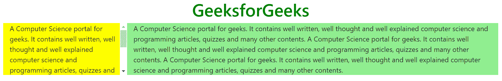

# 如何在 Bootstrap 中设置一列控制高度？

> 原文:[https://www . geesforgeks . org/如何设置一栏控制自举高度/](https://www.geeksforgeeks.org/how-to-set-one-column-control-over-height-in-bootstrap/)

使用 Bootstrap 创建一个 HTML 文档，并创建多个列。任务是使用 Bootstrap 将控件设置为超过高度的列。这样做的方法是利用左列中的另一个 div 内部。向内的划分应该是位置:绝对的。

**示例:**

## 超文本标记语言

```html
<!DOCTYPE html>
<html lang="en">

<head>
  <!-- Required meta tags -->
  <meta charset="utf-8">
  <meta name="viewport" content=
    "width=device-width, initial-scale=1, 
    shrink-to-fit=no">

  <!-- Bootstrap CSS -->
  <link rel="stylesheet" href=
"https://stackpath.bootstrapcdn.com/bootstrap/4.5.0/css/bootstrap.min.css"
    integrity=
"sha384-9aIt2nRpC12Uk9gS9baDl411NQApFmC26EwAOH8WgZl5MYYxFfc+NcPb1dKGj7Sk"
    crossorigin="anonymous">

  <!-- Optional JavaScript -->
  <!-- jQuery first, then Popper.js, 
    then Bootstrap JS -->
  <script src="https://code.jquery.com/jquery-3.5.1.slim.min.js"
    integrity=
"sha384-DfXdz2htPH0lsSSs5nCTpuj/zy4C+OGpamoFVy38MVBnE+IbbVYUew+OrCXaRkfj"
    crossorigin="anonymous">
  </script>

  <script src=
"https://cdn.jsdelivr.net/npm/popper.js@1.16.0/dist/umd/popper.min.js"
    integrity=
"sha384-Q6E9RHvbIyZFJoft+2mJbHaEWldlvI9IOYy5n3zV9zzTtmI3UksdQRVvoxMfooAo"
    crossorigin="anonymous">
  </script>

  <script src=
"https://stackpath.bootstrapcdn.com/bootstrap/4.5.0/js/bootstrap.min.js"
    integrity=
"sha384-OgVRvuATP1z7JjHLkuOU7Xw704+h835Lr+6QL9UvYjZE3Ipu6Tp75j7Bh/kR0JKI"
    crossorigin="anonymous">
  </script>

  <title>
    How to set one column control 
    over height in Bootstrap ?
  </title>

  <style type="text/css">
    .bg-1 {
      background-color: yellow;
    }

    .bg-2 {
      background-color: lightgreen;
    }
  </style>
</head>

<body>
  <center>
    <h1 style="color: green">
      GeeksforGeeks
    </h1>
  </center>

  <div class='container'>
    <div class='row'>
      <div class='col-3 bg-1 overflow-auto'>
        <div class="position-absolute">
          A Computer Science portal for geeks. 
          It contains well written, well thought
          and well explained computer science 
          and programming articles, quizzes and 
          many other contents.
          A Computer Science portal for geeks. 
          It contains well written, well thought
          and well explained computer science 
          and programming articles, quizzes and 
          many other contents.
        </div>
      </div>
      <div class='col-9 bg-2'>
        A Computer Science portal for geeks. 
        It contains well written, well thought
        and well explained computer science 
        and programming articles, quizzes and 
        many other contents.
        A Computer Science portal for geeks. 
        It contains well written, well thought
        and well explained computer science 
        and programming articles, quizzes and 
        many other contents.
        A Computer Science portal for geeks. 
        It contains well written, well thought
        and well explained computer science 
        and programming articles, quizzes and 
        many other contents.
      </div>
    </div>
  </div>
</body>

</html>
```

**输出:**



在上面的示例中，
**位置属性**用于相对于其父级的位置放置组件，并更改其周围的布局。
**溢出属性**指示在内容溢出元素框的情况下应该发生什么。此属性指示当元素的内容足够大以适合指定区域时，是剪切内容还是包含滚动条。