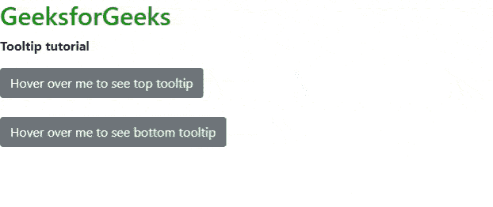

# 如何在 Bootstrap 中设置按钮中工具提示的位置？

> 原文:[https://www . geesforgeks . org/如何设置引导中按钮工具提示的位置/](https://www.geeksforgeeks.org/how-to-set-position-of-tooltip-in-a-button-in-bootstrap/)

工具提示用于在鼠标指针移动时向用户提供关于元素的交互式文本提示。例如，在下图中，GeeksForGeeks 是一个按钮，当用户鼠标在上面移动时，将显示“计算机科学门户”弹出窗口的附加信息。我们将学习如何创建工具提示，以及如何将工具提示放置在不同的位置。

**实施工具提示的分步指南:**

**步骤 1:** 在代码的头部包含所有的引导库。

> <src 脚本= " https://code . jquery . com/jquery-3 . 6 . 0 . slim . js "></script><src 脚本= " https://cdn . jsdelivr . net/NPM/bootstrap @ 4 . 6 . 0/dist/js/bootstrap . min

**第二步:**在 HTML 的按钮控件中实现工具提示，应用*数据-切换*属性，如下图:

```
<button type="button" data-toggle="tooltip" 
        data-placement="bottom" title="title of the button">
    Hover over me
</button> 
```

**步骤 3:** 要在 bootstrap 中实现工具提示，只需遵循代码脚本部分的语法即可。

```
$(function(){
    $('[data-toggle="tooltip"]').tooltip();
})
```

**示例 1:** 以下演示了引导的工具提示功能。这将显示“顶部”和“底部”工具提示。

## 超文本标记语言

```
<!DOCTYPE html>
<html>

<head>
    <meta charset="utf-8" />
    <meta name="viewport" content="width=device-width" />

    <link rel="stylesheet" href=
"https://cdn.jsdelivr.net/npm/bootstrap@4.6.0/dist/css/bootstrap.min.css" />
    <script src="https://code.jquery.com/jquery-3.6.0.slim.js">
    </script>
    <script src=
"https://cdn.jsdelivr.net/npm/bootstrap@4.6.0/dist/js/bootstrap.min.js">
    </script>
    <script src=
"https://cdn.jsdelivr.net/npm/bootstrap@4.6.0/dist/js/bootstrap.bundle.min.js">
    </script>

    <script>
        $(function() {
            $('[data-toggle="tooltip"]').tooltip();
        });
    </script>
</head>

<body>
    <h2 style="color: green">GeeksforGeeks</h2>
    <p><b>Tooltip tutorial</b></p>

    <button type="button" class="btn btn-secondary" 
        data-toggle="tooltip" data-placement="top" 
        title="This is top tooltip">
        Hover over me to see top tooltip
    </button>
    <br /><br />

    <button type="button" class="btn btn-secondary"
        data-toggle="tooltip" data-placement="bottom" 
        title="This is bottom Tooltip">
        Hover over me to see bottom tooltip
    </button>
</body>

</html>
```

**输出:**



顶部底部工具提示

**示例 2:** 用上面给出的底部工具提示片段更改上面的代码。您也可以将*数据放置*更改为*左侧*或*右侧* ，分别放置工具提示位置*左侧*和*右侧*。

## 超文本标记语言

```
<!DOCTYPE html>
<html>

<head>
    <meta charset="utf-8" />
    <meta name="viewport" content="width=device-width" />

    <link rel="stylesheet" href=
"https://cdn.jsdelivr.net/npm/bootstrap@4.6.0/dist/css/bootstrap.min.css" />
    <script src="https://code.jquery.com/jquery-3.6.0.slim.js">
    </script>
    <script src=
"https://cdn.jsdelivr.net/npm/bootstrap@4.6.0/dist/js/bootstrap.min.js">
    </script>
    <script src=
"https://cdn.jsdelivr.net/npm/bootstrap@4.6.0/dist/js/bootstrap.bundle.min.js">
    </script>

    <script>
        $(function() {
            $('[data-toggle="tooltip"]').tooltip();
        });
    </script>

    <style>
        .btn {
            margin: 10px;
        }
    </style>
</head>

<body>
    <h2 style="color: green">GeeksforGeeks</h2>

    <p><b>Tooltip tutorial</b></p>

    <button type="button" class="btn btn-secondary"
        data-toggle="tooltip" data-placement="right" 
        title="This is right Tooltip">
        Hover over me to see RIGHT tooltip
    </button>
</body>

</html>
```

**输出:**


右侧工具提示

**结论:**我们已经学会了如何将工具提示放置在任何方向。你可以使用相同的链接或 div 容器，结果将是相同的。