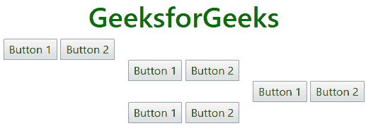
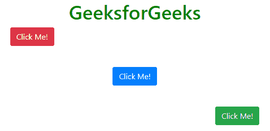
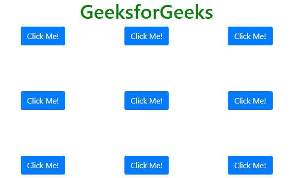

# 如何在 Bootstrap 中设置按钮对齐？

> 原文:[https://www . geesforgeks . org/如何设置引导中的按钮对齐/](https://www.geeksforgeeks.org/how-to-set-the-button-alignment-in-bootstrap/)

引导按钮与 HTML 文档的任何其他 DOM 元素没有什么不同。对齐它们很可能与对齐段落、div 和部分相同。这里有一些你可能会遇到的情况。

**Buttons in ‘container’ class:**

*   **。左文本***   **。文本中心***   **.text-right**

    **语法:**

    ```
    class="text-left"|"text-center"|"text-right"

    ```

    **注意:**也可以使用 HTML5 **<居中>** 标签将按钮对齐居中。

    **示例:**

    ```
    <!DOCTYPE html>
    <html>

    <head>
        <meta charset="utf-8">
        <meta name="viewport" 
        content="width=device-width, initial-scale=1, shrink-to-fit=no">

        <link rel="stylesheet"
    href="https://maxcdn.bootstrapcdn.com/bootstrap/4.0.0/css/bootstrap.min.css" />

        <title>Aligning Buttons</title>
    </head>

    <body>
        <h1 style="color:green;text-align:center;">GeeksforGeeks</h1>
        <div class="container">
            <div class="text-left">
                <button type="button" >Button 1</button>
                <button type="button" >Button 2</button>
            </div>

            <div class="text-center">
                <button type="button" >Button 1</button>
                <button type="button" >Button 2</button>
            </div>

            <div class="text-right">
                <button type="button" >Button 1</button>
                <button type="button" >Button 2</button>
            </div>

            <center>
                <button type="button" >Button 1</button>
                <button type="button" >Button 2</button>
            </center>
        </div>

        <script src="https://code.jquery.com/jquery-3.2.1.slim.min.js">
        </script>
        <script src=
    "https://maxcdn.bootstrapcdn.com/bootstrap/4.0.0/js/bootstrap.min.js">
        </script>
    </body>

    </html>
    ```

    **输出:**
    

    **Buttons inside FlexBox:**

    *   **。d-flex。伸缩排***   **.d-flex .flex-column**

    通过选择其中的一个，可以实现以下模式。
    **例:**

    ```
    <!DOCTYPE html>
    <html>

    <head>
        <meta charset="utf-8">
        <meta name="viewport" 
         content="width=device-width, initial-scale=1, shrink-to-fit=no">

        <link rel="stylesheet" 
    href="https://maxcdn.bootstrapcdn.com/bootstrap/4.0.0/css/bootstrap.min.css" />

        <title>Aligning Buttons</title>

        <style type="text/css">
            html,
            body {
                height: 200px;
            }
        </style>
    </head>

    <body>
        <h1 style="color:green;text-align:center;">GeeksforGeeks</h1>
        <div class="container h-100">
            <div class="d-flex h-100">
                <div class="align-self-start mr-auto">
                    <button type="button" class="btn btn-danger">
                      Click Me!
                    </button>
                </div>
                <div class="align-self-center mx-auto">
                    <button type="button" class="btn btn-primary">
                      Click Me!
                    </button>
                </div>
                <div class="align-self-end ml-auto">
                    <button type="button" class="btn btn-success">
                      Click Me!
                    </button>
                </div>
            </div>
        </div>

        <script src="https://code.jquery.com/jquery-3.2.1.slim.min.js">
        </script>
        <script src=
    "https://maxcdn.bootstrapcdn.com/bootstrap/4.0.0/js/bootstrap.min.js">
        </script>
    </body>

    </html>
    ```

    **输出:**
    

    **Relative-Absolute method:**

    这是目前网上最常用的方法。在这种情况下，父 div 被分配一个“相对”位置，而子 div 被分配一个“绝对”位置。
    绝对 div 内的元素可以按照你想要的任何方式对齐。考虑下面的例子。它显示了 DOM 元素所有可能的对齐方式，在这种情况下，按钮可以有。

    **示例:**

    ```
    <!DOCTYPE html>
    <html>

    <head>
        <meta name="viewport"
        ontent="width=device-width, initial-scale=1, shrink-to-fit=no">

        <link rel="stylesheet"
    href="https://maxcdn.bootstrapcdn.com/bootstrap/4.0.0/css/bootstrap.min.css" />

        <title>Aligning Buttons</title>

        <style type="text/css">
            html,
            body {
                height: 300px;
            }

            .top-left {
                top: 0;
                left: 0;
            }

            .top-center {
                top: 0;
                left: 50%;
                transform: translateX(-50%);
            }

            .top-right {
                top: 0;
                right: 0;
            }

            .mid-left {
                top: 50%;
                left: 0;
                transform: translateY(-50%);
            }

            .mid-center {
                top: 50%;
                left: 50%;
                transform: translateX(-50%) translateY(-50%);
            }

            .mid-right {
                top: 50%;
                right: 0;
                transform: translateY(-50%);
            }

            .bottom-left {
                bottom: 0;
                left: 0;
            }

            .bottom-center {
                bottom: 0;
                left: 50%;
                transform: translateX(-50%);
            }

            .bottom-right {
                bottom: 0;
                right: 0;
            }
        </style>
    </head>

    <body>
        <h1 style="color:green; text-align:center;">GeeksforGeeks</h1>
        <div class="container h-100">
            <div class="position-relative h-100">
                <div class="position-absolute top-left">
                    <button type="button" class="btn btn-primary">Click Me!</button>
                </div>
                <div class="position-absolute top-center">
                    <button type="button" class="btn btn-primary">Click Me!</button>
                </div>
                <div class="position-absolute top-right">
                    <button type="button" class="btn btn-primary">Click Me!</button>
                </div>

                <div class="position-absolute mid-left">
                    <button type="button" class="btn btn-primary">Click Me!</button>
                </div>
                <div class="position-absolute mid-center">
                    <button type="button" class="btn btn-primary">Click Me!</button>
                </div>
                <div class="position-absolute mid-right">
                    <button type="button" class="btn btn-primary">Click Me!</button>
                </div>

                <div class="position-absolute bottom-left">
                    <button type="button" class="btn btn-primary">Click Me!</button>
                </div>
                <div class="position-absolute bottom-center">
                    <button type="button" class="btn btn-primary">Click Me!</button>
                </div>
                <div class="position-absolute bottom-right">
                    <button type="button" class="btn btn-primary">Click Me!</button>
                </div>
            </div>
        </div>

        <script src="https://code.jquery.com/jquery-3.2.1.slim.min.js"></script>
        <script src=
    "https://maxcdn.bootstrapcdn.com/bootstrap/4.0.0/js/bootstrap.min.js">
        </script>
    </body>

    </html>                    
    ```

    **输出:**
    