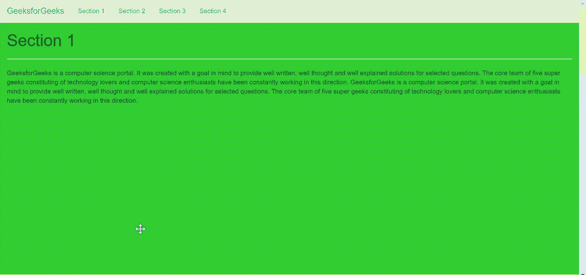
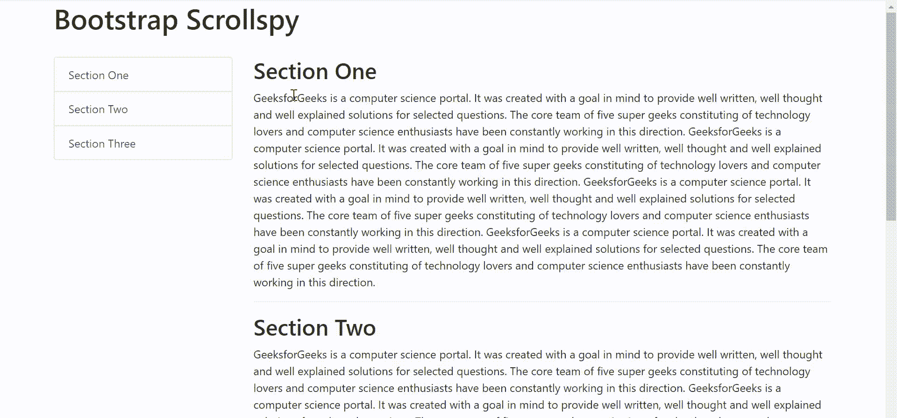

# 如何在 Bootstrap 中设置 ScrollSpy 的偏移量属性？

> 原文:[https://www . geeksforgeeks . org/如何在引导中为 scrollspy 设置偏移量属性/](https://www.geeksforgeeks.org/how-to-set-the-offset-property-for-scrollspy-in-bootstrap/)

**偏移量**是一个 Bootstrap Scrollspy 属性，其中用户可以指定在计算滚动位置时从顶部偏移的像素。当用户觉得导航条或列表很早就改变了状态，或者在冲浪时不需要时，它就变得很有用。它始终是一个数字，默认值为 10。该值可以通过 JavaScript 或者将数据偏移值放入 body 标记中来更改。

**语法:**

*   正常申报

    ```html
    (body data-offset="")
    ```

*   JavaScript 声明

    ```html
    $(document).ready(function(){
      $('body').scrollspy({target: " ", offset: });
    });

    ```

**示例 1:** 该示例描述了使用了四个部分的引导导航栏，并且使用 JavaScript 将 offset 属性设置为 60。

```html
<!DOCTYPE html>
<html>

<head>
  <title>Bootstrap offset property</title>
  <meta charset="utf-8">
  <meta name="viewport" content=
    "width=device-width, initial-scale=1">
  <link rel="stylesheet" href=
"https://maxcdn.bootstrapcdn.com/bootstrap/3.4.1/css/bootstrap.min.css">
  <script src=
"https://ajax.googleapis.com/ajax/libs/jquery/3.5.1/jquery.min.js">
  </script>
  <script src=
"https://maxcdn.bootstrapcdn.com/bootstrap/3.4.1/js/bootstrap.min.js">
  </script>

  <style>
    body {
      position: relative;
    }

    #section1 {
      padding-top: 50px;
      height: 600px;
      background-color: #32CD32;
    }

    #section2 {
      padding-top: 50px;
      height: 600px;
      background-color: #FFFF00;
    }

    #section3 {
      padding-top: 50px;
      height: 600px;
      background-color: #00FF00;
    }

    #section4 {
      padding-top: 50px;
      height: 600px;
      background-color: #FF0000;
    }
  </style>
</head>

<body>
  <nav class="navbar navbar-dark bg-success 
          navbar-fixed-top">
    <div class="container-fluid">
      <div class="navbar-header">
        <button type="button" class="navbar-toggle" 
            data-toggle="collapse" 
            data-target="#myNavbar">
          <span class="icon-bar"></span>
          <span class="icon-bar"></span>
          <span class="icon-bar"></span>
        </button>
        <a class="navbar-brand" href="#">
          GeeksforGeeks
        </a>
      </div>
      <div>
        <div class="collapse navbar-collapse" 
            id="myNavbar">
          <ul class="nav navbar-nav">
            <li><a href="#section1">Section 1</a></li>
            <li><a href="#section2">Section 2</a></li>
            <li><a href="#section3">Section 3</a></li>
            <li><a href="#section4">Section 4</a></li>
          </ul>
        </div>
      </div>
    </div>
  </nav>

  <div id="section1" class="container-fluid">
    <h1>Section 1</h1>
    <hr>
    <p>
      GeeksforGeeks is a computer science
      portal. It was created with a goal
      in mind to provide well written, well
      thought and well explained solutions
      for selected questions. The core team
      of five super geeks constituting of
      technology lovers and computer science
      enthusiasts have been constantly working
      in this direction.
      GeeksforGeeks is a computer science
      portal. It was created with a goal
      in mind to provide well written, well
      thought and well explained solutions
      for selected questions. The core team
      of five super geeks constituting of
      technology lovers and computer science
      enthusiasts have been constantly working
      in this direction.
    </p>
  </div>
  <div id="section2" class="container-fluid">
    <h1>Section 2</h1>
    <hr>
    <p>
      GeeksforGeeks is a computer science
      portal. It was created with a goal
      in mind to provide well written, well
      thought and well explained solutions
      for selected questions. The core team
      of five super geeks constituting of
      technology lovers and computer science
      enthusiasts have been constantly working
      in this direction.
      GeeksforGeeks is a computer science
      portal. It was created with a goal
      in mind to provide well written, well
      thought and well explained solutions
      for selected questions. The core team
      of five super geeks constituting of
      technology lovers and computer science
      enthusiasts have been constantly working
      in this direction.
    </p>
  </div>
  <div id="section3" class="container-fluid">
    <h1>Section 3</h1>
    <hr>
    <p>
      GeeksforGeeks is a computer science
      portal. It was created with a goal
      in mind to provide well written, well
      thought and well explained solutions
      for selected questions. The core team
      of five super geeks constituting of
      technology lovers and computer science
      enthusiasts have been constantly working
      in this direction.
      GeeksforGeeks is a computer science
      portal. It was created with a goal
      in mind to provide well written, well
      thought and well explained solutions
      for selected questions. The core team
      of five super geeks constituting of
      technology lovers and computer science
      enthusiasts have been constantly working
      in this direction.
    </p>
  </div>
  <div id="section4" class="container-fluid">
    <h1>Section 4</h1>
    <hr>
    <p>
      GeeksforGeeks is a computer science
      portal. It was created with a goal
      in mind to provide well written, well
      thought and well explained solutions
      for selected questions. The core team
      of five super geeks constituting of
      technology lovers and computer science
      enthusiasts have been constantly working
      in this direction.
      GeeksforGeeks is a computer science
      portal. It was created with a goal
      in mind to provide well written, well
      thought and well explained solutions
      for selected questions. The core team
      of five super geeks constituting of
      technology lovers and computer science
      enthusiasts have been constantly working
      in this direction.
    </p>

  </div>
  <script>
    $(document).ready(function () {
      $('body').scrollspy({
        target: ".navbar", offset: 50
      });
    });
  </script>
</body>

</html>
```

**输出:**


**示例 2:** 该示例描述了引导列表组，其中使用了三个部分，并且主体标签中的 offset 属性设置为 15。

```html
<!DOCTYPE html>
<html lang="en">

<head>
  <meta charset="utf-8">
  <meta name="viewport" content=
      "width=device-width, initial-scale=1, 
      shrink-to-fit=no">

  <title>Bootstrap 4 ScrollSpy</title>

  <link rel="stylesheet" href=
  "https://stackpath.bootstrapcdn.com/bootstrap/4.3.1/css/bootstrap.min.css">
  <link rel="stylesheet" href=
"https://maxcdn.bootstrapcdn.com/font-awesome/4.7.0/css/font-awesome.min.css">
  <script src=
"https://ajax.googleapis.com/ajax/libs/jquery/3.3.1/jquery.min.js">
  </script>
  <script src=
"https://cdnjs.cloudflare.com/ajax/libs/popper.js/1.14.7/umd/popper.min.js">
  </script>
  <script src=
"https://stackpath.bootstrapcdn.com/bootstrap/4.3.1/js/bootstrap.min.js">
  </script>

  <style>
    body {
      position: relative;
      /* required */
    }

    .list-group {
      position: sticky;
      top: 20px;
    }
  </style>
</head>

<body data-spy="scroll" data-offset="20" 
  data-target="#myScrollspy">

  <div class="container">
    <h1>Bootstrap Scrollspy</h1>
    <br>
    <div class="row">
      <div class="col-sm-3" id="myScrollspy">
        <div class="list-group">
          <a class="list-group-item 
            list-group-item-action active" 
            href="#section1">Section One
          </a>
          <a class="list-group-item 
            list-group-item-action" 
            href="#section2">Section Two
          </a>
          <a class="list-group-item 
            list-group-item-action" 
            href="#section3">Section Three
          </a>
        </div>
      </div>
      <div class="col-sm-9">
        <div id="section1">
          <h2>Section One</h2>
          <p>
            GeeksforGeeks is a computer science portal. It was created with a goal
            in mind to provide well written, well thought and well explained solutions
            for selected questions. The core team of five super geeks constituting of
            technology lovers and computer science enthusiasts have been constantly 
            working in this direction. GeeksforGeeks is a computer science portal. 
            It was created with a goal in mind to provide well written, well thought 
            and well explained solutions for selected questions. The core team of five
            super geeks constituting of technology lovers and computer science 
            enthusiasts have been constantly working in this direction. 
            GeeksforGeeks is a computer science portal. It was created with a goal
            in mind to provide well written, well thought and well explained solutions
            for selected questions. The core team of five super geeks constituting of
            technology lovers and computer science enthusiasts have been constantly 
            working in this direction. GeeksforGeeks is a computer science portal. 
            It was created with a goal in mind to provide well written, well thought 
            and well explained solutions for selected questions. The core team of five
            super geeks constituting of technology lovers and computer science 
            enthusiasts have been constantly working in this direction.
          </p>
        </div>
        <hr>
        <div id="section2">
          <h2>Section Two</h2>
          <p>
            GeeksforGeeks is a computer science portal. It was created with a goal
            in mind to provide well written, well thought and well explained solutions
            for selected questions. The core team of five super geeks constituting of
            technology lovers and computer science enthusiasts have been constantly 
            working in this direction. GeeksforGeeks is a computer science portal. 
            It was created with a goal in mind to provide well written, well thought 
            and well explained solutions for selected questions. The core team of five
            super geeks constituting of technology lovers and computer science 
            enthusiasts have been constantly working in this direction.
            GeeksforGeeks is a computer science portal. It was created with a goal
            in mind to provide well written, well thought and well explained solutions
            for selected questions. The core team of five super geeks constituting of
            technology lovers and computer science enthusiasts have been constantly 
            working in this direction. GeeksforGeeks is a computer science portal. 
            It was created with a goal in mind to provide well written, well thought 
            and well explained solutions for selected questions. The core team of five
            super geeks constituting of technology lovers and computer science 
            enthusiasts have been constantly working in this direction.
          </p>
        </div>
        <hr>
        <div id="section3">
          <h2>Section Three</h2>
          <p>
            GeeksforGeeks is a computer science portal. It was created with a goal
            in mind to provide well written, well thought and well explained solutions
            for selected questions. The core team of five super geeks constituting of
            technology lovers and computer science enthusiasts have been constantly 
            working in this direction. GeeksforGeeks is a computer science portal. 
            It was created with a goal in mind to provide well written, well thought 
            and well explained solutions for selected questions. The core team of five
            super geeks constituting of technology lovers and computer science 
            enthusiasts have been constantly working in this direction.
            GeeksforGeeks is a computer science portal. It was created with a goal
            in mind to provide well written, well thought and well explained solutions
            for selected questions. The core team of five super geeks constituting of
            technology lovers and computer science enthusiasts have been constantly 
            working in this direction. GeeksforGeeks is a computer science portal. 
            It was created with a goal in mind to provide well written, well thought 
            and well explained solutions for selected questions. The core team of five
            super geeks constituting of technology lovers and computer science 
            enthusiasts have been constantly working in this direction.
          </p>
        </div>
        <hr>
      </div>
    </div>
  </div>
</body>

</html>
```

**输出:**
