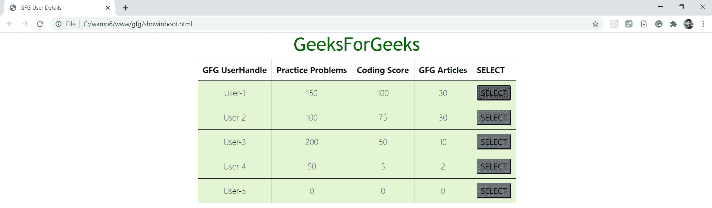
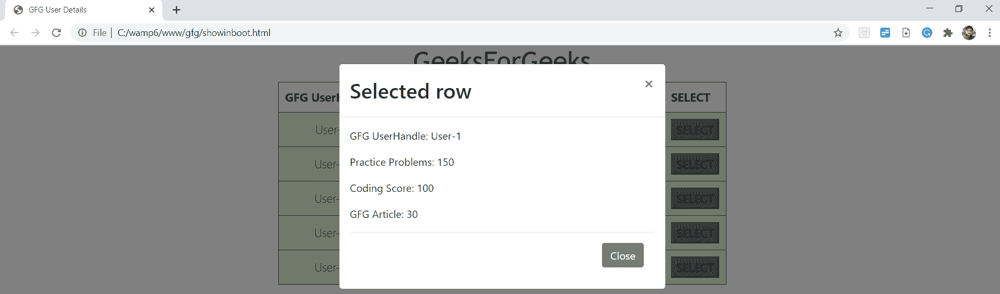
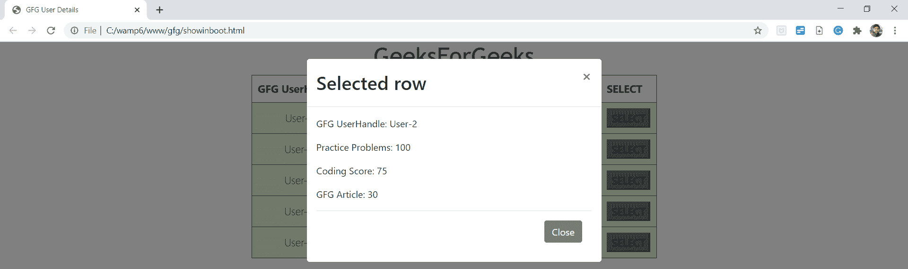

# 如何使用 jQuery 在 Bootstrap 模型中显示表的选定行的内容？

> 原文:[https://www . geeksforgeeks . org/如何使用-jquery 显示自举模型中表的选定行的内容/](https://www.geeksforgeeks.org/how-to-show-contents-of-selected-row-of-a-table-in-bootstrap-model-using-jquery/)

任务是从表的一行中获取数据，并在引导模型上显示它们。

**引导模型**:模态组件是一种对话框或弹出窗口，通过点击页面上提供的按钮显示在当前页面的顶部。但是，单击模型背景时，模型会自动关闭。此外，应该考虑到 Bootstrap 不包含嵌套模式，因为它们会给用户带来更差的用户界面体验。因此，一次只支持一个模态窗口。

**方法:**给我们一个 HTML 表格形式的数据。在我们的代码中，我们使用 jQuery 来完成我们的任务。jQuery 代码有助于从表的行中获取数据，并将其放入引导模型的主体中。最初，它使用 *find()* 方法从表中找到所需数据的位置。它使用 *text()* 方法从该位置获取文本内容，并将它们存储到不同的变量中。然后我们形成一个包含 HTML 代码的字符串来显示模型主体中的数据。使用*清空()*方法清除模型体中的预填充数据。使用 *append()* 方法将字符串放置在模型的主体中。

**代码:**

```html
<!DOCTYPE html>
<html lang="en">
    <head>
        <meta charset="UTF-8" />
        <title>GFG User Details</title>
        <!-- CSS FOR STYLING THE PAGE -->
        <style>
            table {
                margin: 0 auto;
                font-size: large;
                border: 1px solid black;
            }

            h1 {
                text-align: center;
                color: #006600;
                font-size: xx-large;
                font-family: "Gill Sans",
                  "Gill Sans MT", 
                  " Calibri", 
                  "Trebuchet MS",
                  "sans-serif";
            }

            td {
                background-color: #e4f5d4;
                border: 1px solid black;
            }

            th,
            td {
                font-weight: bold;
                border: 1px solid black;
                padding: 10px;
                text-align: center;
            }

            td {
                font-weight: lighter;
            }
        </style>
        <!-- BOOTSTRAP CSS AND PLUGINS-->
        <link rel="stylesheet"
              href=
"https://stackpath.bootstrapcdn.com/bootstrap/4.5.0/css/bootstrap.min.css"
              integrity=
"sha384-9aIt2nRpC12Uk9gS9baDl411NQApFmC26EwAOH8WgZl5MYYxFfc+NcPb1dKGj7Sk" 
              crossorigin="anonymous" />
        <script src=
"https://code.jquery.com/jquery-3.2.1.slim.min.js" 
                integrity=
"sha384-KJ3o2DKtIkvYIK3UENzmM7KCkRr/rE9/Qpg6aAZGJwFDMVNA/GpGFF93hXpG5KkN" 
                crossorigin="anonymous">
      </script>
        <script src=
"https://cdnjs.cloudflare.com/ajax/libs/popper.js/1.12.9/umd/popper.min.js" 
                integrity=
"sha384-ApNbgh9B+Y1QKtv3Rn7W3mgPxhU9K/ScQsAP7hUibX39j7fakFPskvXusvfa0b4Q" 
                crossorigin="anonymous">
      </script>
        <script src=
"https://maxcdn.bootstrapcdn.com/bootstrap/4.0.0/js/bootstrap.min.js" 
                integrity=
"sha384-JZR6Spejh4U02d8jOt6vLEHfe/JQGiRRSQQxSfFWpi1MquVdAyjUar5+76PVCmYl"
                crossorigin="anonymous">
      </script>
        <script src=
"https://code.jquery.com/jquery-3.5.1.js"
                integrity=
"sha256-QWo7LDvxbWT2tbbQ97B53yJnYU3WhH/C8ycbRAkjPDc=" 
                crossorigin="anonymous">
      </script>
    </head>

    <body>
        <section>
            <h1>GeeksForGeeks</h1>
            <!-- TABLE CONSTRUCTION-->
            <table id="GFGtable">
                <tr>
                    <!-- TABLE HEADING -->
                    <th>GFG UserHandle</th>
                    <th>Practice Problems</th>
                    <th>Coding Score</th>
                    <th>GFG Articles</th>
                    <th>SELECT</th>
                </tr>
                <!-- TABLE DATA -->
                <tr>
                    <td class="gfgusername">User-1</td>
                    <td class="gfgpp">150</td>
                    <td class="gfgscores">100</td>
                    <td class="gfgarticles">30</td>
                    <td><button class="gfgselect bg-secondary"
                                data-toggle="modal" 
                                data-target="#gfgmodal">
                      SELECT</button></td>
                </tr>
                <tr>
                    <td class="gfgusername">User-2</td>
                    <td class="gfgpp">100</td>
                    <td class="gfgscores">75</td>
                    <td class="gfgarticles">30</td>
                    <td><button class="gfgselect bg-secondary" 
                                data-toggle="modal" 
                                data-target="#gfgmodal">
                      SELECT</button></td>
                </tr>
                <tr>
                    <td class="gfgusername">User-3</td>
                    <td class="gfgpp">200</td>
                    <td class="gfgscores">50</td>
                    <td class="gfgarticles">10</td>
                    <td><button class="gfgselect bg-secondary"
                                data-toggle="modal"
                                data-target="#gfgmodal">
                      SELECT</button></td>
                </tr>
                <tr>
                    <td class="gfgusername">User-4</td>
                    <td class="gfgpp">50</td>
                    <td class="gfgscores">5</td>
                    <td class="gfgarticles">2</td>
                    <td>
                      <button class="gfgselect bg-secondary"
                                data-toggle="modal"
                                data-target="#gfgmodal">
                      SELECT</button></td>
                </tr>
                <tr>
                    <td class="gfgusername">User-5</td>
                    <td class="gfgpp">0</td>
                    <td class="gfgscores">0</td>
                    <td class="gfgarticles">0</td>
                    <td><button class="gfgselect bg-secondary" 
                                data-toggle="modal"
                                data-target="#gfgmodal">
                      SELECT</button></td>
                </tr>
            </table>
        </section>
        <script>
            $(function () {
                // ON SELECTING ROW
                $(".gfgselect").click(function () {
   //FINDING ELEMENTS OF ROWS AND STORING THEM IN VARIABLES
                    var a =
             $(this).parents("tr").find(".gfgusername").text();
                    var c =
             $(this).parents("tr").find(".gfgpp").text();
                    var d =
             $(this).parents("tr").find(".gfgscores").text();
                    var e = 
             $(this).parents("tr").find(".gfgarticles").text();
                    var p = "";
                    // CREATING DATA TO SHOW ON MODEL
                    p += 
              "<p id='a' name='GFGusername' >GFG UserHandle: "
                      + a + " </p>";

                    p +=
              "<p id='c' name='GFGpp'>Practice Problems: " 
                      + c + "</p>";
                    p += 
              "<p id='d' name='GFGscores' >Coding Score: "
                      + d + " </p>";
                    p += 
              "<p id='e' name='GFGcoding' >GFG Article: "
                      + e + " </p>";
                    //CLEARING THE PREFILLED DATA
                    $("#divGFG").empty();
                    //WRITING THE DATA ON MODEL
                    $("#divGFG").append(p);
                });
            });
        </script>
        <!-- CREATING BOOTSTRAP MODEL -->
        <div class="modal fade" 
             id="gfgmodal"
             tabindex="-1"
             role="dialog">
            <div class="modal-dialog">
                <div class="modal-content">
                    <div class="modal-header">
                        <!-- MODEL TITLE -->
                        <h2 class="modal-title"
                            id="gfgmodallabel">
                          Selected row</h2>
                        <button type="button" 
                                class="close"
                                data-dismiss="modal" 
                                aria-label="Close">
                            <span aria-hidden="true">
                              ×</span>
                        </button>
                    </div>
                    <!-- MODEL BODY -->
                    <div class="modal-body">
                        <div class="GFGclass" 
                             id="divGFG"></div>
                        <div class="modal-footer">
         <!-- The close button in the bottom of the modal -->
                            <button type="button"
                                    class="btn btn-secondary" 
                                    data-dismiss="modal">
                              Close</button>
                        </div>
                    </div>
                </div>
            </div>
        </div>
    </body>
</html>
```

**输出:**



**触发时，第 1 行旁边的选择按钮:**



**触发时，第 2 行旁边的选择按钮:**



jQuery 是一个开源的 JavaScript 库，它简化了 HTML/CSS 文档之间的交互，它以其“少写多做”的理念而闻名。
跟随本 [jQuery 教程](https://www.geeksforgeeks.org/jquery-tutorials/)和 [jQuery 示例](https://www.geeksforgeeks.org/jquery-examples/)可以从头开始学习 jQuery。