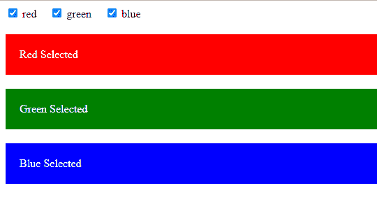

# 如何使用 Bootstrap 和 jQuery 显示/隐藏依赖于多个值的 div 元素？

> 原文:[https://www . geesforgeks . org/how-show-hide-div-element-dependent-multi-values-use-bootstrap-and-jquery/](https://www.geeksforgeeks.org/how-to-show-hide-div-element-depending-multiple-values-using-bootstrap-and-jquery/)

Bootstrap 和 jQuery 一起被用来开发交互式 web 应用程序。Bootstrap 和 jQuery 都是免费和开源的，这使得它在开发人员中很受欢迎。本文讨论在 Bootstrap 和 jQuery 的帮助下，根据用户输入显示和隐藏分区。下面显示了建立相同的两种方法。

**第一种方法:**在第一种方法中，根据用户的输入，一次只能看到一个分割。该方法包括一个下拉列表，其中有三个选项。用户可以一次选择一个选项，并根据选项的值显示相应的部分。代码片段中使用的方法如下:

*   **$(文档)。ready(函数):**加载文档并执行作为参数传递的函数时，会触发 ready 事件。
*   **$(选择器)。change(函数):**当所选元素(输入、文本区域或选择)已被更改，并且作为参数传递的函数被执行时，会触发 change 事件。这里，当用户从下拉菜单中选择一个选项时，作为参数传递的函数被调用。
*   **$(选择器)。find(filter):** 此方法返回所选元素的所有后代元素。这里<选项>是<选择>的后代。此外，该方法需要一个筛选器来返回所需的元素。这里选择的选项是过滤器，即用户选择的选项被返回。
*   **$(选择器)。每个(函数):**该方法执行作为每个匹配元素的参数传递的函数。这里，作为参数传递的函数对 find()方法返回的每个元素执行。
*   **$(选择器)。attr(属性):**该方法分别设置或返回所选元素的属性和值。这里，所选选项的值被提取到选项值变量中。
*   **$(选择器)。not(条件):**此方法返回与指定条件不匹配的元素。在这里，not 方法返回用户没有选择的选项。
*   **$(选择器)。hide():** 此方法隐藏选定的元素。
*   **$(选择器)。show():** 此方法显示选定的元素。

**说明:**页面显示下拉菜单，用户可从中选择一个选项。一旦在<选择>元素中发生变化，就会触发 change()方法，然后调用 find 函数并返回所选选项。attr()方法将选项的值提取到 optionValue 变量中。optionValue 变量后面附加了“.”(这使它成为已定义的划分类中的一个)。not()方法隐藏所有与条件中提到的类不匹配的类。show()方法最终显示用户选择的分部。如果用户没有选择任何选项，则隐藏所有分区。

## 超文本标记语言

```html
<!DOCTYPE html>
<html lang="en">

<head>
    <meta charset="utf-8">
    <title>Show Hide Elements Using Dropdown</title>

    <!--CSS stylesheet-->
    <style>
        .box {
            color: #fff;
            padding: 20px;
            display: none;
            margin-top: 20px;
        }

        .red {
            background: red;
        }

        .green {
            background: green;
        }

        .blue {
            background: blue;
        }
    </style>
    <!--importing jquery cdn-->
    <script src=
"https://code.jquery.com/jquery-1.12.4.min.js">
    </script>

    <script>
        // jQuery functions to hide and show the div
        $(document).ready(function () {
            $("select").change(function () {
                $(this).find("option:selected")
                       .each(function () {
                    var optionValue = $(this).attr("value");
                    if (optionValue) {
                        $(".box").not("." + optionValue).hide();
                        $("." + optionValue).show();
                    } else {
                        $(".box").hide();
                    }
                });
            }).change();
        });
    </script>
</head>

<body>
    <div>
        <!--dropdown list options-->
        <select>
            <option>Choose Color</option>
            <option value="red">Red</option>
            <option value="green">Green</option>
            <option value="blue">Blue</option>
        </select>
    </div>
    <!--divs that hide and show-->
    <div class="red box">Red Selected</div>
    <div class="green box">Green Selected</div>
    <div class="blue box">Blue Selected</div>
</body>

</html>
```

**输出:**


**第二种方法:**这种方法演示了如何同时显示一个或多个分区。这个方法利用复选框来获取用户输入。由于复选框一次可以取多个值，因此它是满足我们目的的理想选择。代码中使用了以下方法:

*   **$(文档)。ready(函数):**加载文档并执行作为参数传递的函数时，会触发 ready 事件。
*   **$(选择器)。click(函数):**此方法触发 click 事件或在 click 事件发生时执行函数。这里，当用户选中复选框时，点击事件被触发，作为参数传递的函数被执行。
*   **$(选择器)。attr(属性):**此方法返回所选元素的值。这里，所选选项的值被提取到输入值变量中。
*   **$(选择器)。toggle():** 此方法为选定的元素在 hide()方法和 show()方法之间切换。如果选中该框，将显示分部。如果未选中该框，则分割将被隐藏。

**说明:**网页包含某些复选框。用户可以一次选择一个或多个复选框。如果复选框最初被隐藏，则对应于复选框的分区会显示出来。如果复选框未被选中，则相应的部分将被隐藏。

## 超文本标记语言

```html
<!DOCTYPE html>
<html lang="en">

<head>
    <meta charset="utf-8">
    <title>Show Hide Elements Using Checkboxes</title>

    <!--CSS stylesheet-->
    <style>
        .box {
            color: #fff;
            padding: 20px;
            display: none;
            margin-top: 20px;
        }

        .red {
            background: red;
        }

        .green {
            background: green;
        }

        .blue {
            background: blue;
        }

        label {
            margin-right: 15px;
        }
    </style>

    <!--import jQuery cdn-->
    <script src=
        "https://code.jquery.com/jquery-1.12.4.min.js">
    </script>

    <script>

        // jQuery functions to show and hide divisions
        $(document).ready(function () {
            $('input[type="checkbox"]').click(function () {
                var inputValue = $(this).attr("value");
                $("." + inputValue).toggle();
            });
        });
    </script>
</head>

<body>

    <div>
        <!--checkboxes-->
        <label><input type="checkbox" 
            name="colorCheckbox" value="red">
            red
        </label>

        <label><input type="checkbox" 
            name="colorCheckbox" value="green"> 
            green
        </label>

        <label><input type="checkbox" 
            name="colorCheckbox" value="blue"> 
            blue
        </label>
    </div>

    <!--Divisions to be shown and hidden-->
    <div class="red box">Red Selected</div>
    <div class="green box">Green Selected</div>
    <div class="blue box">Blue Selected</div>
</body>

</html>
```

**输出**T2】




jQuery 是一个开源的 JavaScript 库，它简化了 HTML/CSS 文档之间的交互，它以其“少写多做”的理念而闻名。
跟随本 [jQuery 教程](https://www.geeksforgeeks.org/jquery-tutorials/)和 [jQuery 示例](https://www.geeksforgeeks.org/jquery-examples/)可以从头开始学习 jQuery。