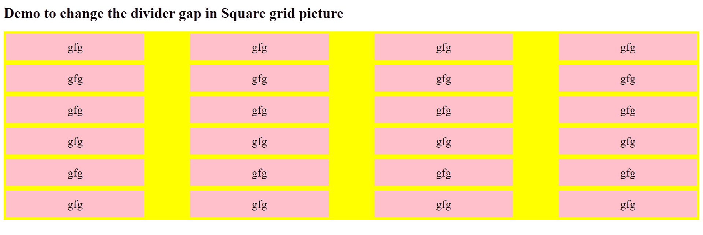
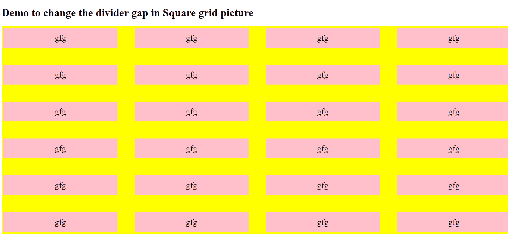

# 如何使用 Bootstrap 指定正方形网格中的分割线间隙？

> 原文:[https://www . geeksforgeeks . org/如何使用自举指定方形网格中的分割器间隙/](https://www.geeksforgeeks.org/how-to-specify-divider-gap-in-square-grid-using-bootstrap/)

[CSS 网格行间隙属性](https://www.geeksforgeeks.org/css-grid-row-gap-property/)用于设置网格行元素之间的间隙大小。类似地， [CSS 网格-柱间隙属性](https://www.geeksforgeeks.org/css-grid-column-gap-property/)用于设置柱元素之间的间隙(檐槽)的大小。

**语法:**

*   **CSS 网格-列-间隙属性**

    ```
    grid-column-gap: none|length|percentage|initial|inherit;
    ```

*   **CSS 网格-行-间隙属性**

    ```
    grid-row-gap: length|percentage|global-values;
    ```

**方法:**指定网格线的大小。你可以把它想象成设置列/行之间的檐槽宽度。

*   选择包含网格布局的类。
*   指定该类的网格间距属性值。
*   例:

    ```
    .container {
        grid-column-gap: <line-size>;
        grid-row-gap: <line-size>;
    }
    ```

**示例:**

```
<!DOCTYPE html>
<html>

<head>
    <style>
        /*  Use grid-row-gap and grid-column-gap
            to specify the gap between the square
            grids the gap between the row is
            specified 10px the gap between the
            row is specified 100px */
        .grid-box {
            display: grid;
            grid-template-columns: auto auto auto auto;

            /* Specify the divider gap measurement in a grid */
            grid-row-gap: 10px;
            grid-column-gap: 100px;
            background-color: yellow;
            padding: 5px;
        }

        .grid-box div {
            background-color: pink;
            text-align: center;
            padding: 15px 0;
            font-size: 25px;
        }
    </style>
</head>

<body>

    <h1>
        Demo to change the divider
        gap in Square grid picture
    </h1>

    <div class="grid-box">
        <div class="item1">gfg</div>
        <div class="item2">gfg</div>
        <div class="item3">gfg</div>
        <div class="item4">gfg</div>
        <div class="item5">gfg</div>
        <div class="item6">gfg</div>
        <div class="item7">gfg</div>
        <div class="item8">gfg</div>
        <div class="item9">gfg</div>
        <div class="item10">gfg</div>
        <div class="item11">gfg</div>
        <div class="item12">gfg</div>
        <div class="item13">gfg</div>
        <div class="item14">gfg</div>
        <div class="item15">gfg</div>
        <div class="item16">gfg</div>
        <div class="item17">gfg</div>
        <div class="item18">gfg</div>
        <div class="item19">gfg</div>
        <div class="item20">gfg</div>
        <div class="item21">gfg</div>
        <div class="item22">gfg</div>
        <div class="item23">gfg</div>
        <div class="item24">gfg</div>
    </div>
</body>

</html>
```

**输出:**


行间距为 50px，列间距为 50px 的网格示例。


**浏览器兼容性:**

*   铬合金:不*   火狐:是的(63.0)*   边缘:不*   互联网浏览器:没有*   歌剧:不*   狩猎:N0

    *   Chrome:是(66.0)
    *   火狐:是的(61.0)
    *   Edge:是(16.0)
    *   互联网浏览器:没有
    *   歌剧:是(53.0)
    *   Safari:是(10.1)