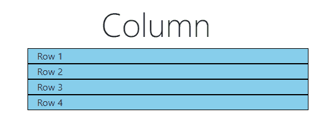

# 如何使用 bootstrap 将一列列表拆分成不同的行？

> 原文:[https://www . geeksforgeeks . org/如何使用引导程序拆分不同行中的列表列/](https://www.geeksforgeeks.org/how-to-split-a-column-of-list-in-different-rows-using-bootstrap/)

**[【BootStrap】](https://www.geeksforgeeks.org/bootstrap-tutorials/)**是用于前端 web 开发的最流行、最免费、最开源的 CSS 框架。 **[BootStrap 4](https://www.geeksforgeeks.org/bootstrap-4-introduction/)** 是正在使用的最新版本。BootStrap 4 提供了广泛的组件、内容、布局和实用程序。Bootstrap 4 提供了一个网格系统，它使用一系列容器、行和列来布局和对齐内容。网格系统允许用户创建具有自定义规格的网格。网格系统是用 flexbox 构建的，完全响应，可以根据屏幕大小调整列的大小。容器是 Bootstrap 中最基本的布局元素，在使用网格系统时需要用到。使用 BootStrap 的网格系统可以将列表的列拆分为行。BootStrap 的“行”和“列”类支持将任何区域拆分为行和列。下面的代码可用于使用 BootStrap 将列表中的一列拆分为不同的行。
考虑以下列表:

*   第 1 行
*   第 2 行
*   第 3 行
*   第 4 行

**示例 1:** 在本例中，我们使用嵌套的行和列将列表的列拆分为行。

```html
<!DOCTYPE html>
<html>
    <head>
        <title>Splitting List Into Columns</title>

        <!-- Linking BootStrap 4 CDN to HTML application -->
        <link rel="stylesheet" href=
"https://stackpath.bootstrapcdn.com/bootstrap/4.4.1/css/bootstrap.min.css" 
              integrity=
"sha384-Vkoo8x4CGsO3+Hhxv8T/Q5PaXtkKtu6ug5TOeNV6gBiFeWPGFN9MuhOf23Q9Ifjh" 
              crossorigin="anonymous" />

        <!--Styling the webpage using CSS -->
        <style type="text/css">
            .col {
                background-color: yellow;
                border: 1px solid black;
            }
        </style>
    </head>
    <body>
        <div class="container">
            <h1 class="text-center display-4">Column</h1>
            <div class="row">
                <div class="col">
                    <div class="row">
                        <div class="col">Row 1</div>
                    </div>
                    <div class="row">
                        <div class="col">Row 2</div>
                    </div>
                    <div class="row">
                        <div class="col">Row 3</div>
                    </div>
                    <div class="row">
                        <div class="col">Row 4</div>
                    </div>
                </div>
            </div>
        </div>
    </body>
</html>
```

**输出:** 

**示例 2:** 在本例中，我们通过在< li >标签中添加类属性，将列表的列拆分为行。

```html
<!DOCTYPE html>
<html>
    <head>
        <title>Splitting List Into Columns</title>
        <link rel="stylesheet" href=
"https://stackpath.bootstrapcdn.com/bootstrap/4.4.1/css/bootstrap.min.css" 
              integrity=
"sha384-Vkoo8x4CGsO3+Hhxv8T/Q5PaXtkKtu6ug5TOeNV6gBiFeWPGFN9MuhOf23Q9Ifjh" 
              crossorigin="anonymous" />

        <style type="text/css">
            .col-12 {
                background-color: skyblue;
                border: 1px solid black;
            }
        </style>
    </head>
    <body>
        <div class="container">
            <h1 class="text-center display-4">Column</h1>
            <ul>
                <li class="col-12">Row 1</li>
                <li class="col-12">Row 2</li>
                <li class="col-12">Row 3</li>
                <li class="col-12">Row 4</li>
            </ul>
        </div>
    </body>
</html>
```

**输出:**


**示例 3:** 在本例中，我们通过嵌套分割将列表的列拆分为行。

```html
<!DOCTYPE html>
<html>
    <head>
        <title>Splitting List Into Columns</title>
        <link rel="stylesheet" href=
"https://stackpath.bootstrapcdn.com/bootstrap/4.4.1/css/bootstrap.min.css" 
              integrity=
"sha384-Vkoo8x4CGsO3+Hhxv8T/Q5PaXtkKtu6ug5TOeNV6gBiFeWPGFN9MuhOf23Q9Ifjh" 
              crossorigin="anonymous" />

        <style type="text/css">
            .col-12 {
                background-color: lightgreen;
                border: 1px solid black;
            }
        </style>
    </head>
    <body>
        <div class="container">
            <h1 class="text-center display-4">Column</h1>
            <div class="col-12">Row 1</div>
            <div class="col-12">Row 2</div>
            <div class="col-12">Row 3</div>
            <div class="col-12">Row 4</div>
        </div>
    </body>
</html>
```

**输出**T2】