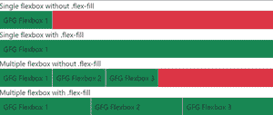
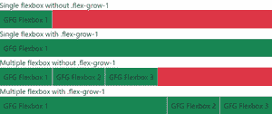

# 如何在 Bootstrap 中拉伸 flexbox 来填充整个容器？

> 原文:[https://www . geeksforgeeks . org/如何拉伸 flexbox 以填充整个引导式容器/](https://www.geeksforgeeks.org/how-to-stretch-flexbox-to-fill-the-entire-container-in-bootstrap/)

我们得到了一个带有弹性框和容器的 HTML 文档(与 Bootstrap 链接)。目标是拉伸 flexbox 以填充整个容器。这可以通过两种不同的方法来实现，使用 Bootstrap 中的 flex-fill 或 flex-grow 类。

**方法 1:使用** [**伸缩填充**](https://www.geeksforgeeks.org/bootstrap-4-flex/) **类:** The *。flex-fill* 类拉伸元素的宽度，以填充整个水平空间。如果有多个应用此类的同级元素，水平空间将在它们之间平均分配。

**语法:**

```html
<div class="flex-fill"></div>
```

**示例:**

```html
<!Doctype html>
<html lang="en">

<head>
    <meta charset="utf-8">
    <meta name="viewport" content=
        "width=device-width, initial-scale=1">

    <link href=
"https://cdn.jsdelivr.net/npm/bootstrap@5.0.0-beta1/dist/css/bootstrap.min.css"
        rel="stylesheet" integrity=
"sha384-giJF6kkoqNQ00vy+HMDP7azOuL0xtbfIcaT9wjKHr8RbDVddVHyTfAAsrekwKmP1"
        crossorigin="anonymous">

    <script src=
"https://cdn.jsdelivr.net/npm/bootstrap@5.0.0-beta1/dist/js/bootstrap.bundle.min.js"
        integrity=
"sha384-ygbV9kiqUc6oa4msXn9868pTtWMgiQaeYH7/t7LECLbyPA2x65Kgf80OJFdroafW"
        crossorigin="anonymous">
    </script>

    <title>GFG Bootstrap Flexbox</title>
</head>

<body>
    <p>Single flexbox without .flex-fill</p>

    <div class="d-flex bg-danger container">
        <div class="bg-success p-2 border">
            GFG Flexbox 1
        </div>
    </div>

    <p>Single flexbox with .flex-fill</p>

    <div class="d-flex bg-danger container">
        <div class="bg-success p-2 border flex-fill">
            GFG Flexbox 1
        </div>
    </div>

    <p>Multiple flexbox without .flex-fill</p>

    <div class="d-flex bg-danger container">
        <div class="bg-success p-2 border">
            GFG Flexbox 1
        </div>
        <div class="bg-success p-2 border">
            GFG Flexbox 2
        </div>
        <div class="bg-success p-2 border">
            GFG Flexbox 3
        </div>
    </div>

    <p>Multiple flexbox with .flex-fill</p>

    <div class="d-flex bg-danger container">
        <div class="bg-success p-2 border flex-fill">
            GFG Flexbox 1
        </div>
        <div class="bg-success p-2 border flex-fill">
            GFG Flexbox 2
        </div>
        <div class="bg-success p-2 border flex-fill">
            GFG Flexbox 3
        </div>
    </div>
</body>

</html>
```

*   **输出:**



**方法 2:使用**[**flex-grow**](https://www.geeksforgeeks.org/bootstrap-4-flex/)**类:**我们还可以使用 Bootstrap 的 flex-grow-*类来改变 flexbox 的宽度。

*。flex-grow-1* 通过仅给其他元素(如果有)必要的空间，将元素拉伸到其最大宽度。

**语法:**

```html
<div class="flex-grow-1"></div>
```

**示例:**

```html
<!Doctype html>
<html lang="en">

<head>
    <meta charset="utf-8">
    <meta name="viewport" content=
        "width=device-width, initial-scale=1">

    <link href=
"https://cdn.jsdelivr.net/npm/bootstrap@5.0.0-beta1/dist/css/bootstrap.min.css"
        rel="stylesheet" integrity=
"sha384-giJF6kkoqNQ00vy+HMDP7azOuL0xtbfIcaT9wjKHr8RbDVddVHyTfAAsrekwKmP1"
        crossorigin="anonymous">

    <script src=
"https://cdn.jsdelivr.net/npm/bootstrap@5.0.0-beta1/dist/js/bootstrap.bundle.min.js"
        integrity=
"sha384-ygbV9kiqUc6oa4msXn9868pTtWMgiQaeYH7/t7LECLbyPA2x65Kgf80OJFdroafW"
        crossorigin="anonymous">
    </script>
</head>

<body>
    <p>Single flexbox without .flex-grow-1</p>

    <div class="d-flex bg-danger container">
        <div class="bg-success p-2 border">
            GFG Flexbox 1
        </div>
    </div>

    <p>Single flexbox with .flex-grow-1</p>

    <div class="d-flex bg-danger container">
        <div class="bg-success p-2 border flex-grow-1">
            GFG Flexbox 1
        </div>
    </div>

    <p>Multiple flexbox without .flex-grow-1</p>

    <div class="d-flex bg-danger container">
        <div class="bg-success p-2 border">
            GFG Flexbox 1
        </div>
        <div class="bg-success p-2 border">
            GFG Flexbox 2
        </div>
        <div class="bg-success p-2 border">
            GFG Flexbox 3
        </div>
    </div>

    <p>Multiple flexbox with .flex-grow-1</p>

    <div class="d-flex bg-danger container">
        <div class="bg-success p-2 border flex-grow-1">
            GFG Flexbox 1
        </div>
        <div class="bg-success p-2 border">
            GFG Flexbox 2
        </div>
        <div class="bg-success p-2 border">
            GFG Flexbox 3
        </div>
    </div>
</body>

</html>
```

**输出:**

