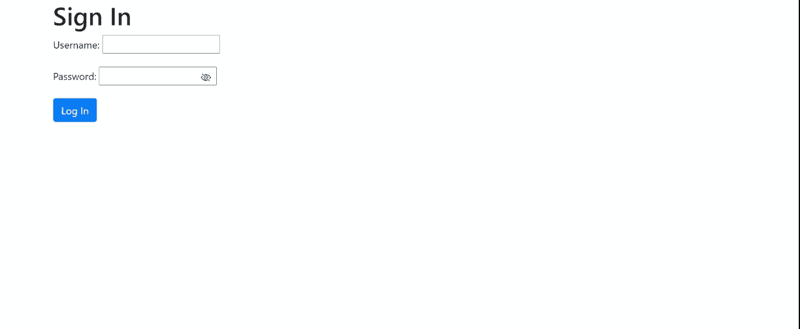

# 如何使用引导图标切换表单中的密码可见性？

> 原文:[https://www . geesforgeks . org/如何切换-密码-表单可见性-使用-引导-图标/](https://www.geeksforgeeks.org/how-to-toggle-password-visibility-in-forms-using-bootstrap-icons/)

密码是那些显示为* * * * * * *的输入类型。它可以通过添加眼睛图标的特征向用户显示，以便用户可以看到密码。

在本文中，我们将学习如何使用 Bootstrap 切换密码可见性。

**进场:**

*   我们将使用几类 Bootstrap 图标–*bi、双眼斜线*、*和双眼。*
*   使用 JavaScript 切换这些类。
*   我们将切换密码输入字段的类型(文本到密码和密码到文本)。

**要导入的文件:**

对于输入栏中的图标(眼睛图标)

> <link rel="”stylesheet”" href="”https://cdn.jsdelivr.net/npm/bootstrap-icons@1.3.0/font/bootstrap-icons.css”">

为表单元素设置样式，如按钮、添加填充等

> <link rel="”stylesheet”" href="”https://stackpath.bootstrapcdn.com/bootstrap/4.3.1/css/bootstrap.min.css”" integrity="”sha384-ggOyR0iXCbMQv3Xipma34MD+dH/1fQ784/j6cY/iJTQUOhcWr7x9JvoRxT2MZw1T”" crossorigin="”anonymous”">

**Javascript 函数说明:**

*   我们正在使用 getAttribute()方法获取*密码*的 id 并确定其类型。这种提取是在创建事件(单击)时完成的。
*   如果是*文字*，则转换为*密码。*
*   如果是*密码*，则转换为*文本。*
*   转换使用 *setAttribute()方法完成。*

## 超文本标记语言

```html
<!DOCTYPE html>
<html lang="en">

<head>

    <title>Toggle Password Visibility</title>
    <link rel="stylesheet" href=
"https://cdn.jsdelivr.net/npm/bootstrap-icons@1.3.0/font/bootstrap-icons.css" />
    <link rel="stylesheet" href=
"https://stackpath.bootstrapcdn.com/bootstrap/4.3.1/css/bootstrap.min.css"
        integrity=
"sha384-ggOyR0iXCbMQv3Xipma34MD+dH/1fQ784/j6cY/iJTQUOhcWr7x9JvoRxT2MZw1T"
        crossorigin="anonymous">

    <style>
        form i {
            margin-left: -30px;
            cursor: pointer;
        }
    </style>
</head>

<body>
    <div class="container">
        <h1>Sign In</h1>
        <form>
            <p>
                <label>Username:</label>
                <input type="text" 
                    name="userID" id="userID">
            </p>

            <p>
                <label>Password:</label>
                <input type="password" 
                    name="password" id="password" />
                <i class="bi bi-eye-slash" 
                    id="togglePassword"></i>
            </p>

            <button type="submit" id="submit" 
                class="btn btn-primary">
                Log In
            </button>
        </form>
    </div>

    <script>
        const togglePassword = document
            .querySelector('#togglePassword');

        const password = document.querySelector('#password');

        togglePassword.addEventListener('click', () => {

            // Toggle the type attribute using
            // getAttribure() method
            const type = password
                .getAttribute('type') === 'password' ?
                'text' : 'password';

            password.setAttribute('type', type);

            // Toggle the eye and bi-eye icon
            this.classList.toggle('bi-eye');
        });
    </script>
</body>

</html>
```

**输出:**

