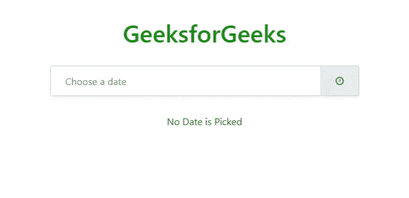

# 如何使用 Bootstrap Datepicker 获取变更事件的日期？

> 原文:[https://www . geesforgeks . org/使用方法-引导-日期选择器-获取更改日期-事件/](https://www.geeksforgeeks.org/how-to-use-bootstrap-datepicker-to-get-date-on-change-event/)

在本文中，我们将学习如何使用 [Bootstrap](https://www.geeksforgeeks.org/bootstrap-4-introduction/) Datepicker 获取事件变化的日期。Bootstrap Datepicker 是一个开源存储库，它提供了一个将日期时间选择器集成到网站前端的应用编程接口。一个人要有 [HTML](https://www.geeksforgeeks.org/html-tutorials/) 、 [CSS](https://www.geeksforgeeks.org/css-tutorials/) 、 [jQuery](https://www.geeksforgeeks.org/jquery-tutorials/) 、 [Bootstrap](https://www.geeksforgeeks.org/bootstrap-tutorials/) 的基础知识。

**进场:**

*   创建一个 HTML 文件。
*   请按照下面的代码格式，按照下面的顺序将一些外部 CSS 链接到头标签内的代码。
*   首先在文件中包含引导 CSS。将[引导日期选择器 CSS](https://www.geeksforgeeks.org/how-to-change-bootstrap-datepicker-with-specific-date-format/?ref=rp) 添加到您的文件中。最后，你需要把[字体的超赞 CSS](https://www.geeksforgeeks.org/how-to-place-font-awesome-icon-to-input-field/) 添加到你的 HTML 文件中。

> <rel = " style sheet "链接 href = " https://cdnjs . cloudflare . com/Ajax/libs/bootstrap-date picker/1 . 9 . 0/CSS/bootstrap-date picker . CSS "/
> <rel = " style sheet "链接 href = " https://stack path . bootstracdn . com/font-awesome/4 . 7 . 0/CSS

*   按照下面的代码格式，按照这个顺序，在[头](https://www.geeksforgeeks.org/html-head-tag/)标签内给你的代码附加一些外部 JavaScript 文件。
*   首先在文件中包含 jquery JavaScript。第二步是将引导 JavaScript 添加到文件中。最后，您需要将[引导日期选择器](https://www.geeksforgeeks.org/how-to-set-bootstrap-timepicker-using-datetimepicker-library/) JavaScript 添加到您的 HTML 文件中。

> <脚本 src = " https://cdnjs . cloudflare . com/Ajax/libs/Twitter-bootstrap/4 . 3 . 1/js/bootstrap . bundle . min . js "></脚本>
> <脚本 src = " https://cdnjs . cloudflare . com/Ajax/libs/bootstrap-datepicker/1 . 9 . 0/js/bootstrap-datepicker . min . js "></

*   根据需要，在输入字段中添加一个类名为“*日期选择器*”和其他引导类
*   您可以使用来自任何资源的任何图标，如 font awesome 或任何其他平台，通过将图标与输入字段对齐来美化您的输入字段。
*   然后，有必要将日期选择器初始化到输入字段，以便当用户单击该输入字段时，将出现弹出日历，然后他们可以从该提示中选择日期。

**示例:**在本例中，我们将类名为“datepicker”的输入字段作为输入，并使用 [datepicker()](https://www.geeksforgeeks.org/how-to-change-bootstrap-datepicker-with-specific-date-format/?ref=rp) 在该输入上初始化 datepicker。

当用户单击输入字段时会出现日历，并且可以从日历中选择日期。一旦用户从日历中选择一个日期，它就会自动写入输入字段。我们为该输入字段添加了一个事件监听器 [onchange](https://www.geeksforgeeks.org/html-dom-onchange-event/) 。当在输入字段中进行选择时，自动调用 [onchange()](https://www.geeksforgeeks.org/html-dom-onchange-event/) 回调方法，使用 jQuery [val()](https://www.geeksforgeeks.org/jquery-val-with-examples/) 方法获取输入字段的值。

## 超文本标记语言

```html
<!DOCTYPE html>
<html>

<head>
    <link rel="stylesheet"
          href=
"https://cdnjs.cloudflare.com/ajax/libs/twitter-bootstrap/4.3.1/css/bootstrap.min.css" />
    <link rel="stylesheet" 
          href=
"https://cdnjs.cloudflare.com/ajax/libs/bootstrap-datepicker/1.9.0/css/bootstrap-datepicker.css" />
    <link rel="stylesheet" 
          href=
"https://stackpath.bootstrapcdn.com/font-awesome/4.7.0/css/font-awesome.min.css" />
    <script src=
"https://code.jquery.com/jquery-3.3.1.slim.min.js">
    </script>
    <script src=
"https://cdnjs.cloudflare.com/ajax/libs/twitter-bootstrap/4.3.1/js/bootstrap.bundle.min.js">
    </script>
    <script src=
"https://cdnjs.cloudflare.com/ajax/libs/bootstrap-datepicker/1.9.0/js/bootstrap-datepicker.min.js">
    </script>

    <style>
        .container {
            display: flex;
            justify-content: center;
            margin-top: 30px;
        }

        h1,
        container {
            color: green;
        }
    </style>
</head>

<body>
    <h1 class="container">
        GeeksforGeeks
    </h1>
    <div class="container">
        <div class="datepicker date 
                    input-group p-0 shadow-sm">
            <input id="reservationDate" 
                   type="text"
                   placeholder="Choose a date" 
                   class="form-control py-4 px-4" />
            <div class="input-group-append"> 
              <span class="input-group-text px-4">
                  <i class="fa fa-clock-o"></i>
                </span> 
            </div>
        </div>
    </div>
    <div class="container">
        <p id="showdate"> No Date is Picked </p>
    </div>

    <script>
        $(".datepicker").datepicker({
            clearBtn: true,
            format: "dd/mm/yyyy",
        });
        $(".datepicker").on("change", function() {
            let pickedDate = $("input").val();
            $("#showdate").text(
            `You picked this ${pickedDate} Date`);
        });
    </script>
</body>

</html>
```

**输出:**

