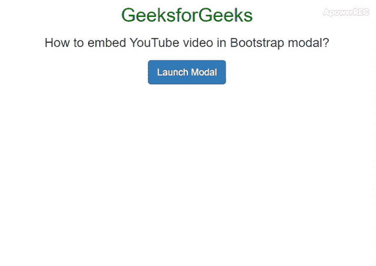
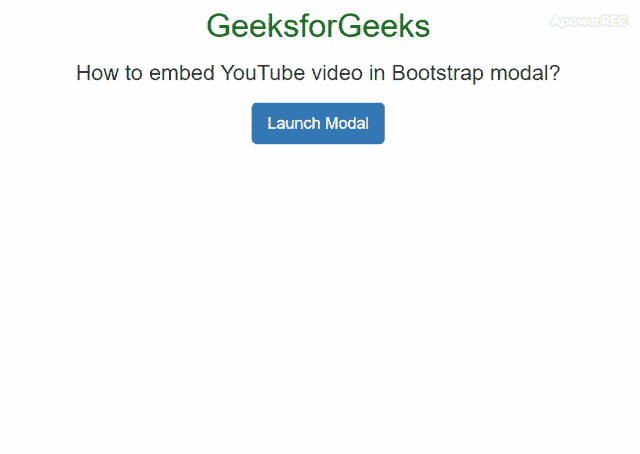

# 如何对 YouTube 视频使用 Bootstrap 模态并自动播放？

> 原文:[https://www . geeksforgeeks . org/如何使用-bootstrap-modal-for-YouTube-video-and-play-automatic/](https://www.geeksforgeeks.org/how-to-use-bootstrap-modal-for-youtube-videos-and-play-automatically/)

任务是在 Bootstrap 中为 YouTube 视频使用模态。这里我们将讨论两个主题，在 Bootstrap 模式中嵌入 YouTube 视频，并使 YouTube 视频在 Bootstrap 模式中自动播放。使用下面的方法，将 YouTube 视频嵌入到 Bootstrap 模式中非常容易实现。但是有一个小问题，当你关闭模式时，视频会继续在后台播放。
**进场:**

*   首先，从 YouTube 网站复制嵌入视频的代码。
*   然后，将代码放入**中。模态体**元素。
*   要在关闭模态时自动停止视频，请使用 jQuery 动态切换 YouTube 视频 iframe src 属性的 URL 值。

下面的例子实现了上面的方法:
**例子 1:** 这个例子实现了如何在 Bootstrap 模式下嵌入 YouTube 视频但不自动播放。

## 超文本标记语言

```html
<!DOCTYPE html>
<html lang="en">

<head>
    <meta charset="utf-8">
    <title>
        Embedding YouTube video in Bootstrap modal
    </title>
    <link rel="stylesheet" href=
"https://maxcdn.bootstrapcdn.com/bootstrap/3.3.7/css/bootstrap.min.css">
    <script src=
"https://ajax.googleapis.com/ajax/libs/jquery/1.12.4/jquery.min.js">
    </script>
    <script src=
"https://maxcdn.bootstrapcdn.com/bootstrap/3.3.7/js/bootstrap.min.js">
    </script>
    <style>
        .bs-example {
            margin: 20px;
        }

        .modal-content iframe {
            margin: 0 auto;
            display: block;
        }
    </style>
    <script>
        $(document).ready(function() {
            var url = $("#Geeks3").attr('src');
            $("#Geeks2").on('hide.bs.modal', function() {
                $("#Geeks3").attr('src', '');
            });
            $("#Geeks2").on('show.bs.modal', function() {
                $("#Geeks3").attr('src', url);
            });
        });
    </script>
</head>

<body>
    <center>
        <h1 style="color:green"> 
        GeeksforGeeks 
    </h1>

        <h3> 
        How to embed YouTube video in Bootstrap modal?
    </h3>
        <div class="bs-example">
            <a href="#Geeks2"
               class="btn btn-lg btn-primary"
               data-toggle="modal">Launch Modal</a>

            <div id="Geeks2" class="modal fade">
                <div class="modal-dialog">
                    <div class="modal-content">
                        <div class="modal-header">
                            <button type="button"
                                    class="close"
                                    data-dismiss="modal"
                                    aria-hidden="true">×</button>
                            <h4 class="modal-title">GeeksforGeeks</h4>
                        </div>
                        <div class="modal-body">
                            <iframe id="Geeks3" width="450" height="350"
                                    src=
 "https://www.youtube.com/embed/V5he1JXiQbg"
                                    frameborder="0" allowfullscreen>
                            </iframe>
                        </div>
                    </div>
                </div>
          </div>
      </div>
    </center>
</body>

</html>
```

**输出:**



**示例 2:** 本示例实现了如何在 Bootstrap 模态内部自动播放 YouTube 视频。要让 YouTube 视频以引导模式自动播放，我们必须放置**？自动播放=1** 在附加的 Youtube 的源文件之后。

## 超文本标记语言

```html
<!DOCTYPE html>
<html lang="en">

<head>
    <meta charset="utf-8">
    <title>
        Embedding YouTube video in Bootstrap modal
    </title>
    <link rel="stylesheet" href=
"https://maxcdn.bootstrapcdn.com/bootstrap/3.3.7/css/bootstrap.min.css">
    <script src=
"https://ajax.googleapis.com/ajax/libs/jquery/1.12.4/jquery.min.js">
    </script>
    <script src=
"https://maxcdn.bootstrapcdn.com/bootstrap/3.3.7/js/bootstrap.min.js">
    </script>
    <style>
        .bs-example {
            margin: 20px;
        }

        .modal-content iframe {
            margin: 0 auto;
            display: block;
        }
    </style>
    <script>
        $(document).ready(function() {
            var url = $("#Geeks3").attr('src');
            $("#Geeks2").on('hide.bs.modal', function() {
                $("#Geeks3").attr('src', '');
            });
            $("#Geeks2").on('show.bs.modal', function() {
                $("#Geeks3").attr('src', url);
            });
        });
    </script>
</head>

<body>
    <center>
        <h1 style="color:green">
        GeeksforGeeks
    </h1>

        <h3>
        How to embed YouTube video in Bootstrap modal?
    </h3>
        <div class="bs-example">
            <a href="#Geeks2"
            class="btn btn-lg btn-primary"
            data-toggle="modal">Launch Modal</a>

            <div id="Geeks2" class="modal fade">
                <div class="modal-dialog">
                    <div class="modal-content">
                        <div class="modal-header">
                            <button type="button"
                                    class="close"
                                    data-dismiss="modal"
                                    aria-hidden="true">×</button>
                            <h4 class="modal-title">GeeksforGeeks</h4>
                        </div>
                        <div class="modal-body">
                            <iframe id="Geeks3" width="450" height="350"
                                    src=
"https://www.youtube.com/embed/V5he1JXiQbg?autoplay=1"
                                    frameborder="0" allowfullscreen>
                            </iframe>
                        </div>
                    </div>
                </div>
        </div>
    </div>
    </center>
</body>

</html>                   
```

**输出:**



**支持的浏览器:**

*   谷歌 Chrome
*   微软边缘
*   火狐浏览器
*   歌剧
*   狩猎

jQuery 是一个开源的 JavaScript 库，它简化了 HTML/CSS 文档之间的交互，它以其“少写多做”的理念而闻名。
跟随本 [jQuery 教程](https://www.geeksforgeeks.org/jquery-tutorials/)和 [jQuery 示例](https://www.geeksforgeeks.org/jquery-examples/)可以从头开始学习 jQuery。