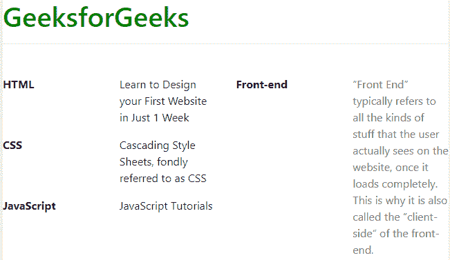

# 如何使用 Bootstrap 将标签与内容对齐成 4 列？

> 原文:[https://www . geesforgeks . org/如何使用引导程序将标签与内容对齐成 4 列/](https://www.geeksforgeeks.org/how-to-use-bootstrap-to-align-labels-with-content-into-4-columns/)

本文的目的是将内容排列成四列，其中前两列表示标签及其内容，后两列表示标签及其内容。类“行”和“列”用于创建一个网格，该网格可以由许多行和列来表示。类“行”创建一行，内容将被放入该行中，类“列”在该行中创建分区，为要放在该行中的 4 个标签或 4 个项目腾出空间。
本示例使用 Bootstrap 创建四列，其中前两列表示标签及其内容，后两列表示标签及其内容。
**例:**

```
<!DOCTYPE html>
<html>

<head>
    <title>
        How to use Bootstrap to align labels
        with content into 4 columns ?
    </title>

    <link rel="stylesheet" href=
"https://stackpath.bootstrapcdn.com/bootstrap/4.3.1/css/bootstrap.min.css">
    <link rel="stylesheet" type="text/css" href=
"https://stackpath.bootstrapcdn.com/font-awesome/4.7.0/css/font-awesome.min.css">

    <style>
        form {
            margin-top: 30px;
            margin-bottom: 30px;
            padding-bottom: 25px;
        }
        .form-area {
            margin-top: 30px;
        }
        label {
            display: block;
            color: black;
            font-weight: bold;
        }
    </style>
</head>

<body>
    <h1 style="color:green">GeeksforGeeks</h1>
    <hr>
    <form>
        <div class="row">
            <div class="col">

                <div class="row">
                    <div class="col">
                        <label>HTML</label>
                    </div>
                    <div class="col">
                        <p>
                            Learn to Design your First
                            Website in Just 1 Week
                        </p>
                    </div>
                </div>

                <div class="row">
                    <div class="col">
                        <label>CSS</label>
                    </div>
                    <div class="col">
                        <p>
                            Cascading Style Sheets, fondly
                            referred to as CSS
                        </p>
                    </div>
                </div>

                <div class="row">
                    <div class="col">
                        <label>JavaScript</label>
                    </div>
                    <div class="col">
                        <p>JavaScript Tutorials</p>
                    </div>
                </div>

            </div>

            <div class="col">
                <div class="row">
                    <div class="col">
                        <label>Front-end</label>
                    </div>
                    <div class="col">
                        <p style="font-weight: italic; color: grey">
                            “Front End” typically refers to all the 
                            kinds of stuff that the user actually sees 
                            on the website, once it loads completely. 
                            This is why it is also called the “client-side”
                            of the front-end.
                        </p>
                    </div>
                </div>
            </div>
        </div>
    </form>
</body>

</html>                    
```

**输出:**
