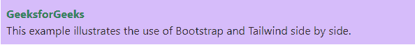

# 如何同时使用顺风 CSS 和 Bootstrap 4？

> 原文:[https://www . geeksforgeeks . org/如何同时使用两者-tail wind-CSS-和-bootstrap-4/](https://www.geeksforgeeks.org/how-to-use-both-tailwind-css-and-bootstrap-4-at-the-same-time/)

在本文中，我们将知道如何在相同的代码中使用 Bootstrap 和 Tailwind CSS。我们可以一起使用这两个 CSS 框架，但不建议这样做。因为很少有类会像“容器”、“clearfix”等那样互相矛盾。我们知道 Bootstrap 是一个已知的 CSS 框架。虽然与 [Bootstrap](https://www.geeksforgeeks.org/bootstrap-4-introduction/) 相比，顺风 CSS 框架也可以并行使用。[tailswind CSS](https://www.geeksforgeeks.org/introduction-to-tailwind-css/)基本上是一个实用程序优先的 CSS 框架，有助于快速构建自定义用户界面。所以在开发领域，更熟悉的是顺风而不是自举。[顺风 CSS 与自举](https://www.geeksforgeeks.org/tailwind-css-vs-bootstrap/)有显著差异。

假设有一个预建网站，老开发者已经使用了 Bootstrap，新开发者想使用 Tailwind。在这种情况下，新开发人员必须小心使用 Bootstrap 类，这些类不应该相互矛盾。我们将在代码示例中使用下面的 CDN 链接，以便在单个页面上使用各种适用的 Boostrap & Tailwind CSS 类，并利用它们。

**引导 CDN 链接:**

> <src 脚本= " https://Ajax . Google APIs . com/Ajax/libs/jquery/3 . 5 . 1/jquery . min . js "></script><src 脚本= " https://cdnjs . cloudflare . com/Ajax/libs/popper . js

**泰风 CSS CDN 链接:**

> <link href="“" https:="" rel="”stylesheet”">

**示例:**在本例中，我们将使用 Bootstrap 进行内容对齐，&进行文本和背景颜色，我们将使用 Tailwind CSS。所以这两个框架都适用。

## 超文本标记语言

```html
<!DOCTYPE html>
<html>

<head>
    <!-- Bootstrap CDN Links -->
    <link rel="stylesheet" 
          href=
"https://maxcdn.bootstrapcdn.com/bootstrap/4.5.2/css/bootstrap.min.css">
    <script src=
"https://ajax.googleapis.com/ajax/libs/jquery/3.5.1/jquery.min.js">
    </script>
    <script src=
"https://cdnjs.cloudflare.com/ajax/libs/popper.js/1.16.0/umd/popper.min.js">
    </script>
    <script src=
"https://maxcdn.bootstrapcdn.com/bootstrap/4.5.2/js/bootstrap.min.js">
    </script>

    <!-- Tailwind CSS CDN Links -->
    <link href=
"https://unpkg.com/tailwindcss@^1.0/dist/tailwind.min.css" 
          rel="stylesheet"> 
</head>

<body>

    <!-- Bootstrap Class -->
    <div class="col">
        <div class="col-md-4">

            <!-- Tailwind CSS Class -->
            <p class="bg-purple-300 p-2"> 
                <b class="text-green-700">GeeksforGeeks</b>
                <br>This example illustrates the use of 
                    Bootstrap and Tailwind side by side.
            </p>
        </div>
    </div>
</body>

</html>
```

**输出:**

