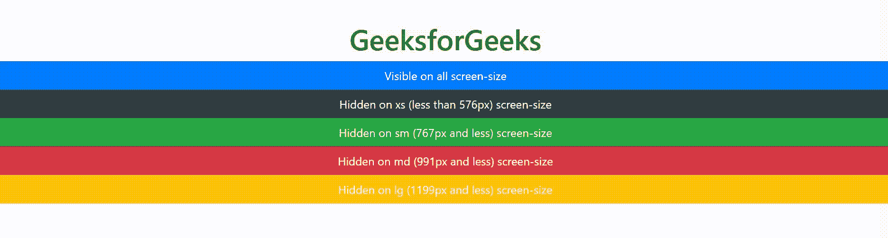

# 如何在 Bootstrap 中使用网格断点类？

> 原文:[https://www . geesforgeks . org/如何使用-网格-断点-类内引导/](https://www.geeksforgeeks.org/how-to-use-grid-breakpoint-class-in-bootstrap/)

要获取网格断点值，我们可以使用 bootstrap 的 display 属性。使用响应显示实用程序类更改 display 属性值。根据需要，可以针对不同的影响组合课程。

*   **。xs 的 d-{value}**
*   **。xl、lg、md 和 sm 的 d-{断点}-{值}** 。

这里**值**可以是无、内联、内联块、块、表、表单元格、表行、flex、内联 flex 中的一个。

媒体查询会影响具有给定断点或更大断点的屏幕宽度。例:**。d-MD-无**设置**显示:无；**在 md、lg 和 xl 屏幕上。

网格断点是

*   **xs: < 576px** 超小玩意(人像手机，低于 576px)。
*   **sm: > =576px** 小玩意(风景手机，576px 及以上)。
*   **md: > =768px** 中型小工具(平板电脑，768px 及以上)。
*   **lg: > =992px** 大型小玩意(台式机，992px 及以上)。
*   **xl: > =1200px** 超大型小工具(大型台式机，1200px 及以上)。

使用**遮盖部件。d-none** 级或者**之一。d-{sm，md，lg，XL }-无**类，适用于任何响应屏幕变化。

要在给定的屏幕尺寸间隔内显示组件，您可以组合一个**。d-*-无**类带**。d-*-*类**，举例说明**。没有。d-MD-街区。d-xl-none** 将覆盖除中大型小工具外的所有屏幕尺寸的组件。

**例 1:**

## 超文本标记语言

```html
<!DOCTYPE html>
<html lang="en">

<head>
    <!-- Required meta tags -->
    <meta charset="utf-8">
    <meta name="viewport" content=
        "width=device-width, 
        initial-scale=1, 
        shrink-to-fit=no">

    <!-- Bootstrap CSS -->
    <link rel="stylesheet" href=
"https://stackpath.bootstrapcdn.com/bootstrap/4.5.0/css/bootstrap.min.css"
        integrity=
"sha384-9aIt2nRpC12Uk9gS9baDl411NQApFmC26EwAOH8WgZl5MYYxFfc+NcPb1dKGj7Sk"
        crossorigin="anonymous">

    <!-- Optional JavaScript -->
    <!-- jQuery first, then Popper.js, 
         then Bootstrap JS -->
    <script src="https://code.jquery.com/jquery-3.5.1.slim.min.js"
        integrity=
"sha384-DfXdz2htPH0lsSSs5nCTpuj/zy4C+OGpamoFVy38MVBnE+IbbVYUew+OrCXaRkfj"
        crossorigin="anonymous">
    </script>

    <script src=
"https://cdn.jsdelivr.net/npm/popper.js@1.16.0/dist/umd/popper.min.js"
        integrity=
"sha384-Q6E9RHvbIyZFJoft+2mJbHaEWldlvI9IOYy5n3zV9zzTtmI3UksdQRVvoxMfooAo"
        crossorigin="anonymous">
    </script>

    <script src=
"https://stackpath.bootstrapcdn.com/bootstrap/4.5.0/js/bootstrap.min.js"
        integrity=
"sha384-OgVRvuATP1z7JjHLkuOU7Xw704+h835Lr+6QL9UvYjZE3Ipu6Tp75j7Bh/kR0JKI"
        crossorigin="anonymous">
    </script>

    <title>bootstrap4 | grid-breakpoint</title>
</head>

<body>
    <center>
        <h1 style="color: green">GeeksforGeeks</h1>

        <div class="d-inline p-2 bg-primary text-white">
            Visible on all screen-size
        </div>

        <div class="d-inline d-sm-none p-2 bg-dark 
                        text-white">
            Only Visible on xs (less 
            than 576px) screen-size
        </div>

        <div class="d-none d-sm-inline d-md-none 
                p-2 bg-success text-white">
            Only Visible on sm (767px to 
            576px) screen-size
        </div>

        <div class="d-none d-md-inline d-lg-none 
                p-2 bg-danger text-white">
            Only Visible on md (991px 
            to 768px) screen-size
        </div>

        <div class="d-none d-lg-inline d-xl-none 
            p-2 bg-warning text-white">
            Only Visible on lg (1199px 
            to 992px) screen-size
        </div>

        <div class="d-none d-xl-inline p-2 
                bg-light text-black">
            Only Visible on xl (>=1200px) 
            screen-size
        </div>
    </center>
</body>

</html>
```

**输出:**


**例 2:**

## 超文本标记语言

```html
<!DOCTYPE html>
<html lang="en">

<head>
    <!-- Required meta tags -->
    <meta charset="utf-8">
    <meta name="viewport" content=
        "width=device-width, 
        initial-scale=1, 
        shrink-to-fit=no">

    <!-- Bootstrap CSS -->
    <link rel="stylesheet" href=
"https://stackpath.bootstrapcdn.com/bootstrap/4.5.0/css/bootstrap.min.css"
        integrity=
"sha384-9aIt2nRpC12Uk9gS9baDl411NQApFmC26EwAOH8WgZl5MYYxFfc+NcPb1dKGj7Sk"
        crossorigin="anonymous">

    <!-- Optional JavaScript -->
    <!-- jQuery first, then Popper.js, 
        then Bootstrap JS -->
    <script src="https://code.jquery.com/jquery-3.5.1.slim.min.js"
        integrity=
"sha384-DfXdz2htPH0lsSSs5nCTpuj/zy4C+OGpamoFVy38MVBnE+IbbVYUew+OrCXaRkfj"
        crossorigin="anonymous">
    </script>

    <script src=
"https://cdn.jsdelivr.net/npm/popper.js@1.16.0/dist/umd/popper.min.js"
        integrity=
"sha384-Q6E9RHvbIyZFJoft+2mJbHaEWldlvI9IOYy5n3zV9zzTtmI3UksdQRVvoxMfooAo"
        crossorigin="anonymous">
    </script>

    <script src=
"https://stackpath.bootstrapcdn.com/bootstrap/4.5.0/js/bootstrap.min.js"
        integrity=
"sha384-OgVRvuATP1z7JjHLkuOU7Xw704+h835Lr+6QL9UvYjZE3Ipu6Tp75j7Bh/kR0JKI"
        crossorigin="anonymous">
    </script>

    <title>Bootstrap4 grid-breakpoint</title>
</head>

<body>
    <center>
        <h1 style="color: green">
            GeeksforGeeks
        </h1>

        <div class="d-block p-2 bg-primary 
                text-white">
            Visible on all screen-size
        </div>

        <div class="d-none d-sm-block p-2 
            bg-dark text-white">
            Hidden on xs (less than 
            576px) screen-size
        </div>

        <div class="d-none d-md-block p-2 
            bg-success text-white">
            Hidden on sm (767px and 
            less) screen-size
        </div>

        <div class="d-none d-lg-block p-2 
            bg-danger text-white">
            Hidden on md (991px and 
            less) screen-size
        </div>

        <div class="d-none d-xl-block p-2 
            bg-warning text-white">
            Hidden on lg (1199px and 
            less) screen-size
        </div>

        <div class="d-xl-none p-2 bg-light 
            text-black">
            Hidden only on xl (1200px 
            and up) screen-size
        </div>
    </center>
</body>

</html>
```

**输出:**

