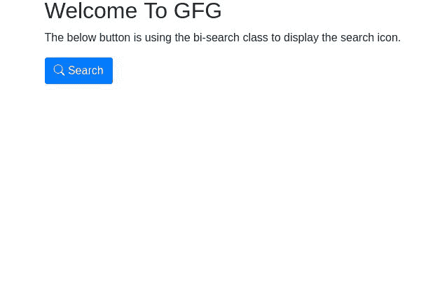

# 如何在 Bootstrap 框架中使用图标？

> 原文:[https://www . geesforgeks . org/如何使用引导程序框架中的图标/](https://www.geeksforgeeks.org/how-to-use-icons-in-bootstrap-framework/)

**Bootstrap** 是开发响应性和移动优先网站的 CSS 框架。Bootstrap 增加了一个功能，可以使用 Bootstrap 提供的质量图标。这些图标有 SVG 或网络字体格式。

Bootstrap 提供了一千多个高质量的图标，您可以在项目中使用。您也可以根据需要更改这些图标的颜色和大小。

是什么让 Bootstrap 框架中的图标与众不同，我们为什么要使用它？

*   “灵活性”是它区别于其他图标解决方案的地方。如果在 Bootstrap 框架中使用图标，可以借助 CSS 的 *color* 属性改变图标的颜色。
*   也可以使用 CSS 的*字号*属性改变图标的大小。
*   在您的项目中使用 Bootstrap 的图标并不需要 Bootstrap，您可以在有或没有 Bootstrap 的情况下使用它。

**使用引导图标的基本语法:**

```html
<i class="bi-class-name"></i>
```

*< i >* 元素是用于添加 Bootstrap 图标的容器元素。字符串“bi-”总是附加在图标的类名之前。它指的是引导图标。*类名*基本上是我们正在使用的一类图标。Bootstrap 为我们提供了许多类别的图标，如脸书、推特、地球仪、星星和搜索等。

**示例:**这是在提交按钮中使用 Bootstrap 的搜索图标的 HTML 代码。

## 超文本标记语言

```html
<!DOCTYPE html>
<html>

<head>
    <!-- Bootstrap CSS -->
    <link rel="stylesheet" href=
"https://cdn.jsdelivr.net/npm/bootstrap@4.6.0/dist/css/bootstrap.min.css">

    <!--Bootstrap Icons CSS -->
    <link rel="stylesheet" href=
"https://cdn.jsdelivr.net/npm/bootstrap-icons@1.5.0/font/bootstrap-icons.css">

</head>

<body class="container">
    <h2>Welcome To GFG</h2>
    <p>
        The below button is using the bi-search 
        class to display the search icon.
    </p>

    <!-- We made a button on which Bootstrap 
        icon of 'search' class present -->
    <button type="submit" class="btn btn-primary">
        <span class="bi-search"></span>
        Search
    </button>
</body>

</html>
```

**输出:**你在按钮上看到的搜索图标是 Bootstrap 框架提供的图标，属于类名*搜索。*

