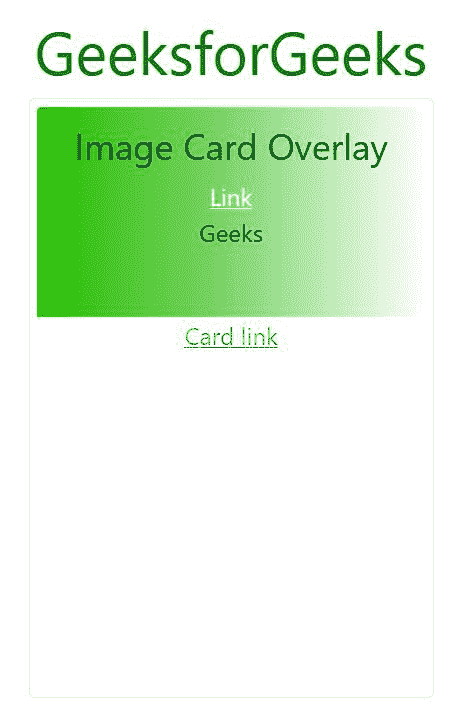
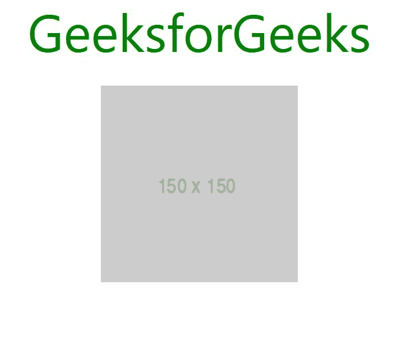
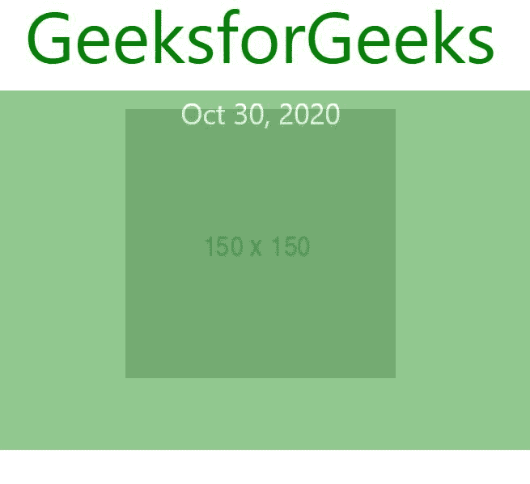

# 如何用 Bootstrap 正确使用图像叠加？

> 原文:[https://www . geeksforgeeks . org/如何使用-镜像-覆盖-正确使用-引导/](https://www.geeksforgeeks.org/how-to-use-image-overlay-correctly-with-bootstrap/)

在这篇文章中，我们将学习如何使用 Bootstrap 正确地使用图像覆盖。但在此之前，首先，我们需要知道什么是图像叠加。

**图像叠加:**图像叠加一般是指图像作为背景图像，并在图像内部插入文本、链接。可以使用引导程序中存在的“*卡片-img-overlay”*属性来完成。我们也可以用普通的 CSS 和引导主题来做。今天我们将学习这两种技术来了解财产。

**示例 1:** **在引导中使用“card-img-overlay”属性。**

首先，我们需要所有必要的引导 cdn 来执行操作。为了得到这些，你可以简单地进入他们的网站，复制他们代码的链接。cdn 的链接如下:

```html
https://getbootstrap.com/docs/5.0/getting-started/introduction/
```

从那里，复制所有的 CSS 和 JS 文件到你的代码中。

**代码:**

## 超文本标记语言

```html
<!DOCTYPE html>
<html>

<head>
    <link href=
"https://cdn.jsdelivr.net/npm/bootstrap@5.0.0-beta1/dist/css/bootstrap.min.css"
        rel="stylesheet" integrity=
"sha384-giJF6kkoqNQ00vy+HMDP7azOuL0xtbfIcaT9wjKHr8RbDVddVHyTfAAsrekwKmP1"
        crossorigin="anonymous">

    <script src=
"https://cdn.jsdelivr.net/npm/bootstrap@5.0.0-beta1/dist/js/bootstrap.bundle.min.js"
        integrity=
"sha384-ygbV9kiqUc6oa4msXn9868pTtWMgiQaeYH7/t7LECLbyPA2x65Kgf80OJFdroafW"
        crossorigin="anonymous">
    </script>

    <style>
        .card {
            width: 270px;
            height: 400px;
            padding: 5px;
        }

        h1 {
            color: green;
            text-align: center;
        }

        img {
            height: 140px;
        }

        .container {
            margin-top: 50px;
            width: 600px;
            height: auto;
        }
    </style>
</head>

<body>
    <div class="container">
        <center>
            <h1>GeeksforGeeks</h1>
            <div class="card r">
                
                <div class="card-img-overlay card-inverse">
                    <h4 class="text-stroke">
                        Image Card Overlay
                    </h4>

                    <div class="card-block">
                        <a href="#" class="card-link 
                            text-white">Link
                        </a>

                        <p class="card-text">Geeks</p>
                    </div>
                </div>

                <a href="#" class="card-link ">Card link</a>
            </div>
        </center>
    </div>
</body>

</html>             
```

**输出:**



*在输出中，文本和链接在图像内部正常工作，从而展示了图像叠加特征。*

**示例 2:(仅使用 CSS 而不使用 bootstrap 类):**在本例中，我们将演示使用 CSS 的图像覆盖，而 Bootstrap 将包含在代码中。但是在编写代码之前，我们必须包含引导 cdn，以便将引导效果应用到我们的网站。

**代码:**

## 超文本标记语言

```html
<!DOCTYPE html>
<html>

<head>
    <title>With CSS</title>
    <link rel="stylesheet" href=
"https://stackpath.bootstrapcdn.com/bootstrap/4.3.1/css/bootstrap.min.css"
        integrity=
"sha384-ggOyR0iXCbMQv3Xipma34MD+dH/1fQ784/j6cY/iJTQUOhcWr7x9JvoRxT2MZw1T"
        crossorigin="anonymous">

    <script src="https://code.jquery.com/jquery-3.3.1.slim.min.js"
        integrity=
"sha384-q8i/X+965DzO0rT7abK41JStQIAqVgRVzpbzo5smXKp4YfRvH+8abtTE1Pi6jizo"
        crossorigin="anonymous">
    </script>

    <script src=
"https://cdnjs.cloudflare.com/ajax/libs/popper.js/1.14.7/umd/popper.min.js"
        integrity=
"sha384-UO2eT0CpHqdSJQ6hJty5KVphtPhzWj9WO1clHTMGa3JDZwrnQq4sF86dIHNDz0W1"
        crossorigin="anonymous">
    </script>

    <script src=
"https://stackpath.bootstrapcdn.com/bootstrap/4.3.1/js/bootstrap.min.js"
        integrity=
"sha384-JjSmVgyd0p3pXB1rRibZUAYoIIy6OrQ6VrjIEaFf/nJGzIxFDsf4x0xIM+B07jRM"
        crossorigin="anonymous">
    </script>

    <style>
        h1 {
            color: green;
        }

        .images img {
            padding: 10px;
        }

        .col {
            position: relative;
            width: 200px;
            height: 200px;
        }

        .overlay {
            position: absolute;
            color: white;
            display: block;
            top: 0;
            bottom: 0;
            left: 0;
            right: 0;
            height: 100%;
            width: 100%;
            opacity: 0;
            transition: .5s ease;
            background-color: green;
        }

        .col:hover .overlay {
            opacity: 0.6;
        }
    </style>
</head>

<body>
    <center>
        <h1>GeeksforGeeks</h1>
        <div class="d-flex 
            justify-content-center images">

            <div class="col">
                <a href="#"></a>
                <div class="overlay">
                    <div class="text">Oct 30, 2020</div>
                </div>
            </div>
        </div>
    </center>
</body>

</html>
```

**输出:**

**悬停前:**



**悬停后:**

