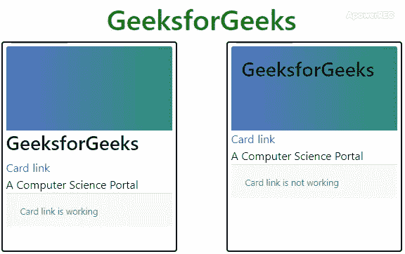
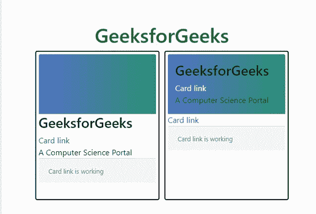

# 如何在 Bootstrap 4 中使用卡片-img-覆盖类上的链接？

> 原文:[https://www . geesforgeks . org/如何使用-卡上链接-img-overlay-class-in-bootstrap-4/](https://www.geeksforgeeks.org/how-to-use-links-on-card-img-overlay-class-in-bootstrap-4/)

当我们把任何一个链接放在引导卡里面时，它表现得很好，直到我们用卡-img-overlay 把一个图像作为该卡的背景。

*   **[Bootstrap 卡:](https://www.geeksforgeeks.org/bootstrap-cards/)**Bootstrap 4 中的一张卡是一个灵活且可扩展的内容容器。它包括页眉、页脚、内容、颜色、链接等选项。
*   **卡片图像叠加:**卡片-img-叠加用于将图像设置为卡片的背景图像，并在图像上添加文本。
    **语法:**用于卡片叠加

    ```html
    <div class="card">
     
     <div class="card-img-overlay">
      <p class="text">....</p>
     </div>
    </div>
    ```

**进场:**所有放在类卡-img-overlay 里面的链接都可以用，但是放在这个类外面的链接不行。要使这些链接工作，请将这些链接的位置设置为“相对”。

**CSS 代码:**把这个放在<风格>标签里面。

```html
.card-link 
    { 
    position:relative; 
    }

```

下面的例子说明了这种方法:

**示例 1:** 此示例说明了 card card-img-overlay，在第一张卡中，我们没有使用 card-img-overlay，但是当我们使用 card-img-overlay 时，即使文本没有作为文本响应，链接也不起作用。它的行为完全像一幅画。

*   **程序:**

    ```html
    <!DOCTYPE html>
    <html lang="en">

    <head>
        <title>Bootstrap Card</title>
        <meta charset="utf-8">
        <meta name="viewport" 
              content="width=device-width, initial-scale=1">
        <link rel="stylesheet"
              href=
    "https://maxcdn.bootstrapcdn.com/bootstrap/4.3.1/css/bootstrap.min.css">
        <script src=
    "https://ajax.googleapis.com/ajax/libs/jquery/3.4.1/jquery.min.js">
        </script>
        <script src=
    "https://cdnjs.cloudflare.com/ajax/libs/popper.js/1.14.7/umd/popper.min.js">
        </script>
        <script src=
    "https://maxcdn.bootstrapcdn.com/bootstrap/4.3.1/js/bootstrap.min.js">
        </script>
        <style>
            .card {
                width: 250px;
                height: 300px;
                border: 2px solid black;
                padding: 5px;
            }

            h1 {
                color: green;
                text-align: center;
            }

            img {
                height: 120px;
            }

            .left {
                float: left;
            }

            .right {
                float: right;
            }

            .container {
                margin-top: 50px;
                width: 600px;
                height: auto;
            }
        </style>
    </head>

    <body>
        <div class="container">
            <h1>GeeksforGeeks</h1>
            <div class="card left">
                
                <div class="card-inverse">
                    <h3 class="text-stroke">GeeksforGeeks</h3>
                </div>
                <div class="card-block">
                    <a href="#" class="card-link">Card link</a>
                    <p class="card-text">A Computer Science Portal</p>
                </div>
                <div class="card-footer">
                    <small class="text-muted">Card link is working</small>
                </div>
            </div>

            <div class="card right">
                
                <div class="card-img-overlay card-inverse">
                    <h3 class="text-stroke">GeeksforGeeks</h3>
                </div>
                <div class="card-block">
                    <a href="#" class="card-link">Card link</a>
                    <p class="card-text">A Computer Science Portal</p>
                </div>
                <div class="card-footer">
                    <small class="text-muted">Card link is not working</small>
                </div>
            </div>
        </div>
    </body>

    </html>
    ```

*   **输出:**
    

**示例 2:** 此示例说明了 card card-img-overlay，在第一张卡中，我们没有使用 card-img-overlay，但是当我们使用 card-img-overlay 时，链接工作正常，文本也表现为文本。

*   **程序:**

    ```html
    <!DOCTYPE html>
    <html lang="en">

    <head>
        <title>Bootstrap Card</title>
        <meta charset="utf-8">
        <meta name="viewport"
            content="width=device-width, initial-scale=1">
        <link rel="stylesheet"
            href=
    "https://maxcdn.bootstrapcdn.com/bootstrap/4.3.1/css/bootstrap.min.css">
        <script src=
    "https://ajax.googleapis.com/ajax/libs/jquery/3.4.1/jquery.min.js">
        </script>
        <script src=
    "https://cdnjs.cloudflare.com/ajax/libs/popper.js/1.14.7/umd/popper.min.js">
        </script>
        <script src=
    "https://maxcdn.bootstrapcdn.com/bootstrap/4.3.1/js/bootstrap.min.js">
        </script>
        <style>
           .card-link{
             position:relative;
            }
            .card {
                width: 250px;
                height: 300px;
                border: 2px solid black;
                padding: 5px;
            }

            h1 {
                color: green;
                text-align: center;
            }

            img {
                height: 120px;
            }

            .left {
                float: left;
            }

            .right {
                float: right;
            }

            .container {
                margin-top: 50px;
                width: 600px;
                height: auto;
            }

        </style>
    </head>

    <body>
        <div class="container">
            <h1>GeeksforGeeks</h1>
            <div class="card left">
                
                <div class="card-inverse">
                    <h3 class="text-stroke">GeeksforGeeks</h3>
                </div>
                <div class="card-block">
                    <a href="#" class="card-link">Card link</a>
                    <p class="card-text">A Computer Science Portal</p>
                </div>
                <div class="card-footer">
                    <small class="text-muted">Card link is working</small>
                </div>
            </div>

            <div class="card right">
                
                <div class="card-img-overlay card-inverse">
                    <h3 class="text-stroke">GeeksforGeeks</h3>
                    <div class="card-block">
                        <a href="#" class="card-link text-white" >Card link</a>
                        <p class="card-text">A Computer Science Portal</p>
                    </div>
                </div>
                <a href="#" class="card-link " >Card link</a>
                <div class="card-footer">
                    <small>Card link is  working</small>
                </div>
            </div>
        </div>
    </body>

    </html>                    
    ```

*   **输出:** 

**注意:**在第二个示例中，静音文本的行为不像文本，因为它不在卡片链接分区内。