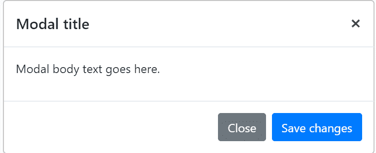

# 如何在 Twitter Bootstrap 中使用模态关闭事件？

> 原文:[https://www . geeksforgeeks . org/如何使用-模式-关闭-事件-在 twitter-bootstrap/](https://www.geeksforgeeks.org/how-to-use-modal-closing-event-in-twitter-bootstrap/)

Bootstrap Modals 提供了一个轻量级的、多用途的 JavaScript 弹出窗口，它是可定制和响应的。它们可用于在网站中显示提醒弹出窗口、视频和图像。引导模式分为三个主要部分:页眉、正文和页脚。

**语法:**

```html
class | tabindex | role | aria-labelledby
```

**方式:**显示弹出菜单，有表头、表体、表尾，有关闭提交按钮。

```html
<div class="modal fade" 
     id="exampleModal" 
     tabindex="-1" 
     role="dialog" 
     aria-labelledby="exampleModalLabel" 
     aria-hidden="true">
    <div class="modal-dialog" role="document">
    </div>
</div>
```

**说明:**下面是一个静态模态示例(表示其位置和显示已被覆盖)，包括模态头、模态体(填充所需)和模态尾(可选)。我们要求您尽可能将模态头包含在消除动作中，或者提供另一个显式消除动作。

**示例:**

```html
<!DOCTYPE html>
<html>

<head>
    <title></title>
    <link rel="stylesheet" 
          href=
"https://maxcdn.bootstrapcdn.com/bootstrap/4.0.0/css/bootstrap.min.css" 
          integrity=
"sha384-Gn5384xqQ1aoWXA+058RXPxPg6fy4IWvTNh0E263XmFcJlSAwiGgFAW/dAiS6JXm" 
          crossorigin="anonymous">
    <script src="https://code.jquery.com/jquery-3.2.1.slim.min.js" 
            integrity=
"sha384-KJ3o2DKtIkvYIK3UENzmM7KCkRr/rE9/Qpg6aAZGJwFDMVNA/GpGFF93hXpG5KkN" 
            crossorigin="anonymous"></script>
    <script src=
"https://cdnjs.cloudflare.com/ajax/libs/popper.js/1.12.9/umd/popper.min.js" 
            integrity=
"sha384-ApNbgh9B+Y1QKtv3Rn7W3mgPxhU9K/ScQsAP7hUibX39j7fakFPskvXusvfa0b4Q"
            crossorigin="anonymous"></script>
    <script src=
"https://maxcdn.bootstrapcdn.com/bootstrap/4.0.0/js/bootstrap.min.js"
            integrity=
"sha384-JZR6Spejh4U02d8jOt6vLEHfe/JQGiRRSQQxSfFWpi1MquVdAyjUar5+76PVCmYl" 
            crossorigin="anonymous"></script>
</head>

<body>
    <!-- Button trigger modal -->
    <button type="button" class="btn btn-primary" 
            data-toggle="modal" data-target="#exampleModal">
        Launch demo modal
    </button>

    <!-- Modal -->
    <div class="modal fade" id="exampleModal" tabindex="-1"
         role="dialog" aria-labelledby="exampleModalLabel" 
         aria-hidden="true">
        <div class="modal-dialog" role="document">
            <div class="modal-content">
                <div class="modal-header">
                    <h5 class="modal-title" 
                        id="exampleModalLabel">
                      Modal title
                  </h5>
                    <button type="button" class="close" 
                            data-dismiss="modal" aria-label="Close">
                        <span aria-hidden="true">×</span>
                    </button>
                </div>
                <div class="modal-body">
                    ...
                </div>
                <div class="modal-footer">
                    <button type="button" class="btn btn-secondary" 
                            data-dismiss="modal">Close</button>
                    <button type="button" class="btn btn-primary">
                      Save changes</button>
                </div>
            </div>
        </div>
    </div>
</body>

</html>
```

```html
$('#myModal').on('shown.bs.modal', function () {
  $('#myInput').trigger('focus')
})
```

**输出:**


**支持的浏览器:**支持 Flex 布局。

*   铬:是的
*   火狐:是的(63.0)
*   边缘:不
*   互联网浏览器:没有