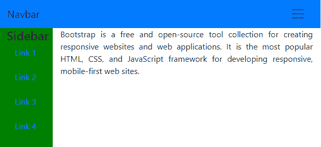
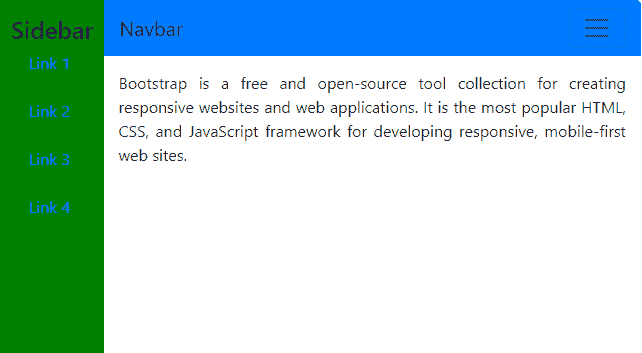

# 如何使用 Bootstrap 使用左侧导航栏的顶部导航？

> 原文:[https://www . geeksforgeeks . org/使用方法-左侧导航栏-使用引导/](https://www.geeksforgeeks.org/how-to-use-top-navigation-with-left-navigation-bar-using-bootstrap/)

Bootstrap 是一个开源的 CSS 框架，由前端开发人员用来制作交互式网页设计。Bootstrap 的最新版本是 Bootstrap 5 alpha，它增加了许多功能。然而，Bootstrap 5 仍处于持续开发阶段，因此大多数网络开发人员仍在使用 Bootstrap 4。Bootstrap 4 还提供了广泛的组件、实用程序和布局。除此之外，还有中杠和侧杠。虽然 Bootstrap 4 有预定义的 navbar 类和大量的特性，但是没有专门的预定义类用于侧边栏。因此侧边栏主要是定制的划分。使用顶部导航栏和左侧导航栏时，可以有不同的布局。本文演示了这两种布局。

**第一种方法:**第一种方法处理顶部导航栏正下方有侧边栏的布局。整个车身分为两部分:顶部的中杠和下方的容器。顶部导航栏下面的容器包含侧边栏部分以及网页主要内容的部分。该容器包含一行，该行又包含两列。第一列容纳侧边栏，第二列容纳主要内容。

```html
<!DOCTYPE html>
<html>

<head>
    <!-- import bootstrap cdn-->
    <link rel="stylesheet" href=
"https://stackpath.bootstrapcdn.com/bootstrap/4.5.2/css/bootstrap.min.css"
        integrity=
"sha384-JcKb8q3iqJ61gNV9KGb8thSsNjpSL0n8PARn9HuZOnIxN0hoP+VmmDGMN5t9UJ0Z"
        crossorigin="anonymous" />

    <!-- import jquery cdn -->
    <script src="https://code.jquery.com/jquery-3.5.1.slim.min.js"
        integrity=
"sha384-DfXdz2htPH0lsSSs5nCTpuj/zy4C+OGpamoFVy38MVBnE+IbbVYUew+OrCXaRkfj"
        crossorigin="anonymous">
    </script>

    <!-- import popper.js cdn -->
    <script src=
"https://cdn.jsdelivr.net/npm/popper.js@1.16.1/dist/umd/popper.min.js"
        integrity=
"sha384-9/reFTGAW83EW2RDu2S0VKaIzap3H66lZH81PoYlFhbGU+6BZp6G7niu735Sk7lN"
        crossorigin="anonymous">
    </script>

    <!-- import javascript cdn -->
    <script src=
"https://stackpath.bootstrapcdn.com/bootstrap/4.5.2/js/bootstrap.min.js"
        integrity=
"sha384-B4gt1jrGC7Jh4AgTPSdUtOBvfO8shuf57BaghqFfPlYxofvL8/KUEfYiJOMMV+rV"
        crossorigin="anonymous">
    </script>

    <!-- CSS stylesheet -->
    <style type="text/css">
        html,
        body {
            height: 100%;
        }

        #green {
            height: 100%;
            background: green;
            text-align: center;
            color: black;
        }
    </style>
</head>

<body>
    <!-- top navbar -->
    <nav class="navbar navbar-expand-lg 
            navbar-light bg-primary">
        <a class="navbar-brand" href="#">Navbar</a>
        <!-- hamburger button that toggles the navbar-->
        <button class="navbar-toggler" type="button" 
            data-toggle="collapse" 
            data-target="#navbarNavAltMarkup"
            aria-controls="navbarNavAltMarkup" 
            aria-expanded="false" 
            aria-label="Toggle navigation">
            <span class="navbar-toggler-icon">
            </span>
        </button>
        <!-- navbar links -->
        <div class="collapse navbar-collapse" 
                id="navbarNavAltMarkup">
            <div class="navbar-nav">
                <a class="nav-item nav-link 
                    active" href="#">Home</a>
                <a class="nav-item nav-link" 
                    href="#">Features</a>
                <a class="nav-item nav-link" 
                    href="#">Price</a>
                <a class="nav-item nav-link" 
                    href="#">About</a>
            </div>
        </div>
    </nav>

    <!-- This container contains the sidebar
             and main content of the page -->
    <!-- h-100 takes the full height of the body-->
    <div class="container-fluid h-100">
        <div class="row h-100">
            <div class="col-2" id="green">
                <h4>Sidebar</h4>

                <!-- Navigation links in sidebar-->
                <a href="#">Link 1</a><br />
                <br />
                <a href="#">Link 2</a><br />
                <br />
                <a href="#">Link 3</a><br />
                <br />
                <a href="#">Link 4</a><br />
                <br />
            </div>
            <!--Contains the main content
                    of the webpage-->
            <div class="col-10" style="text-align: justify;">
                Bootstrap is a free and open-source
                tool collection for creating responsive
                websites and web applications. It
                is the most popular HTML, CSS, and
                JavaScript framework for developing
                responsive, mobile-first web sites.
            </div>
        </div>
    </div>
</body>

</html>
```

**输出:**


**第二种方法:**第二种方法展示了一种布局，在侧边栏占据了所需的空间之后，导航栏只占据了主体的剩余宽度。HTML 页面的主体包括一行，该行由两列组成。第一列 col-2 用于显示侧栏。第二列 col-10 用于显示导航栏。第二列也由导航栏正下方的网页主要内容组成。吧台是可折叠的。当屏幕宽度减小时，它会折叠，可以使用汉堡图标查看。

```html
<!DOCTYPE html>
<html>

<head>
    <title>Topnav with sidebar</title>

    <!-- Import bootstrap cdn -->
    <link rel="stylesheet" href=
"https://stackpath.bootstrapcdn.com/bootstrap/4.5.2/css/bootstrap.min.css"
        integrity=
"sha384-JcKb8q3iqJ61gNV9KGb8thSsNjpSL0n8PARn9HuZOnIxN0hoP+VmmDGMN5t9UJ0Z"
        crossorigin="anonymous" />

    <!-- Import jquery cdn -->
    <script src="https://code.jquery.com/jquery-3.5.1.slim.min.js"
        integrity=
"sha384-DfXdz2htPH0lsSSs5nCTpuj/zy4C+OGpamoFVy38MVBnE+IbbVYUew+OrCXaRkfj"
        crossorigin="anonymous">
    </script>

    <!-- Import popper.js cdn -->
    <script src=
"https://cdn.jsdelivr.net/npm/popper.js@1.16.1/dist/umd/popper.min.js"
        integrity=
"sha384-9/reFTGAW83EW2RDu2S0VKaIzap3H66lZH81PoYlFhbGU+6BZp6G7niu735Sk7lN"
        crossorigin="anonymous">
    </script>

    <!-- Import javascript cdn -->
    <script src=
"https://stackpath.bootstrapcdn.com/bootstrap/4.5.2/js/bootstrap.min.js"
        integrity=
"sha384-B4gt1jrGC7Jh4AgTPSdUtOBvfO8shuf57BaghqFfPlYxofvL8/KUEfYiJOMMV+rV"
        crossorigin="anonymous">
    </script>

    <!-- CSS stylesheet -->
    <style type="text/css">
        html,
        body {
            height: 100%;
        }

        #green {
            height: 100%;
            background: green;
            text-align: center;
            color: black;
            padding: 15px;
        }
    </style>
</head>

<body>
    <!-- h-100 takes the full height of the body-->
    <div class="container-fluid h-100">

        <!-- h-100 takes the full height 
                 of the container-->
        <div class="row h-100">
            <div class="col-2" id="green">
                <h4>Sidebar</h4>

                <!-- Navigation links in sidebar-->
                <a href="#">Link 1</a><br />
                <br />
                <a href="#">Link 2</a><br />
                <br />
                <a href="#">Link 3</a><br />
                <br />
                <a href="#">Link 4</a><br />
                <br />
            </div>
            <div class="col-10" style="padding: 0;">

                <!-- Top navbar -->
                <nav class="navbar navbar-expand-lg 
                                navbar-light bg-primary">
                    <a class="navbar-brand" href="#">Navbar</a>
                    <!-- Hamburger button that toggles the navbar-->
                    <button class="navbar-toggler" 
                        type="button" data-toggle="collapse"
                        data-target="#navbarNavAltMarkup" 
                        aria-controls="navbarNavAltMarkup" 
                        aria-expanded="false"
                        aria-label="Toggle navigation">
                        <span class="navbar-toggler-icon"></span>
                    </button>
                    <!-- navbar links -->
                    <div class="collapse navbar-collapse" 
                        id="navbarNavAltMarkup">
                        <div class="navbar-nav">
                            <a class="nav-item nav-link 
                                active" href="#">Home</a>
                            <a class="nav-item nav-link" 
                                href="#">Features</a>
                            <a class="nav-item nav-link" 
                                href="#">Price</a>
                            <a class="nav-item nav-link" 
                                href="#">About</a>
                        </div>
                    </div>
                </nav>

                <!-- Contains the main content of the webpage-->
                <p style="padding: 15px; text-align: justify;">
                    Bootstrap is a free and open-source
                    tool collection for creating responsive
                    websites and web applications.
                    It is the most popular HTML, CSS, and
                    JavaScript framework for developing
                    responsive, mobile-first web sites.
                </p>
            </div>
        </div>
    </div>
</body>

</html>
```

**输出:**
