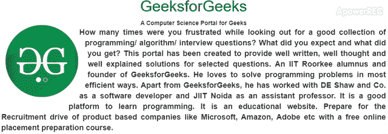

# 在 Bootstrap 4 中如何将文本环绕在圆形转盘上？

> 原文:[https://www . geeksforgeeks . org/如何绕过文本-循环-bootstrap 中的转盘-4/](https://www.geeksforgeeks.org/how-to-wrap-text-around-circular-carousel-in-bootstrap-4/)

与包装圆形图像或任何形状的图像相比，包装圆形旋转木马相当忙乱。在本文中，首先，我们必须创建一个旋转木马来使其循环，然后我们可以使用文本来包装旋转木马。
首先，你必须创建 [**引导转盘**](https://www.geeksforgeeks.org/bootstrap-carousel/) 。要使旋转木马呈圆形，可以使用 [**CSS 边框半径**](https://www.geeksforgeeks.org/css-border-radius-property/) 属性。然后写下你的环绕文字，使用主 div 上的 [**CSS Circle()函数**](https://www.geeksforgeeks.org/css-circle-function/) 。这将以适当的方式包装您的圆形转盘:
下面的示例说明了上面的方法:
**示例:**

## 超文本标记语言

```
<!DOCTYPE html>
<html lang="en">

<head>
    <title>
        How to wrap text around circular
        carousel in Bootstrap 4 ?
    </title>

    <meta charset="utf-8">
    <meta name="viewport"
        content="width=device-width, initial-scale=1">

    <link rel="stylesheet" href=
"https://maxcdn.bootstrapcdn.com/bootstrap/3.4.1/css/bootstrap.min.css">

    <script src=
"https://ajax.googleapis.com/ajax/libs/jquery/3.4.1/jquery.min.js">
    </script>

    <script src=
"https://maxcdn.bootstrapcdn.com/bootstrap/3.4.1/js/bootstrap.min.js">
    </script>

    <style>
        h1{
            color: green;
        }
        .container {
            margin: 15px 10px 0px;
            width: 200px;
            height: 200px;
            float: left;
            shape-outside: circle();
        }
        .carousel {
            border-radius: 50% ;
            overflow: hidden;
        }
        .text {
            font-size: 18px;
            text-align: justify;
            margin: 0px 15px;
        }
    </style>
</head>

<body>
    <center>
        <h1>GeeksforGeeks</h1>

        <b>
            A Computer Science Portal
            for Geeks
        </b>

        <div class="container">
            <div id="myCarousel"
                class="carousel slide"
                data-ride="carousel">

                <!-- Indicators -->
                <ol class="carousel-indicators">
                    <li data-target="#myCarousel"
                        data-slide-to="0" class="active"></li>
                    <li data-target="#myCarousel"
                        data-slide-to="1"></li>
                </ol>

                <!-- Wrapper for slides -->
                <div class="carousel-inner">
                    <div class="item active">
                        
                    </div>

                    <div class="item">
                        
                    </div>
                </div>

                <!-- Left and right controls -->
                <a class="left carousel-control"
                        href="#myCarousel" >
                </a>

                <a class="right carousel-control"
                        href="#myCarousel" >
                </a>
            </div>
        </div>
        <div class="text">
            <b>
                How many times were you frustrated while
                looking out for a good collection of
                programming/ algorithm/ interview questions?
                What did you expect and what did you get?
                This portal has been created to provide well
                written, well thought and well explained
                solutions for selected questions. An IIT
                Roorkee alumnus and founder of GeeksforGeeks.
                He loves to solve programming problems in
                most efficient ways. Apart from GeeksforGeeks,
                he has worked with DE Shaw and Co. as a
                software developer and JIIT Noida as an
                assistant professor. It is a good platform
                to learn programming. It is an educational
                website. Prepare for the Recruitment drive
                of product based companies like Microsoft,
                Amazon, Adobe etc with a free online
                placement preparation course.
            </b>
        </div>
    <center>
</body>

</html>
```

**输出:**

