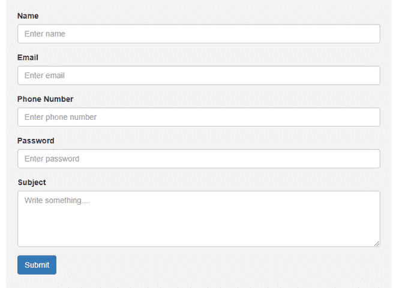

# 如何用 Bootstrap 写一个不同行的表单？

> 原文:[https://www . geeksforgeeks . org/如何使用引导程序编写不同行的表单/](https://www.geeksforgeeks.org/how-to-write-a-form-in-different-line-using-bootstrap/)

[Bootstrap](https://getbootstrap.com/) 是一个开源的前端框架，用于开发标准的&装饰网站或网页应用程序，速度快，用户友好。Bootstrap 包括基于 HTML 和 CSS 的模板，用于表格、表单、按钮等。Bootstrap 还使用 JavaScript，帮助我们创建响应性设计。表单是每个网站的重要组成部分。短靴为造型增添了风格，给人一种标准的外观&的感觉。本文将向您介绍如何仅使用 Bootstrap 创建表单(Bootstrap 垂直表单)。

**表单布局规则**

1.  对于理想间距，在**<div class = " form-group ">**中包装**标签**和**表单控件**。
2.  添加类**。表单控制**到所有文本**。**等表单控件**类输入>、<文本区>、<选择>、**元素。

在我们开始编码之前，我们需要在 HTML 文件中包含以下样式表，用于**加载所有 CSS。**

> <link rel="”stylesheet”" href="”https://maxcdn.bootstrapcdn.com/bootstrap/3.4.1/css/bootstrap.min.css”">

## 超文本标记语言

```
<DOCTYPE html>
<html lang="en">
    <head>
      <link rel="stylesheet" href=
"https://maxcdn.bootstrapcdn.com/bootstrap/3.4.1/css/bootstrap.min.css"
      />

      <style>
        /* Add a background color and 
           some padding around the form */
        .container {
          /* Make width to 100% for 
             full screen size form*/
          width: 50%; 
          border-radius: 5px;
          background-color: #f2f2f2; /*rgb(242, 242, 242) hsl(0, 0%, 95%)*/
          padding: 20px;
        }
      </style>
    </head>

    <body>
      <div class="container">
        <form>
          <div class="form-group">
            <label for="InputName">Name</label>
            <input
              type="text"
              class="form-control"
              id="InputName"
              placeholder="Enter name"
            />
          </div>

          <div class="form-group">
            <label for="InputEmail">Email</label>
            <input
              type="email"
              class="form-control"
              id="InputEmail"
              placeholder="Enter email"
            />
          </div>

          <div class="form-group">
            <label for="InputPhoneNumber">Phone Number</label>
            <input
              type="tel"
              class="form-control"
              id="InputPhoneNumber"
              placeholder="Enter phone number"
            />
          </div>

          <div class="form-group">
            <label for="InputPassword">Password</label>
            <input
              type="password"
              class="form-control"
              id="InputPassword"
              placeholder="Enter password"
            />
          </div>

          <div class="form-group">
            <label for="InputSubject">Subject</label>
            <textarea
              class="form-control"
              id="InputSubject"
              placeholder="Write something...."
              style="height: 100px"
            >
            </textarea>
          </div>

          <button type="submit" 
                  class="btn btn-primary">Submit</button>
        </form>
      </div>
    </body>
</html>
```

**输出:**现在，正如你在**输出**中看到的，我们已经使用 Bootstrap 创建了一个漂亮简单的表单，你可以将其添加到你的网站上，并将吸引观众浏览网页。

