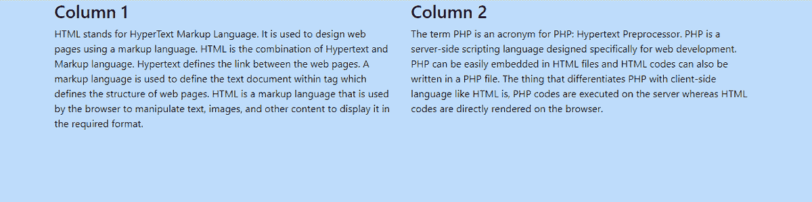

# 如何编写超大屏幕的引导媒体查询？

> 原文:[https://www . geeksforgeeks . org/如何编写超大屏幕自举媒体查询/](https://www.geeksforgeeks.org/how-to-write-the-bootstrap-media-queries-for-very-large-screens/)

**Bootstrap:** 它是一个免费的开源 CSS 框架，用于构建响应性网站，即无论屏幕大小的分辨率如何，UI 都不会扭曲。它可能是一台 iPad、平板电脑、手机或网站运行流畅的任何其他设备。为了实现这个目标，我们可以使用框架的内置类，也可以使用媒体查询定制类属性。下面有一个表，列举了所有的媒体查询断点。

<figure class="table">

| **Type of equipment** | **The minimum width is px** |
| Small devices such as cell phones | 576 像素 |
| Medium-sized devices such as tablets | 768 像素 |
| Large equipment such as desktop | 992px |

</figure>

**示例:**以下示例使用**媒体查询**并将为非常大的屏幕的*背景色*添加属性。

## 超文本标记语言

```html
<!DOCTYPE html>
<html lang="en">

<head>

    <meta charset="utf-8">
    <meta name="viewport" content="width=device-width, 
        initial-scale=1">
    <link rel="stylesheet" href=
"https://maxcdn.bootstrapcdn.com/bootstrap/4.5.2/css/bootstrap.min.css">
    <script src=
"https://ajax.googleapis.com/ajax/libs/jquery/3.5.1/jquery.min.js">
    </script>
    <script src=
"https://cdnjs.cloudflare.com/ajax/libs/popper.js/1.16.0/umd/popper.min.js">
    </script>
    <script src=
"https://maxcdn.bootstrapcdn.com/bootstrap/4.5.2/js/bootstrap.min.js">
    </script>

    <style>
        @media screen and (min-width: 1200px) {
            body {
                background-color: #bedcfa;
                color: black;
            }
        }
    </style>
</head>

<body>
    <div class="container">
        <div class="row">
            <div class="col-sm-6">
                <h3>Column 1</h3>
                <p>
                    HTML stands for HyperText Markup 
                    Language. It is used to design 
                    web pages using a markup language.
                    HTML is the combination of 
                    Hypertext and Markup language.
                    Hypertext defines the link between 
                    the web pages. A markup language 
                    is used to define the text document
                    within tag which defines the 
                    structure of web pages. HTML is a 
                    markup language that is used by 
                    the browser to manipulate text, 
                    images, and other content to
                    display it in the required format.
                </p>
            </div>

            <div class="col-sm-6">
                <h3>Column 2</h3>
                <p>
                    The term PHP is an acronym for PHP:
                    Hypertext Preprocessor. PHP is a 
                    server-side scripting language 
                    designed specifically for web 
                    development. PHP can be easily 
                    embedded in HTML files and HTML 
                    codes can also be written in a PHP 
                    file. The thing that differentiates 
                    PHP with client-side language like 
                    HTML is,PHP codes are executed on 
                    the server whereas HTML codes are 
                    directly rendered on the browser.
                </p>
            </div>
        </div>
    </div>
</body>

</html>
```

**输出:**



**观察:**如果屏幕尺寸大于 1200px，那么*背景色*就是上面的那个，如果分辨率小于 1200px，那么它的背景色就没有了。