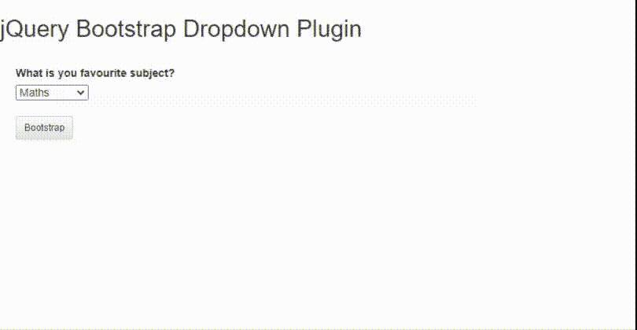
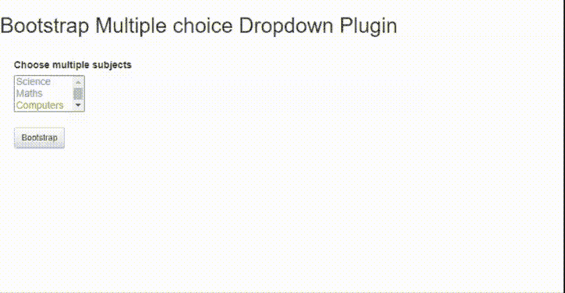

# jQuery 船务选取外挂程式

> 哎哎哎:# t0]https://www . geeksforgeeks . org/jquery-boot trapselect 插件/

在本文中，我们将学习如何使用 jQuery **引导选择**插件实现引导下拉功能。

**注意:**请下载工作文件夹中的 jQuery [bootstrapSelect](https://github.com/PhilippeMarcMeyer/bootstrapSelect) 插件，并将所需文件包含在 HTML 代码的头部。

> <link href="”https://fonts.googleapis.com/css?family=Roboto:300," rel="”stylesheet”&nbsp;<br/"> type="text/css"/ >
> 
> <link href="”https://maxcdn.bootstrapcdn.com/bootstrap/3.3.7/css/bootstrap.min.css”&nbsp;<br/"> rel= "样式表" type="text/css"/ >
> 
> <link href="”https://maxcdn.bootstrapcdn.com/bootstrap/3.3.7/css/bootstrap-theme.min.css”&nbsp;<br/"> rel= "样式表" type="text/css"/ >
> 
> <link href="”bootstrapSelect.css”rel=”stylesheet”" type="”text/css”/">

**示例 1:** 以下示例演示了 Bootstrap select 下拉插件的基本功能，该插件选择一个主题，引导它，清空用户的选择，并在控制框中设置值。

## 超文本标记语言

```
<!DOCTYPE html>
<html>
<head>
    <meta charset="utf-8">
    <meta http-equiv="x-ua-compatible" content="ie=edge">

    <title>jQuery Bootstrap Dropdown Plugin</title>

    <meta name="description" content="">
    <meta name="viewport"
          content="width=device-width, initial-scale=1">

    <link rel="stylesheet" href=
"https://fonts.googleapis.com/css?family=Roboto:300,500">
    <link rel="stylesheet" href="
https://maxcdn.bootstrapcdn.com/bootstrap/3.3.7/css/bootstrap.min.css"
              integrity=
"sha384-BVYiiSIFeK1dGmJRAkycuHAHRg32OmUcww7on3RYdg4Va+PmSTsz/K68vbdEjh4u"
              crossorigin="anonymous">
    <link rel="stylesheet" href="
https://maxcdn.bootstrapcdn.com/bootstrap/3.3.7/css/bootstrap-theme.min.css"
             integrity=
"sha384-rHyoN1iRsVXV4nD0JutlnGaslCJuC7uwjduW9SVrLvRYooPp2bWYgmgJQIXwl/Sp"
             crossorigin="anonymous">
    <link rel="stylesheet" href="bootstrapSelect.css">

    <style>
        body
        {
            font-family: Helvetica, Arial, sans-serif;
        }

        #containerID
    {
            width: 90%;
            padding-top: 20px;
            padding-left: 20px;                     
        }     
        .science {
            color: #0099aa;
        }
        .maths {
            color: #00aaaa;
        }
        .computers {
            color: #aa9900;
        }
        .literature {
            color: #2a00aa;
            font-weight: bold;
            text-decoration: underline;
        }
    </style>
</head>

<body>
   <h2>jQuery Bootstrap Dropdown Plugin</h2>

    <div id="containerID">
         <div id="bootstrapSelectZone" 
              style="max-width:600px;width:600px;">
           <div>
                <label>What is your favourite subject?</label><br />
                <select id="selectOptionID">
                    <option value=""></option>
                    <option class="science" value="science">
                      Science
                    </option>
                    <option class="maths" value="maths" 
                            selected="selected">
                      Maths
                    </option>
                    <option class="computers" value="computers">
                      Computers
                    </option>
                    <option class="literature" value="literature">
                      Literature
                    </option>
                    <option value="history">History</option>
                </select>
            </div>
            <br />
            <button type="button" id="btnBootstrapID"
                    class="btn btn-sm btn-default">
              Bootstrap
            </button>
            <button type="button" id="btnEmptyID" 
                    class="btn btn-sm btn-default">
              Empty selection
            </button>
            <button type="button" id="btnSetID" 
                    class="btn btn-sm btn-default">
              SetValue("literature")
            </button>            
        </div>
      <script src="
https://cdnjs.cloudflare.com/ajax/libs/modernizr/2.8.3/modernizr.min.js">
      </script>
      <script src="
https://code.jquery.com/jquery-2.2.4.min.js" 
              integrity=
"sha256-BbhdlvQf/xTY9gja0Dq3HiwQF8LaCRTXxZKRutelT44=" 
              crossorigin="anonymous">
      </script>
      <script src="
https://maxcdn.bootstrapcdn.com/bootstrap/3.3.7/js/bootstrap.min.js"
              integrity=
"sha384-Tc5IQib027qvyjSMfHjOMaLkfuWVxZxUPnCJA7l2mCWNIpG9mGCD8wGNIcPD7Txa"
              crossorigin="anonymous">
      </script>
      <script src="bootstrapSelect.js"></script>

        <script>
            $(document).ready(function () {

                $("#btnSetID").hide();
                $("#btnEmptyID").hide();               

                $("#btnBootstrapID").on("click", function () {
                    $("#selectOptionID").bootstrapSelect
                    ("init", { "maxWidth": 500 });
            $("#btnBootstrapID").hide();
                    $("#btnSetID").show();
                    $("#btnEmptyID").show();                   
                });

                $("#btnEmptyID").on("click", function () {
                    $("#selectOptionID").bootstrapSelect("empty");
                });

                $("#btnSetID").on("click", function () {
                    $("#selectOptionID").bootstrapSelect
                  ("setValue", "literature");
                });               

            });
        </script>
    </div>
</html>
```

**输出:**



**例 2:**

## 超文本标记语言

```
   <!DOCTYPE html>
<html>

<head>
    <meta charset="utf-8">
    <meta http-equiv="x-ua-compatible" content="ie=edge">

    <title>jQuery Bootstrap Multiple choice Dropdown Plugin</title>

    <meta name="description" content="">
    <meta name="viewport" content="width=device-width, initial-scale=1">

    <link rel="stylesheet" href="
https://fonts.googleapis.com/css?family=Roboto:300,500">
    <link rel="stylesheet" href="
https://maxcdn.bootstrapcdn.com/bootstrap/3.3.7/css/bootstrap.min.css"
          integrity=
"sha384-BVYiiSIFeK1dGmJRAkycuHAHRg32OmUcww7on3RYdg4Va+PmSTsz/K68vbdEjh4u"
          crossorigin="anonymous">
    <link rel="stylesheet" href="
https://maxcdn.bootstrapcdn.com/bootstrap/3.3.7/css/bootstrap-theme.min.css"
          integrity=
"sha384-rHyoN1iRsVXV4nD0JutlnGaslCJuC7uwjduW9SVrLvRYooPp2bWYgmgJQIXwl/Sp"
          crossorigin="anonymous">   
    <link rel="stylesheet" href="bootstrapSelect.css">

    <style>
        body {
            font-family: Helvetica, Arial, sans-serif;
        }

        #containerID
        {
            width: 90%;
            padding-top: 20px;
            padding-left: 20px; 

        }

        .science {
            color: #0099aa;
        }

        .maths {
            color: #00aaaa;
        }

        .computers {
            color: #aa9900;
        }

        .literature {
            color: #2a00aa;           
        }
    </style>
</head>

<body>
   <h2>Bootstrap Multiple choice Dropdown Plugin</h2>

    <div id="containerID">
         <div id="bootstrapSelectZone" style="max-width:600px;width:600px;">
           <div>
                <label>Choose multiple subjects</label><br />
                <select id="selectMultipleID" size="3" multiple="">
                    <option class="science" value="science">
                    Science</option>
                    <option class="maths" value="maths">
                    Maths</option>
                    <option class="computers" value="computers">
                    Computers</option>
                    <option class="literature" value="literature">
                    Literature</option>
                    <option value="cooking">Cooking</option>
                    <option value="painting">Painting</option>
                    <option value="reading">Reading</option>
                    <option value="photography">Photography</option>
                    <option value="writing">Writing</option>
                    <option value="gyming">Gyming</option>
                </select>
            </div>
            <br />
            <button type="button" id="btnBootstrapID" 
                    class="btn btn-sm btn-default">
               Bootstrap
            </button>       

            <button type="button" id="btnEmptyID" 
                    class="btn btn-sm btn-default">
               Empty selection
            </button>
            <button type="button" id="btnDisableID" 
                    class="btn btn-sm btn-default">
               Disable
            </button>
            <button type="button" id="btnEnableID" 
                    class="btn btn-sm btn-default">
               Enable
            </button>
            <button type="button" id="btnSetID" 
                    class="btn btn-sm btn-default">
               SetValue("science,maths,literature")
            </button>
            <button type="button" id="btnDestroyID" 
                    class="btn btn-sm btn-danger">
               Destroy
            </button>
      </div>
      <script src="
https://cdnjs.cloudflare.com/ajax/libs/modernizr/2.8.3/modernizr.min.js">
      </script>
      <script src="
https://code.jquery.com/jquery-2.2.4.min.js" 
              integrity=
"sha256-BbhdlvQf/xTY9gja0Dq3HiwQF8LaCRTXxZKRutelT44=" 
              crossorigin="anonymous">
       </script>
       <script src="
https://maxcdn.bootstrapcdn.com/bootstrap/3.3.7/js/bootstrap.min.js"
               integrity=
"sha384-Tc5IQib027qvyjSMfHjOMaLkfuWVxZxUPnCJA7l2mCWNIpG9mGCD8wGNIcPD7Txa"
               crossorigin="anonymous">
       </script>
      <script src="bootstrapSelect.js"></script>

        <script>
            $(document).ready(function () {

        // Initially hiding all the buttons
                $("#btnHideID").hide();
                $("#btnShowID").hide();
                $("#btnEmptyID").hide();
                $("#btnDisableID").hide();
                $("#btnEnableID").hide();
                $("#btnSetID").hide();             
                $("#btnEmptyID").hide();
                $("#btnDestroyID").hide();               

                $("#btnBootstrapID").on("click", function () {
                    $("#selectMultipleID").bootstrapSelect
           (
            "init",
            { "maxWidth": 460, "maxHeight": 300, 
              "search": true ,"placeHolder":"Select anything >> "}
           );
                    $("#btnBootstrapID").hide();
                    $("#btnHideID").show();
                    $("#btnEmptyID").show();
                    $("#btnDisableID").show();
                    $("#btnSetID").show();
                    $("#btnDestroyID").show();

                });
                $("#btnHideID").on("click", function () {
                    $("#selectMultipleID").bootstrapSelect("hideOption", "cooking");
                    $("#btnHideID").hide();
                    $("#btnShowID").show();
                });
                $("#btnShowID").on("click", function () {
                    $("#selectMultipleID").bootstrapSelect("showOption", "cooking");
                    $("#btnHideID").show();
                    $("#btnShowID").hide();
                });
                $("#btnEmptyID").on("click", function () {
                    $("#selectMultipleID").bootstrapSelect("empty");
                });
                $("#btnDisableID").on("click", function () {
                    $("#selectMultipleID").bootstrapSelect("disable");
                    $("#btnEnableID").show();
                    $("#btnDisableID").hide();
                });
                $("#btnEnableID").on("click", function () {
                    $("#selectMultipleID").bootstrapSelect("enable");
                    $("#btnEnableID").hide();
                    $("#btnDisableID").show();
                });
                $("#btnSetID").on("click", function () {
                    $("#selectMultipleID").bootstrapSelect
                    ("setValue", "science,maths,literature");
                });

                $("#btnDestroyID").on("click", function () {
                    $("#selectMultipleID").bootstrapSelect("destroy");
            $("#selectMultipleID").show();
            $("#btnBootstrapID").show();
                    $("#btnHideID").hide();
                    $("#btnEmptyID").hide();
                    $("#btnDisableID").hide();
                    $("#btnSetID").hide();
                    $("#btnDestroyID").hide();                     
                });             

            });
        </script>
    </div>
</html>
```

**输出:**

