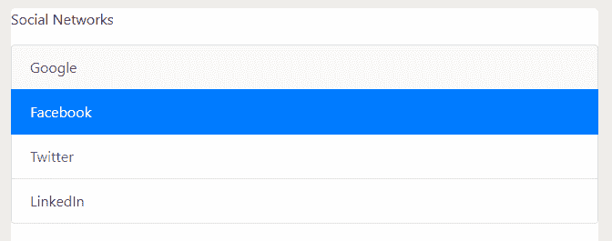

# 使用例子列出引导中的组

> 原文:[https://www . geesforgeks . org/list-group-in-bootstrap-with-examples/](https://www.geeksforgeeks.org/list-group-in-bootstrap-with-examples/)

列表组用于显示一系列内容。我们可以根据需要修改它们以支持任何内容。列表组的使用只是以有组织的方式显示一系列或一系列内容。
下面是使用 HTML 中的[无序列表](https://www.geeksforgeeks.org/css-lists/)和适当的**引导类** :
创建的基本列表组

## 超文本标记语言

```html
<!DOCTYPE html>
<head>
    <title>List Groups example</title>

    <!-- Link Bootstrap Files -->
    <link rel="stylesheet"
          href="https://stackpath.bootstrapcdn.com/bootstrap/4.2.1/css/bootstrap.min.css"
          integrity="sha384-GJzZqFGwb1QTTN6wy59ffF1BuGJpLSa9DkKMp0DgiMDm4iYMj70gZWKYbI7
                     06tWS" crossorigin="anonymous">
    <script src="https://code.jquery.com/jquery-3.3.1.slim.min.js"
            integrity="sha384-q8i/X+965DzO0rT7abK41JStQIAqVgRVzpbzo5smXKp4YfRvH+8abtTE1P
                       i6jizo" crossorigin="anonymous"></script>
    <script src="https://stackpath.bootstrapcdn.com/bootstrap/4.2.1/js/bootstrap.min.js"
            integrity="sha384-B0UglyR+jN6CkvvICOB2joaf5I4l3gm9GU6Hc1og6Ls7i6U
                       /mkkaduKaBhlAXv9k" crossorigin="anonymous"></script>
</head>

<body>

<p>To do list</p>

    <ul class="list-group">
        <li class="list-group-item">study</li>
        <li class="list-group-item">pay bills</li>
        <li class="list-group-item">call mom</li>
        <li class="list-group-item">drop an email</li>
    </ul>
</body>
</html>                   
```

**输出:**


**活动列表项**
添加**。激活**类列出项目，表示它是当前激活的项目。

## 超文本标记语言

```html
<!DOCTYPE html>
<head>
    <title>List Groups example</title>

    <!-- Link Bootstrap Files -->
    <link rel="stylesheet" href="https://stackpath.bootstrapcdn.com/bootstrap/4.2.1/css
                                 /bootstrap.min.css"
          integrity="sha384-GJzZqFGwb1QTTN6wy59ffF1BuGJpLSa9DkKMp0DgiMDm4iYMj70gZWKYbI7
                     06tWS" crossorigin="anonymous">
    <script src="https://code.jquery.com/jquery-3.3.1.slim.min.js"
            integrity="sha384-q8i/X+965DzO0rT7abK41JStQIAqVgRVzpbzo5smXKp4YfRvH+8abtT
                       E1Pi6jizo" crossorigin="anonymous"></script>
    <script src="https://stackpath.bootstrapcdn.com/bootstrap/4.2.1/js/bootstrap.min.js"
            integrity="sha384-B0UglyR+jN6CkvvICOB2joaf5I4l3gm9GU6Hc1og6Ls7i6U
                       /mkkaduKaBhlAXv9k" crossorigin="anonymous"></script>
</head>

<body>

<p>To do list</p>

    <ul class="list-group">
        <li class="list-group-item active">study</li>
        <li class="list-group-item">pay bills</li>
        <li class="list-group-item">call mom</li>
        <li class="list-group-item">drop an email</li>
    </ul>
</body>
</html>                   
```

**输出:**


**禁用列表项**
添加**。禁用**类列出项目以指示其已禁用。当要禁用的内容是链接/按钮时，我们可能需要添加自定义 javascript 代码来完全禁用项目。

## 超文本标记语言

```html
<!DOCTYPE html>
<html>   

<head>
    <title>List Groups example</title>

    <!-- Add Bootstrap Links -->
    <link rel="stylesheet" href="https://stackpath.bootstrapcdn.com/bootstrap/4.2.1/css
                                 /bootstrap.min.css"
          integrity="sha384-GJzZqFGwb1QTTN6wy59ffF1BuGJpLSa9DkKMp0DgiMDm4iYMj70gZWKYb
                     I706tWS" crossorigin="anonymous">
    <script src="https://code.jquery.com/jquery-3.3.1.slim.min.js"
            integrity="sha384-q8i/X+965DzO0rT7abK41JStQIAqVgRVzpbzo5smXKp4YfRv
                       H+8abtTE1Pi6jizo" crossorigin="anonymous"></script>
    <script src="https://stackpath.bootstrapcdn.com/bootstrap/4.2.1/js/bootstrap.min.js"
            integrity="sha384-B0UglyR+jN6CkvvICOB2joaf5I4l3gm9GU6Hc1og6Ls7i6U
                       /mkkaduKaBhlAXv9k" crossorigin="anonymous"></script>
</head>

<body>

<p>To do list</p>

    <ul class="list-group">

        <!-- Using the disabled bootstrap class on below
            List Item will make it faded -->           
        <li class="list-group-item disabled">study</li>

        <li class="list-group-item">pay bills</li>
        <li class="list-group-item">call mom</li>
        <li class="list-group-item">drop an email</li>
    </ul>
</body>
</html>                   
```

**输出:**


**超链接和按钮**:使用**。列表-组-项目-动作**类创建具有悬停、禁用和活动状态的可操作列表项目。

## 超文本标记语言

```html
<!DOCTYPE html>
<html>

<head>
    <title>List Groups example</title>

    <!-- Add Bootstrap Links -->
    <link rel="stylesheet" href="https://stackpath.bootstrapcdn.com/bootstrap/4.2.1/css
                                 /bootstrap.min.css"
          integrity="sha384-GJzZqFGwb1QTTN6wy59ffF1BuGJpLSa9DkKMp0DgiMDm4iYMj70gZWKYbI706tW
                     S" crossorigin="anonymous">
    <script src="https://code.jquery.com/jquery-3.3.1.slim.min.js"
            integrity="sha384-q8i/X+965DzO0rT7abK41JStQIAqVgRVzpbzo5smXKp4YfRvH+8abtTE1Pi6
                       jizo" crossorigin="anonymous"></script>
    <script src="https://stackpath.bootstrapcdn.com/bootstrap/4.2.1/js/bootstrap.min.js"
            integrity="sha384-B0UglyR+jN6CkvvICOB2joaf5I4l3gm9GU6Hc1og6Ls7i6U/mkkaduKaBhlA
                       Xv9k" crossorigin="anonymous"></script>
</head>

<body>

<p>Social Networks</p>

    <ul class="list-group">
        <a href="#" class="list-group-item
            list-group-item-action">Google</a>
        <a href="#" class="list-group-item
            list-group-item-action active">Facebook</a>
        <a href="#" class="list-group-item
            list-group-item-action disabled">Twitter</a>
        <a href="#" class="list-group-item
            list-group-item-action">LinkedIn</a>
    </ul>
</body>
</html>                   
```

**输出:**



**Flush** :使用 Flush 类去掉一些边框和圆角，这样在父容器中看起来就不错了。

## 超文本标记语言

```html
<!DOCTYPE html>
<html>

<head>
    <title>List Groups Example</title>

    <!-- Add important Bootstrap Links -->
    <link rel="stylesheet" href="https://stackpath.bootstrapcdn.com/bootstrap/4.2.1/css
                                 /bootstrap.min.css"
          integrity="sha384-GJzZqFGwb1QTTN6wy59ffF1BuGJpLSa9DkKMp0DgiMDm4iYMj70gZWKYbI
                     706tWS" crossorigin="anonymous">
    <script src="https://code.jquery.com/jquery-3.3.1.slim.min.js"
            integrity="sha384-q8i/X+965DzO0rT7abK41JStQIAqVgRVzpbzo5smXKp4YfRvH+8abtTE1
                       Pi6jizo" crossorigin="anonymous"></script>
    <script src="https://stackpath.bootstrapcdn.com/bootstrap/4.2.1/js/bootstrap.min.js"
            integrity="sha384-B0UglyR+jN6CkvvICOB2joaf5I4l3gm9GU6Hc1og6Ls7i6U
                       /mkkaduKaBhlAXv9k" crossorigin="anonymous"></script>
</head>
<body>

<p>To do lists</p>

    <ul class="list-group list-group-flush">
        <li class="list-group-item">study</li>
        <li class="list-group-item">pay bills</li>
        <li class="list-group-item">call mom</li>
        <li class="list-group-item">drop an email</li>
    </ul>
</body>
</html>                   
```

**输出:**


**上下文类**:使用上下文类为列表项设置合适的背景和颜色。

## 超文本标记语言

```html
<!DOCTYPE html>
<html>

<head>
    <title>List Groups example</title>

    <!-- Add Bootstrap Links -->
    <link rel="stylesheet" href="https://stackpath.bootstrapcdn.com/bootstrap/4.2.1/css
                                 /bootstrap.min.css"
          integrity="sha384-GJzZqFGwb1QTTN6wy59ffF1BuGJpLSa9DkKMp0DgiMDm4iYMj70gZWKYbI70
                     6tWS" crossorigin="anonymous">
    <script src="https://code.jquery.com/jquery-3.3.1.slim.min.js"
            integrity="sha384-q8i/X+965DzO0rT7abK41JStQIAqVgRVzpbzo5smXKp4YfRvH+8abtTE1Pi6
                       jizo" crossorigin="anonymous"></script>
    <script src="https://stackpath.bootstrapcdn.com/bootstrap/4.2.1/js/bootstrap.min.js"
            integrity="sha384-B0UglyR+jN6CkvvICOB2joaf5I4l3gm9GU6Hc1og6Ls7i6U
                       /mkkaduKaBhlAXv9k" crossorigin="anonymous"></script>
</head>

<body>
    <ul class="list-group">
        <li class="list-group-item">
                Basic list group item
        </li>
        <li class="list-group-item
            list-group-item-primary">
                Primary list group item
        </li>
        <li class="list-group-item
            list-group-item-secondary">
                Secondary list group item
        </li>
        <li class="list-group-item
            list-group-item-success">
                Success list group item
        </li>
        <li class="list-group-item
            list-group-item-danger">
                Danger list group item
        </li>
        <li class="list-group-item
            list-group-item-warning">
                Warning list group item
        </li>
        <li class="list-group-item
            list-group-item-info">
                Info list group item
        </li>
        <li class="list-group-item
            list-group-item-light">
                Light list group item
        </li>
        <li class="list-group-item
            list-group-item-dark">
                Dark list group item
        </li>
    </ul>
</body>
</html>                   
```

**输出:**


**徽章**:我们可以添加徽章来列出群组物品，如下图:

## 超文本标记语言

```html
<!DOCTYPE html>
<html>

<head>
    <title>Badge Example</title>

    <!-- Adding Bootstrap Classes -->
    <link rel="stylesheet" href="https://stackpath.bootstrapcdn.com/bootstrap/4.2.1/css
                                 /bootstrap.min.css"
          integrity="sha384-GJzZqFGwb1QTTN6wy59ffF1BuGJpLSa9DkKMp0DgiMDm4iYMj70gZWKYbI706
                     tWS" crossorigin="anonymous">
    <script src="https://code.jquery.com/jquery-3.3.1.slim.min.js"
            integrity="sha384-q8i/X+965DzO0rT7abK41JStQIAqVgRVzpbzo5smXKp4YfRvH+8abtTE1Pi6
                       jizo" crossorigin="anonymous"></script>
    <script src="https://stackpath.bootstrapcdn.com/bootstrap/4.2.1/js/bootstrap.min.js"
            integrity="sha384-B0UglyR+jN6CkvvICOB2joaf5I4l3gm9GU6Hc1og6Ls7i6U/mkkaduKaBh
                       lAXv9k" crossorigin="anonymous"></script>
</head>

<body>
    <div class="list-group">
        <button type="button"
            class="list-group-item list-group-item-action">
            NOTIFICATIONS
            <span class="badge badge-pill badge-light">2</span>
        </button>

        <button type="button"
            class="list-group-item list-group-item-action">
            MESSAGES
            <span class="badge badge-pill badge-warning">2</span>
        </button>

        <button type="button"
            class="list-group-item list-group-item-action">
            UPDATES
            <span class="badge badge-pill badge-danger">2</span>
        </button>

        <button type="button"
            class="list-group-item list-group-item-action">
            NEWS
            <span class="badge badge-pill badge-success">2</span>
        </button>
    </div>
</body>
</html>                   
```

**输出:**


**支持的浏览器:**

*   谷歌 Chrome
*   微软边缘
*   火狐浏览器
*   歌剧
*   旅行队

**参考** :

*   [徽章和面包屑](https://www.geeksforgeeks.org/bootstrap-badges-and-breadcrumbs/)。
*   [列出组引导](https://getbootstrap.com/docs/4.0/components/list-group/)。