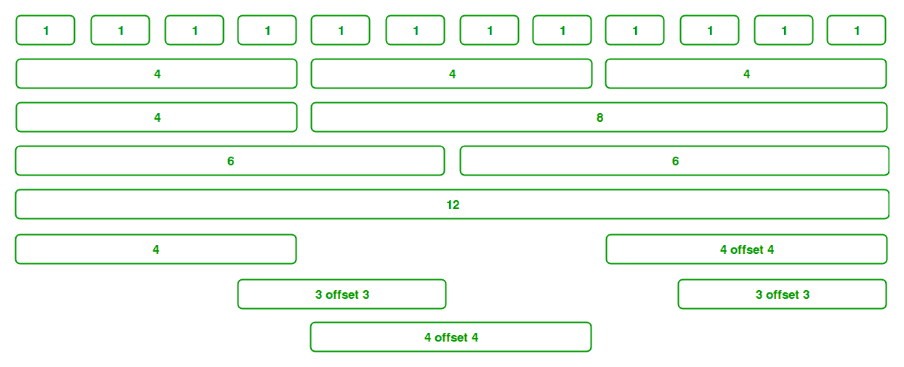
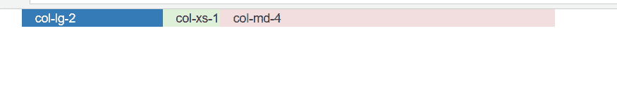

# Bootstrap

中“col-md-4”、“col-xs-1”、“col-lg-2”中数字的含义

> 原文:[https://www . geesforgeks . org/numbers-in-col-MD-4-col-xs-1-col-LG-2-in-bootstrap/](https://www.geeksforgeeks.org/meaning-of-numbers-in-col-md-4-col-xs-1-col-lg-2-in-bootstrap/)

Bootstrap 中的[网格系统帮助您并排对齐文本，并使用一系列容器、行和列。Bootstrap 中的网格系统使用 ems 和 rems 来定义大多数大小，而 pxs 用于网格断点和容器宽度。引导网格系统允许页面中最多有 12 列。您可以单独使用它们中的每一个，也可以将它们合并在一起用于更宽的列。您可以使用总和为 12 的所有值组合。您可以使用宽度为 1 的 12 列，或宽度为 3 的 4 列或任何其他组合。](https://www.geeksforgeeks.org/bootstrap-part-2/)



网格系统中主要有以下五类:

*   **。col-** 超小型(< 576 像素)
*   **。小(> = 576 像素)**
*   **。col-md-** 中等(> = 768 像素)
*   **。col-lg-** 大号(> = 992 像素)
*   **。col-xl-** 超大(> = 1200 像素)

Bootstrap 每行提供 12 列，在 Column 类中提供。因此，您可以通过在中指定数字来控制列宽。col-*，其中*表示数字列的宽度。

**col-md-4:** 当设备大小为中等或大于 768px，容器最大宽度为 720px，并且您希望宽度等于 4 列时，使用此类。

**col-xs-1:** 当设备尺寸特别小(可移动)并且希望宽度等于 1 列时，使用此类。

**col-lg-2:** 当设备大小大于或等于 992px，容器最大宽度为 960px，并且希望大小等于 2 列时，使用此类。

**示例:**

```html
<!DOCTYPE html>
<html>

<head>
    <title>
        Bootstrap numbers col-md-4, col-xs-1, col-lg-2
    </title>

    <link rel="stylesheet" href=
"https://maxcdn.bootstrapcdn.com/bootstrap/3.4.0/css/bootstrap.min.css">

    <!-- jQuery library -->
    <script src=
"https://ajax.googleapis.com/ajax/libs/jquery/3.3.1/jquery.min.js">
    </script>

    <!-- Latest compiled JavaScript -->
    <script src=
"https://maxcdn.bootstrapcdn.com/bootstrap/3.4.0/js/bootstrap.min.js">
    </script>
</head>

<body>
    <div class="container">
        <div class=" row bg-primary col-lg-2">col-lg-2</div>
        <div class=" row bg-success col-xs-1">col-xs-1</div>
        <div class=" row bg-danger col-md-4">col-md-4</div>
    </div>
</body>

</html>
```

**输出:**
