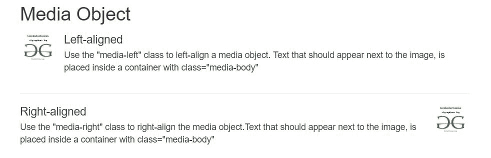
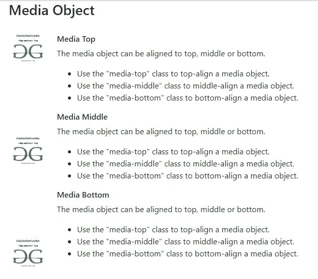
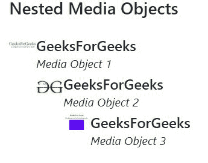
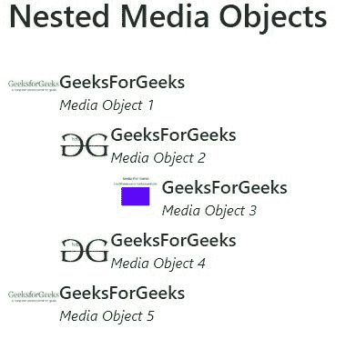

# 引导中的媒体对象，示例

> 原文:[https://www . geesforgeks . org/media-objects-in-bootstrap-with-examples/](https://www.geeksforgeeks.org/media-objects-in-bootstrap-with-examples/)

引导媒体对象(如图像或视频)可以以简单有效的方式对齐到某些内容的左侧或右侧。
引导媒体对象用于将一些数据放在内容旁边，以构建内容的复杂和递归组件。
可用的媒体对象类别有:

*   。媒体
*   。媒体主体

引导间距用于控制填充和边距。
**左右对齐**

*   “媒体左对齐”类用于左对齐媒体对象。
*   “media-right”类用于右对齐媒体对象。
*   “媒体-正文”类用于放置内容。

**语法:**

```
<div class="media-left">
    
</div>
<div class="media-body">
    Content to be placed 
</div>
```

下面程序举例说明左右对齐:

## 超文本标记语言

```
<!DOCTYPE html>
<html lang="en">
    <head>

        <!-- Link Bootstrap CSS -->
        <link rel="stylesheet" href="https://stackpath.bootstrapcdn.com/bootstrap
                                     /4.2.1/css/bootstrap.min.css"
              integrity="sha384-GJzZqFGwb1QTTN6wy59ffF1BuGJpLSa9DkKMp0DgiMDm4iYMj70gZW
                         KYbI706tWS" crossorigin="anonymous">

        <!-- Link Bootstrap JS and JQuery -->
        <script src="https://code.jquery.com/jquery-3.3.1.slim.min.js"></script>
        <script src="https://cdnjs.cloudflare.com/ajax/libs/popper.js/1.14.6/umd
                     /popper.min.js"></script>
        <script src="https://stackpath.bootstrapcdn.com/bootstrap/4.2.1/js
                     /bootstrap.min.js"></script>

        <title>GeeksForGeeks Bootstrap Example</title>
    </head>
    <body>
        <div class="container">
            <h2>Media Object</h2>

            <!-- Left-aligned media object -->
            <div class="media">
                <div class="media-left">
                    
                </div>

                <div class="media-body">
                    <h4 class="media-heading">
                        Left-aligned
                    </h4>

<p>
                        Use the "media-left" class to
                        left-align a media object. Text
                        that should appear next to the
                        image, is placed inside a container
                        with class="media-body"
                    </p>

                </div>
            </div>
            <hr>

            <!-- Right-aligned media object -->
            <div class="media">
                <div class="media-body">
                    <h4 class="media-heading">
                        Right-aligned
                    </h4>

<p>
                        Use the "media-right" class to
                        right-align the media object.
                        Text that should appear next to
                        the image, is placed inside a
                        container with class="media-body"
                    </p>

                </div>

                <div class="media-right">
                    
                </div>
            </div>
        </div>
    </body>
</html>
```

**输出:**



**顶部、中部或底部对齐** :

*   类似于左右对齐，媒体对象可以顶部、中部或底部对齐。
*   要将介质与顶部、中部或底部对齐，请使用以下类别-顶部介质、中部介质或底部介质类别

**语法:**

```
<div class="media-top">
    
</div>
<div class="media-body">
    Content to be placed 
</div>
```

下面的程序说明了上述方法:

## 超文本标记语言

```
<!DOCTYPE html>
<html>
    <head>
        <!-- Link Bootstrap CSS -->
        <link rel="stylesheet" href="https://stackpath.bootstrapcdn.com
                                     /bootstrap/4.2.1/css/bootstrap.min.css"
              integrity="sha384-GJzZqFGwb1QTTN6wy59ffF1BuGJpLSa9DkKMp0DgiMDm4iYMj70
                         gZWKYbI706tWS" crossorigin="anonymous">

        <!-- Link Bootstrap JS and JQuery -->
        <script src="https://code.jquery.com/jquery-3.3.1.slim.min.js"
                integrity="sha384-q8i/X+965DzO0rT7abK41JStQIAqVgRVzpbzo5smXKp4YfR
                           vH+8abtTE1Pi6jizo" crossorigin="anonymous"></script>
        <script src="https://cdnjs.cloudflare.com/ajax/libs/popper.js/1.14.6
                     /umd/popper.min.js"
                integrity="sha384-wHAiFfRlMFy6i5SRaxvfOCifBUQy1xHdJ
                           /yoi7FRNXMRBu5WHdZYu1hA6ZOblgut"
                crossorigin="anonymous"></script>
        <script src="https://stackpath.bootstrapcdn.com/bootstrap/4.2.1
                     /js/bootstrap.min.js"
                integrity="sha384-B0UglyR+jN6CkvvICOB2joaf5I4l3gm9GU6Hc1og6Ls7i6U
                           /mkkaduKaBhlAXv9k" crossorigin="anonymous"></script>

        <title>GeeksForGeeks Bootstrap Example</title>
    </head>
    <body>
        <div class="container">
            <h3>Media Object</h3>
            <br>

            <div class="media">
                
                <div class="media-body">

                    <h6 class="media-heading">
                        Media Top
                    </h6>

<p>
                        The media object can be aligned to
                        top, middle or bottom.
                    </p>

                    <ul>
                        <li>
                            Use the "media-top" class to
                            top-align a media object.
                        </li>
                        <li>
                            Use the "media-middle" class to
                            middle-align a media object.
                        </li>
                        <li>
                            Use the "media-bottom" class to
                            bottom-align a media object.
                        </li>
                    </ul>
                </div>
            </div>

            <div class="media">
                

                <div class="media-body">
                    <h6 class="media-heading">Media Top</h6>

<p>
                        The media object can be aligned to
                        top, middle or bottom.
                    </p>

                    <ul>
                        <li>
                            Use the "media-top" class to
                            top-align a media object.
                        </li>
                        <li>
                            Use the "media-middle" class to
                            middle-align a media object.
                        </li>
                        <li>
                            Use the "media-bottom" class to
                            bottom-align a media object.
                        </li>
                    </ul>
                </div>
            </div>

            <div class="media">
                
                <div class="media-body">
                    <h6 class="media-heading">Media Top</h6>

<p>
                        The media object can be aligned to
                        top, middle or bottom.
                    </p>

                    <ul>
                        <li>
                            Use the "media-top" class to
                            top-align a media object.
                        </li>
                        <li>
                            Use the "media-middle" class to
                            middle-align a media object.
                        </li>
                        <li>
                            Use the "media-bottom" class to
                            bottom-align a media object.
                        </li>
                    </ul>
                </div>
            </div>
        </div>
    </body>
</html>
```

**输出:**



**嵌套格式的媒体对象**

*   如果您想在第二个媒体下放置一个媒体，您可以使用媒体对象中的嵌套
*   嵌套的。媒体可以放在父媒体对象的。媒体-身体类。

**语法:**

```
<div class="media-left">
    
    <div class="media-left">
        Content to be placed 
    </div>
</div>
```

**例 1:**

## 超文本标记语言

```
<!DOCTYPE html>
<html lang="en">
    <head>
        <!-- Link Bootstrap CSS -->
        <link rel="stylesheet" href="https://stackpath.bootstrapcdn.com/bootstrap
                                     /4.2.1/css/bootstrap.min.css"
              integrity="sha384-GJzZqFGwb1QTTN6wy59ffF1BuGJpLSa9DkKMp0DgiMDm4iYMj70gZ
                         WKYbI706tWS" crossorigin="anonymous">

        <!-- Link Bootstrap JS and JQuery -->
        <script src="https://code.jquery.com/jquery-3.3.1.slim.min.js"
                integrity="sha384-q8i/X+965DzO0rT7abK41JStQIAqVgRVzpbzo5smXKp4YfRvH+
                           8abtTE1Pi6jizo" crossorigin="anonymous"></script>
        <script src="https://cdnjs.cloudflare.com/ajax/libs/popper.js/1.14.6/umd
                     /popper.min.js" integrity="sha384-wHAiFfRlMFy6i5SRaxvfOCifBUQy1xHdJ
                                                /yoi7FRNXMRBu5WHdZYu1hA6ZOblgut"
                crossorigin="anonymous"></script>
        <script src="https://stackpath.bootstrapcdn.com/bootstrap/4.2.1/js
                     /bootstrap.min.js"
                integrity="sha384-B0UglyR+jN6CkvvICOB2joaf5I4l3gm9GU6Hc1og6Ls7i6U
                           /mkkaduKaBhlAXv9k" crossorigin="anonymous"></script>

        <title>GeeksForGeeks Bootstrap Example</title>
    </head>
    <body>
        <div class="container">
            <h3>Nested Media Objects</h3>
            <br>
            <div class="media">
                <div class="media-left">
                    
                </div>

                <div class="media-body">
                    <h4 class="media-heading">GeeksForGeeks <small><br><i>Media Object 1
                      </i></small></h4>

                    <!-- Nested media object -->
                    <div class="media">
                        <div class="media-left">
                            
                        </div>

                        <div class="media-body">
                            <h4 class="media-heading">
                                GeeksForGeeks
                                <small><br><i>Media Object 2</i></small>
                            </h4>

                            <!-- Nested media object -->
                            <div class="media">
                                <div class="media-left">
                                    
                                </div>

                                <div class="media-body">
                                    <h4 class="media-heading">
                                        GeeksForGeeks
                                        <small><br><i>Media Object 3</i></small>
                                    </h4>
                                </div>
                            </div>
                        </div>
                    </div>
                </div>
            </div>
        </div>
    </body>
</html>
```

**输出:**



**例 2:**

## 超文本标记语言

```
<!DOCTYPE html>
<html lang="en">
    <head>
        <!-- Link BootStrap CSS -->
        <link rel="stylesheet" href="https://stackpath.bootstrapcdn.com/bootstrap/4.2.1
                                     /css/bootstrap.min.css"
              integrity="sha384-GJzZqFGwb1QTTN6wy59ffF1BuGJpLSa9DkKMp0DgiMDm4iYMj70gZWKY
                         bI706tWS" crossorigin="anonymous">

        <!-- Link Bootstrap JS and JQuery -->
        <script src="https://code.jquery.com/jquery-3.3.1.slim.min.js"
                integrity="sha384-q8i/X+965DzO0rT7abK41JStQIAqVgRVzpbzo5smXKp4YfRvH+
                           8abtTE1Pi6jizo" crossorigin="anonymous"></script>
        <script src="https://cdnjs.cloudflare.com/ajax/libs/popper.js/1.14.6/umd
                     /popper.min.js"
                integrity="sha384-wHAiFfRlMFy6i5SRaxvfOCifBUQy1xHdJ/yoi7FRNXMR
                           Bu5WHdZYu1hA6ZOblgut" crossorigin="anonymous"></script>
        <script src="https://stackpath.bootstrapcdn.com/bootstrap/4.2.1/js
                     /bootstrap.min.js"
                integrity="sha384-B0UglyR+jN6CkvvICOB2joaf5I4l3gm9GU6Hc1og6Ls7i6U/
                           mkkaduKaBhlAXv9k" crossorigin="anonymous"></script>

        <title>GeeksForGeeks Bootstrap Example</title>
    </head>

    <body>
        <div class="container">
            <h3>Nested Media Objects</h3>
            <br>

            <div class="media">
                <div class="media-left">
                    
                </div>

                <div class="media-body">
                    <h6 class="media-heading">GeeksForGeeks <small><br><i>Media Object 1
                      </i></small></h6>

                    <!-- Nested media object -->
                    <div class="media">
                        <div class="media-left">
                            
                        </div>

                        <div class="media-body">
                            <h6 class="media-heading">GeeksForGeeks <small><br>
                              <i>Media Object 2</i></small></h6>

                            <!-- Nested media object -->
                            <div class="media">
                                <div class="media-left">
                                    
                                </div>

                                <div class="media-body">
                                    <h6 class="media-heading">GeeksForGeeks <small><br>
                                      <i>Media Object 3</i></small></h6>
                                </div>
                            </div>
                        </div>
                    </div>

                    <div class="media">
                        <div class="media-left">
                            
                        </div>

                        <div class="media-body">
                            <h6 class="media-heading">GeeksForGeeks <small><br><i>Media Object 4</i></small></h6>
                        </div>
                    </div>
                </div>
            </div>

            <div class="media">
                <div class="media-left">
                    
                </div>

                <div class="media-body">
                    <h6 class="media-heading">GeeksForGeeks <small><br><i>Media Object 5
                      </i></small></h6>
                </div>
            </div>
        </div>
    </body>
</html>
```

**输出:**



**支持的浏览器:**

*   谷歌 Chrome
*   微软边缘
*   火狐浏览器
*   歌剧
*   狩猎