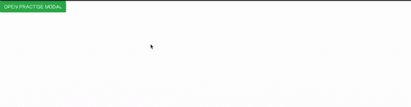
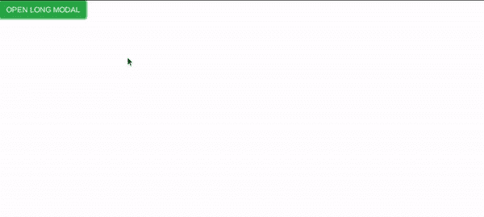
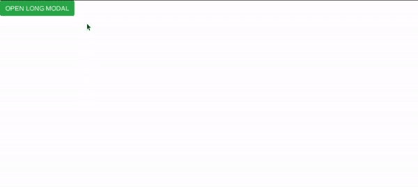
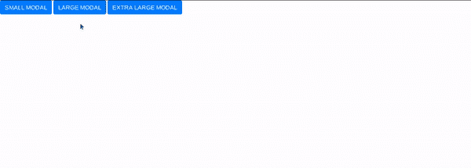

# 模态 JavaScript 插件(引导程序)示例

> 原文:[https://www . geesforgeks . org/modal-JavaScript-plugin-bootstrap-with-example/](https://www.geeksforgeeks.org/modal-javascript-plugin-bootstrap-with-example/)

您可以使用 Bootstrap 的 Javascript Modal 插件来创建用户通知、灯箱或自定义内容框。
**例:**

```
<html>
<head> 
<title>Modal example</title> 
<meta charset="utf-8"> 
<meta name="viewport" content="width=device-width, initial-scale=1">
<link rel="stylesheet"
href="https://stackpath.bootstrapcdn.com/bootstrap/4.2.1/css/bootstrap.min.css" 
integrity="sha384-GJzZqFGwb1QTTN6wy59ffF1BuGJpLSa9DkKMp0DgiMDm4iYMj70gZWKYbI706tWS"
crossorigin="anonymous">
<script 
src="https://code.jquery.com/jquery-3.3.1.slim.min.js" 
integrity="sha384-q8i/X+965DzO0rT7abK41JStQIAqVgRVzpbzo5smXKp4YfRvH+8abtTE1Pi6jizo"
crossorigin="anonymous"></script>
<script 
src="https://stackpath.bootstrapcdn.com/bootstrap/4.2.1/js/bootstrap.min.js" 
integrity="sha384-B0UglyR+jN6CkvvICOB2joaf5I4l3gm9GU6Hc1og6Ls7i6U/mkkaduKaBhlAXv9k"
crossorigin="anonymous"></script>
</head> 
<body> 
    <!-- Modal Trigger Button -->
    <button type="button" class="btn btn-success" data-toggle="modal"
data-target="#practiseModal">
        OPEN PRACTISE MODAL
    </button>  
    <!-- Modal Body -->
    <div class="modal fade" id="practiseModal" tabindex="-1" role="dialog" 
aria-labelledby="practiseModalLabel" aria-hidden="true">
        <div class="modal-dialog" role="document">
        <div class="modal-content">
            <div class="modal-header">
            <h5 class="modal-title" id="practiseModalLabel">
              Title of the Modal</h5>
            <button type="button" class="close" 
                 data-dismiss="modal" aria-label="Close">
                <span aria-hidden="true">×</span>
            </button>
            </div>
            <div class="modal-body">
            Content of the Modal
            </div>
            <div class="modal-footer">
            <button type="button" class="btn btn-danger" 
               data-dismiss="modal">Close</button>
            </div>
        </div>
        </div>
    </div>
</body>
</html>
```

**输出:**


**滚动长度超过视口的内容:**
当模态中的内容超过用户的视口时，模态变成可滚动的，它们独立于页面滚动。源代码同上。
**输出:**


**垂直居中的模态:**
要垂直居中一个模态，你应该在有“模态对话框”类的 div 中添加一个“模态对话框居中”类。

```
<!DOCTYPE html> 
<head> 
<title>Modal example</title> 
<meta charset="utf-8"> 
<meta name="viewport" content="width=device-width, initial-scale=1">
<link rel="stylesheet" 
href="https://stackpath.bootstrapcdn.com/bootstrap/4.2.1/css/bootstrap.min.css" 
integrity="sha384-GJzZqFGwb1QTTN6wy59ffF1BuGJpLSa9DkKMp0DgiMDm4iYMj70gZWKYbI706tWS"
crossorigin="anonymous">
<script src="https://code.jquery.com/jquery-3.3.1.slim.min.js"
integrity="sha384q8i/X+965DzO0rT7abK41JStQIAqVgRVzpbzo5smXKp4YfRvH+8abtTE1Pi6jizo"
crossorigin="anonymous"></script>
<script src="https://stackpath.bootstrapcdn.com/bootstrap/4.2.1/js/bootstrap.min.js" 
integrity="sha384-B0UglyR+jN6CkvvICOB2joaf5I4l3gm9GU6Hc1og6Ls7i6U/mkkaduKaBhlAXv9k"
crossorigin="anonymous"></script>
</head> 
<body> 
    <!-- Modal Trigger Button -->
    <button type="button" class="btn btn-success" data-toggle="modal" 
      data-target="#practiseLongModal">
        OPEN CENTERED MODAL
    </button>  
    <!-- Modal Body -->
    <div class="modal fade" id="practiseLongModal" 
    tabindex="-1" role="dialog" aria-labelledby="practiseLongModalLabel" 
       aria-hidden="true">
        <div class="modal-dialog modal-dialog-centered" role="document">
        <div class="modal-content">
            <div class="modal-header">
            <h5 class="modal-title" id="practiseLongModalLabel">
               Title of the Modal</h5>
            <button type="button" class="close" data-dismiss="modal" 
                 aria-label="Close">
                <span aria-hidden="true">×</span>
            </button>
            </div>
            <div class="modal-body">
            Content of the Modal
            </div>
            <div class="modal-footer">
            <button type="button" class="btn btn-danger" 
              data-dismiss="modal">Close</button>
            </div>
        </div>
        </div>
    </div>
</body>
</html> 
```

**输出:**


**不同大小的情态动词:**
你可以使用不同大小的情态动词。向具有“模式对话框”类的 div 中添加以下类之一。下表描述了 Bootstrap 提供的不同大小。您也可以使用自定义大小使用 JS 或 CSS。

| 大小 | 班级 | 宽度(像素) |
| 小的 | .modal-sm | Three hundred |
| 默认 | 没有人 | Five hundred |
| 大型 | 。模态 lg | eight hundred |
| 特大号 | .modal-xl | One thousand one hundred and forty |

**源代码:**

```
<!DOCTYPE html> 
<head> 
<title>Modal example</title> 
<meta charset="utf-8"> 
<meta name="viewport" content="width=device-width, initial-scale=1">
<link rel="stylesheet" 
href="https://stackpath.bootstrapcdn.com/bootstrap/4.2.1/css/bootstrap.min.css" 
integrity="sha384-GJzZqFGwb1QTTN6wy59ffF1BuGJpLSa9DkKMp0DgiMDm4iYMj70gZWKYbI706tWS"
crossorigin="anonymous">
<script 
src="https://code.jquery.com/jquery-3.3.1.slim.min.js" 
integrity="sha384-q8i/X+965DzO0rT7abK41JStQIAqVgRVzpbzo5smXKp4YfRvH+8abtTE1Pi6jizo"
crossorigin="anonymous"></script>
<script 
src="https://stackpath.bootstrapcdn.com/bootstrap/4.2.1/js/bootstrap.min.js" 
integrity="sha384-B0UglyR+jN6CkvvICOB2joaf5I4l3gm9GU6Hc1og6Ls7i6U/mkkaduKaBhlAXv9k"
crossorigin="anonymous"></script>
</head> 
<body>

    <!-- Small Modal -->
    <button type="button" class="btn btn-primary" data-toggle="modal" 
data-target=".smallExampleModal">SMALL MODAL</button>

    <div class="modal fade smallExampleModal" tabindex="-1" role="dialog" 
aria-labelledby="mySmallModalLabel" aria-hidden="true">
    <div class="modal-dialog modal-sm">
        <div class="modal-content">
            <div class="modal-header">
                <h3>Small Modal</h3>
            </div>
        </div>
    </div>
    </div>

    <!-- Large Modal -->
    <button type="button" class="btn btn-primary" data-toggle="modal" 
data-target=".largeExampleModal">LARGE MODAL</button>

    <div class="modal fade largeExampleModal" tabindex="-1" role="dialog" 
aria-labelledby="myLargeModalLabel" aria-hidden="true">
    <div class="modal-dialog modal-lg">
        <div class="modal-content">
            <div class="modal-header">
                <h3>Large Modal</h3>
            </div>
        </div>
    </div>
    </div>

    <!-- Extra Large Modal -->
    <button type="button" class="btn btn-primary" data-toggle="modal" 
data-target=".extraLargeExampleModal">EXTRA LARGE MODAL</button>
    <div class="modal fade extraLargeExampleModal" 
    tabindex="-1" role="dialog" aria-labelledby="myExtraLargeModalLabel" 
aria-hidden="true">
    <div class="modal-dialog modal-xl">
        <div class="modal-content">
            <div class="modal-header">
                <h3>Extra Large Modal</h3>
            </div>
        </div>
    </div>
    </div>    
</body>
</html> 
```

**输出:**
