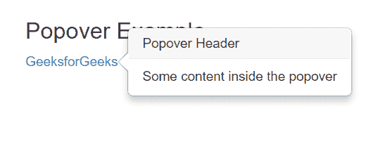
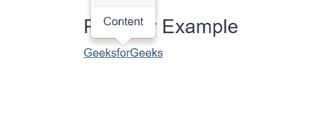
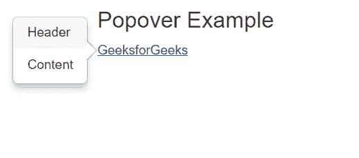
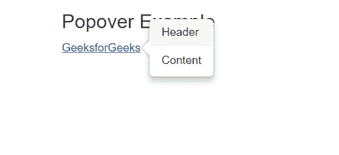
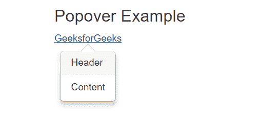

# 引导中的弹出，示例为

> Original: [https://www.geeksforgeeks.org/popovers-in-bootstrap-with-examples/](https://www.geeksforgeeks.org/popovers-in-bootstrap-with-examples/)

Bootstrap popover 是 bootstrap 中的一个属性，可以用来使任何网站看起来更有活力。 弹出窗口通常用于显示有关任何元素的附加信息，并在鼠标指针单击该元素时显示。 在弹出窗口中，如果您单击脚本中包含的任何元素，它将给出一条特定的消息作为弹出窗口，您可以看到您在脚本中定义的消息。)
使用 Bootstrap 在网站上实现弹出窗口很容易，因为您只需要定义元素的几个属性，如下所述：
**语法**：*

```
data-toggle="popover" 
title="Popover Header" 
data-content="Some content inside the box"
```

*data-togling*属性定义 Popover，*Title*属性定义 Popover 的平铺，*data-content*属性用于存储要在各个 Popover 中显示的内容。
在您的代码中包含以下 javascript 以使其正常工作。

## JavaScript

```
<script>
$(document).ready(function(){
  $('[data-toggle="popover"]').popover();
});
</script>
```

**示例：**和

## 超文本标记语言

```
<!DOCTYPE html>
<html>
<head>
    <title>Bootstrap Example</title>

    <!-- Link Bootstrap CSS -->
    <link rel="stylesheet" href="https://maxcdn.bootstrapcdn.com/bootstrap/3.4.0/css/bootstrap.min.css">
    <script src="https://ajax.googleapis.com/ajax/libs/jquery/3.3.1/jquery.min.js"></script>
    <script src="https://maxcdn.bootstrapcdn.com/bootstrap/3.4.0/js/bootstrap.min.js"></script>
</head>

<body>
    <div class="container">
      <h3>Popover Example</h3>
      <a href="#" data-toggle="popover"
                  title="Popover Header"
                  data-content="Some content inside the popover">GeeksforGeeks</a>
    </div>

    <script>
    $(document).ready(function(){
        $('[data-toggle="popover"]').popover();  
    });
    </script>
</body>
</html>
```

发帖主题：Re：Колибри0.7.8.0



**Bootstrap**
中不同类型的弹出方向

*   **顶部对齐**：在这种类型的弹出对齐中，弹出内容显示在我们应用了该属性的元素的**顶部**。 要将弹出窗口与顶部对齐，请指定属性**data-place=“top”**。

## 超文本标记语言

```
<!DOCTYPE html>
<html>
<head>
    <title>Bootstrap Example</title>

    <!-- Bootstrap CSS and JS -->
    <link rel="stylesheet" href="https://maxcdn.bootstrapcdn.com/bootstrap/3.4.0/css/bootstrap.min.css">
    <script src="https://ajax.googleapis.com/ajax/libs/jquery/3.3.1/jquery.min.js"></script>
    <script src="https://maxcdn.bootstrapcdn.com/bootstrap/3.4.0/js/bootstrap.min.js"></script>
</head>

<body>
    <div class="container">
      <h3>Popover Example</h3>
      <ul class="list-inline">
        <li><a href="#" title="Header"
                        data-toggle="popover"
                        data-placement="top"
                        data-content="Content">
                GeeksforGeeks
            </a>
        </li>
      </ul>
    </div>

    <script>
    $(document).ready(function(){
        $('[data-toggle="popover"]').popover();  
    });
    </script>
</body>
</html>
```

*   发帖主题：Re：Колибри0.7.8.0



*   **左对齐**：在这种类型的弹出对齐中，弹出内容显示在我们应用了该属性的元素的**左侧**。 要将弹出窗口与顶部对齐，请指定属性**data-place=“Left”**。

## 超文本标记语言

```
<!DOCTYPE html>
<html>
<head>
    <title>Bootstrap Example</title>

    <!-- Bootstrap CSS and JS -->
    <link rel="stylesheet" href="https://maxcdn.bootstrapcdn.com/bootstrap/3.4.0/css/bootstrap.min.css">
    <script src="https://ajax.googleapis.com/ajax/libs/jquery/3.3.1/jquery.min.js"></script>
    <script src="https://maxcdn.bootstrapcdn.com/bootstrap/3.4.0/js/bootstrap.min.js"></script>
</head>

<body>
    <div class="container">
      <h3>Popover Example</h3>
      <ul class="list-inline">
        <li><a href="#" title="Header"
                        data-toggle="popover"
                        data-placement="left"
                        data-content="Content">
                GeeksforGeeks
            </a>
        </li>
      </ul>
    </div>

    <script>
    $(document).ready(function(){
        $('[data-toggle="popover"]').popover();  
    });
    </script>
</body>
</html>
```

*   发帖主题：Re：Колибри0.7.8.0



*   **右对齐**：在这种类型的弹出对齐中，弹出内容显示在我们应用了该属性的元素的**顶部**。 要将弹出窗口与顶部对齐，请指定属性**Data-Placement=“right”**。

## 超文本标记语言

```
<!DOCTYPE html>
<html>
<head>
    <title>Bootstrap Example</title>

    <!-- Bootstrap CSS and JS -->
    <link rel="stylesheet" href="https://maxcdn.bootstrapcdn.com/bootstrap/3.4.0/css/bootstrap.min.css">
    <script src="https://ajax.googleapis.com/ajax/libs/jquery/3.3.1/jquery.min.js"></script>
    <script src="https://maxcdn.bootstrapcdn.com/bootstrap/3.4.0/js/bootstrap.min.js"></script>
</head>

<body>
    <div class="container">
      <h3>Popover Example</h3>
      <ul class="list-inline">
        <li><a href="#" title="Header"
                        data-toggle="popover"
                        data-placement="right"
                        data-content="Content">
                GeeksforGeeks
            </a>
        </li>
      </ul>
    </div>

    <script>
    $(document).ready(function(){
        $('[data-toggle="popover"]').popover();  
    });
    </script>
</body>
</html>
```

*   发帖主题：Re：Колибри0.7.8.0



*   **底部对齐**：在这种类型的弹出对齐中，弹出内容显示在我们应用此属性的元素的**底部**。 要将弹出窗口与顶部对齐，请指定属性**data-place=“Bottom”**。

## 超文本标记语言

```
<!DOCTYPE html>
<html>
<head>
    <title>Bootstrap Example</title>

    <!-- Bootstrap CSS and JS -->
    <link rel="stylesheet" href="https://maxcdn.bootstrapcdn.com/bootstrap/3.4.0/css/bootstrap.min.css">
    <script src="https://ajax.googleapis.com/ajax/libs/jquery/3.3.1/jquery.min.js"></script>
    <script src="https://maxcdn.bootstrapcdn.com/bootstrap/3.4.0/js/bootstrap.min.js"></script>
</head>

<body>
    <div class="container">
      <h3>Popover Example</h3>
      <ul class="list-inline">
        <li><a href="#" title="Header"
                        data-toggle="popover"
                        data-placement="bottom"
                        data-content="Content">
                GeeksforGeeks
            </a>
        </li>
      </ul>
    </div>

    <script>
    $(document).ready(function(){
        $('[data-toggle="popover"]').popover();  
    });
    </script>
</body>
</html>
```

*   发帖主题：Re：Колибри0.7.8.0



**支持的浏览器：**

*   Google Chrome
*   微软边缘
*   火狐
*   歌剧 / 歌剧院 / 作品（opus 的复数）
*   野生动物考察 / 旅行 / 狩猎远征 / 旅行队